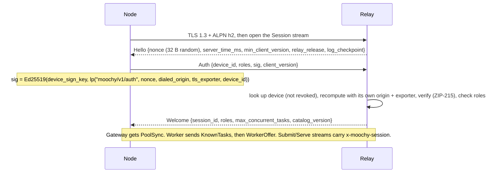
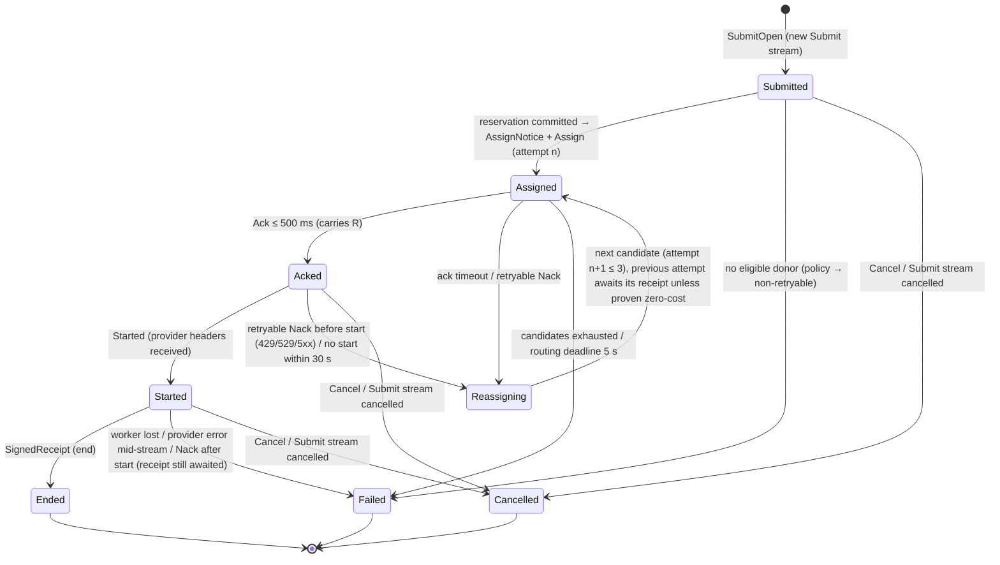

# 03 — Wire Protocol (`moochy.v1`)

> Every byte that crosses the network between Nodes and the Relay: transport, authentication, message framing, end-to-end envelopes, task authenticity, streaming, failover, cancellation, receipts, disputes, and versioning.
> Field tables describe semantics only. Exact encodings are fixed by `spec/CONTRACT.md` (§1–§5, §12), by `spec/proto/moochy/v1/link.proto`, and by the **golden test vectors** in `spec/vectors/` ([§17](#17-test-vectors)).
> Notation: `lp(a, b, …)` is the **length-prefixed** concatenation (each field preceded by its 4-byte big-endian length). Integer fields carry the width written at the call site (`u32(x)` = 4 bytes BE, `u64(x)` = 8 bytes BE); an integer written without a width is `u64`. Every signature, hash, and key derivation input uses `lp`, so field boundaries can never be ambiguous.
> The public, client-facing subset of this document is published as `spec/protocol.md` (open source, shipped with the client).

> **Updated 2026-10-01:** the link is now described as gRPC (`moochy.v1.NodeLink`) and every encoding matches `spec/CONTRACT.md`; cryptography and semantics are unchanged. Changes: gRPC over HTTP/2 replaces the WebSocket subprotocol, text/binary frames and the 23-byte frame header (ADR-33, C2, C9); message catalog mapped to `link.proto` names (§5.4); `window` → `window_open`, an eligibility flag only (C3, C7); inner payload = whole JSON zstd-compressed, field `headers` (C8); explicit `lp` widths, constant request `kind_byte` `0x01`, `dialed_origin` = `https://host:port` (D4, D5, D7); route header carried as raw bytes in `SubmitOpen.route` / `Assign.route` (D6); relay-asserted membership only under `MOOCHY_INSECURE_DEV=1` until the key log ships (D14); served-task set in memory plus a boot-time floor (D18); `over_task_cap` → 400, `quota_exceeded` → 403 (C4); `MaxConcurrentStreams` 128 (D9); relay self-hosting is not offered (CONTRACT §0a).

---

## 1. Design principles

1. **One HTTP/2 connection per Node, one stream per task.** A Node keeps a single TLS 1.3 HTTP/2 connection to the Relay. It carries all roles (Gateway and Worker) and all concurrent tasks, and all local clients share it through the Node. The connection is authenticated once, by one long-lived `Session` stream (§3). Each task then gets its own `Submit` stream on the Gateway side, and each assigned attempt its own `Serve` stream on the Worker side. Per-stream HTTP/2 flow control means one slow task never stalls another, cancelling a stream cancels the task, and deadlines come with the stream.
2. **Protobuf for messages, signed JSON as opaque bytes.** All messages are protobuf (`link.proto`), so Go and Rust share one typed schema, and bulk ciphertext travels in `bytes` fields with no base64 inflation and no JSON parsing of large payloads. Signed artifacts (route header, inner payload, receipts, projections, catalog) stay the **exact JSON bytes** that were signed, carried verbatim in `bytes` fields (principle 4). Protobuf parsing is **never trusted for a strict security or money decision** (proto3 merges a repeated singular field, last one wins): those decisions read the signed JSON bytes with the strict parser of CONTRACT §1.
3. **The Relay never needs the plaintext, and never gets to choose keys.** Everything it routes on is in a small plaintext **route header**. Everything else is sealed between the two endpoints, and both endpoints run the open-source client (Apache-2.0) that anyone can read and verify. Users never need to trust the closed-source Relay for confidentiality: it only ever sees ciphertext, the route header, and accounting metadata. Every encryption key is unique per body and per attempt (§6).
4. **Sign bytes, not objects.** Signed artifacts are transmitted and stored as the exact byte strings that were signed. Nobody re-serializes them, so there is no canonical-JSON implementation to get wrong in two languages.
5. **Domain separation everywhere.** Every signature, commitment, and key derivation starts with a distinct label (`moochy/v1/receipt`, `moochy/v1/auth`, …) inside `lp(…)`, so a value made for one purpose can never be replayed as another.
6. **Client-generated identifiers, scoped to their creator.** Task ids are ULIDs created by the Gateway. Deduplication is per `(gateway_device, task_id)`, so retries never double-spend and one device cannot collide with another's tasks.
7. **Fail toward the client's own retry logic.** Errors reach the client as the provider's native error shapes, so existing agent harnesses already know what to do. Policy failures are explicitly **non-retryable** so agents do not loop.

Earlier drafts ran this protocol over one WebSocket with JSON text frames and a custom 23-byte binary frame header. ADR-33 replaced that with gRPC: one typed schema for both languages, and per-task flow control, cancellation, and deadlines without custom code. The cryptography, AADs, signatures, receipts, and semantics in this document did not change.

---

## 2. Transport

| Property | Value |
|---|---|
| Service | gRPC `moochy.v1.NodeLink` (`spec/proto/moochy/v1/link.proto`): `Session`, `Submit`, `Serve`, `DeviceStart`, `DevicePoll` |
| Endpoint | `https://<relay host>:<port>` of the public relay (the Relay's `--grpc-addr` listener, separate from its HTTP listener). The Node's relay URL is configurable for development and tests only; self-hosting the relay is not offered |
| TLS | 1.3 only, ALPN `h2`, terminated **in the Relay process** (required for channel binding, §3). No plaintext h2c on the network |
| Compression | gRPC compression **disabled**. Bodies are zstd-compressed before sealing, ciphertext does not compress, and compression next to secrets invites CRIME-style oracles |
| Keepalive | HTTP/2 pings every **15 s**; the peer is considered dead after **2 missed pings** or on TCP close. Ping RTT (and the Session `Ping`/`Pong` messages) feeds the Scheduler's latency estimate (EWMA, α = 0.2) |
| Message size | Ciphertext per `Chunk` ≤ **64 KiB** (plaintext ≤ 65,497 bytes, §4.2); gRPC `MaxRecvMsgSize` / `MaxSendMsgSize` **128 KiB** |
| Streams | `MaxConcurrentStreams` **128** per connection (§16); `MaxHeaderListSize` 16 KiB |
| Max request body | 32 MiB decompressed (checked by the Worker); the sealed size is checked against the same bound by the Relay |
| Libraries | Go `google.golang.org/grpc` + `google.golang.org/protobuf`; Rust `tonic` (no default TLS features, our own `tokio-rustls` connector for channel binding) + `prost`. Generated code is committed; regenerate with `spec/proto/gen.sh` |
| Latency | Every chunk is flushed as its own gRPC message as soon as it exists, `TCP_NODELAY` on every socket, connections kept warm (CONTRACT §13, measured by E22) |

Other gRPC links use the same stack but never touch the network: the CLI and MCP stdio shim talk to the running Node through `moochy.v1.LocalControl` on the 0600 Unix socket `<home>/state/node.sock` (peer uid checked), and the operator talks to the Relay through `moochy.v1.RelayAdmin` on a 0600 Unix socket (`relay admin …`). The provider-compatible API door (HTTP + SSE), the MCP door (stdio / Streamable HTTP), the browser, OAuth, badges, and the test-only dev API are **not** gRPC: external compatibility decides there.

### 2.1 gRPC hardening

All of the following are mandatory and tested (CONTRACT §12):

- Server: `MaxConcurrentStreams` 128 per connection; message caps 128 KiB; `MaxHeaderListSize` 16 KiB; keepalive enforcement (`MinTime` 10 s, `PermitWithoutStream` true) plus server pings every 15 s, 2 missed = dead.
- Per-connection limits on the stream-open rate and on stream resets (HTTP/2 Rapid Reset, CVE-2023-44487); current grpc-go and `x/net` with the 2024 CONTINUATION-flood fixes and HPACK limits; a per-IP connection cap.
- `DeviceStart` / `DevicePoll` rate-limited per IP. Every call other than `Session` and `Device*` is rejected before any task state is allocated unless it arrives on an authenticated connection (§3).
- Client (Rust): the same message-size caps, `http2_max_header_list_size`, connect and request timeouts, bounded per-stream buffers, no gRPC compression.
- gRPC reflection and channelz are disabled in production; `grpc.health.v1` is allowed.
- Status mapping: Relay policy errors travel as `Failed{code, retryable}` **inside the stream**, so the Gateway can turn them into provider-native errors (§10.3). gRPC status codes are reserved for transport and auth failures (`UNAUTHENTICATED`, `RESOURCE_EXHAUSTED`, `UNAVAILABLE`, `DEADLINE_EXCEEDED`).
- Protobuf fields are a transport convenience. Every strict decision (route-header checks, task authenticity, receipts, money) reads the signed JSON bytes with the strict parser of CONTRACT §1 (duplicate keys, invalid UTF-8, lone surrogates, out-of-range numbers, and nesting deeper than 64 are all rejected).

---

## 3. Authentication handshake

- **Authentication is per HTTP/2 connection.** Exactly one `Session` stream per connection. The Relay's `TransportCredentials` tag every TLS connection with an id and its channel-binding value. After `Welcome`, `Submit` and `Serve` streams are accepted only when they arrive **on the same underlying connection** and carry the metadata `x-moochy-session: <session_id>`; anything else gets `UNAUTHENTICATED` before any task state is allocated. A Node that loses its connection rebuilds the channel (new TLS connection) and authenticates again.
- `dialed_origin` is the exact origin the **Node itself dialed and verified with TLS** for the gRPC link, scheme included: `https://host:port`. It is never taken from `Hello`, so a phishing relay cannot replay a login to the real one.
- `tls_exporter` is the RFC 9266 channel-binding value of this TLS connection (`EXPORTER-Channel-Binding`, empty context, 32 bytes). A signature captured on one connection is useless on any other.
- No bearer token on the wire, and **no shared secret stored server-side**. The draft's `mcp_secret` column (plaintext, per repo) is removed. A database leak exposes only public keys.
- A new successful auth for a device **closes that device's previous session** (§14). Events from non-current sessions are ignored.
- Clock skew larger than 5 min (from `server_time_ms`) produces a local warning. Task ids carry timestamps that Workers check (§7).
- **Device login** uses the unauthenticated unary calls `DeviceStart{sign_pub, enc_pub, roles, name, suite, sig}` (sig = `Ed25519(sign key, lp("moochy/v1/device-start", sign_pub, enc_pub, roles_csv, name, suite))`, proving possession of the key) and `DevicePoll{device_code}`, which returns the device id once the user approves the `user_code` on the web.

---

## 4. Frame format

There are no frames of our own any more: gRPC frames the messages, and each stream identifies its task. This section keeps its number because other documents refer to it.

### 4.1 Text frames (control): now protobuf messages

Every message is a protobuf message from `link.proto`, sent on one of three stream kinds:

| Stream | Opened by | First messages | Carries |
|---|---|---|---|
| `Session` | Node, once per connection | Relay sends `Hello` first; Node answers `Auth` | Auth and all control traffic not tied to one task stream (offers, pool sync, assign notices, disputes, receipt replay, catalog, key-log checkpoints, drain, ping) |
| `Submit` | Gateway, one per task | Gateway sends `SubmitOpen` first | The request body, then the response stream of the accepted attempt, then the receipt or failure |
| `Serve` | Worker, one per assigned attempt, after `AssignNotice` | Worker sends `ServeOpen`; Relay sends `Assign` first | The request body to the Worker, then `Ack`/`Nack`, the response stream, and the receipt |

A stream whose first message breaks these rules is reset. On `Submit` and `Serve` the stream itself identifies the task (`SubmitOpen.task`, `ServeOpen.task` + `attempt`); on `Session`, task-scoped messages carry `task` and, where relevant, `attempt`. Unknown protobuf fields are ignored (fields are additive within v1, §15). A `Session` message whose `oneof` is empty (for example a message type from a newer version) is answered with `Error{code: "unknown_type"}` and otherwise ignored. This tolerance applies to protobuf only: the signed route header is strict (§7.1).

### 4.2 Binary frames (bulk): now `Chunk`

Earlier drafts put a 23-byte binary header (`kind`, 16-byte `task_id`, `attempt`, `seq`, `flags`) in front of every ciphertext frame. That header is gone. Bulk data travels as:

`Chunk{attempt (uint32), seq (uint32), last (bool), ct (bytes)}`

| Former header field | Where it lives now |
|---|---|
| `kind` | Implied by the stream and direction: `SubmitUp.body` and `ServeDown.body` are request-body chunks; `SubmitDown.chunk` and `ServeUp.chunk` are response chunks. The request AAD keeps a constant `kind_byte` `0x01` for domain separation (§6.2) |
| `task_id` | The stream (`SubmitOpen.task`, `Assign.task`); still bound into every AAD as 16 raw ULID bytes |
| `attempt` | `Chunk.attempt` (`0` for request-body chunks, the attempt number for response chunks) |
| `seq` | `Chunk.seq`, counting from 0 |
| `flags` bit0 | `Chunk.last` |
| `payload` | `Chunk.ct`: AEAD ciphertext including its 16-byte tag, opaque to the Relay |

**Size limits (C9):** plaintext per chunk ≤ **65,497 bytes**, ciphertext ≤ **64 KiB**, gRPC message cap **128 KiB**. The 65,497-byte plaintext limit is kept from the old frame layout so chunking and test vectors stay unchanged. Receivers reject a chunk that is oversize, out of order (gap or repeat in `seq`), names the wrong attempt, or follows a `last` chunk.

**Source binding.** The Relay forwards request chunks only from the Gateway's own `Submit` stream for that task, and response chunks only from the `Serve` stream of the current attempt. Because every stream is bound to an authenticated connection (§3), a Node cannot inject chunks into someone else's task. The Relay itself could inject a forged `Chunk` into a Gateway's live `Submit` stream; the AEAD stops that: the Gateway fails the task on the first AEAD failure with a native retryable error and logs `bad_envelope`, and no forged byte reaches the client (E17, chaos `inject_frame`).

---

## 5. Message catalog

All names are `link.proto` messages. "Stream" says where each one travels. §5.4 maps the dotted names of earlier drafts (still used in older notes) onto them.

### 5.1 Gateway ⇄ Relay

| Message | Stream, direction | Key fields | Notes |
|---|---|---|---|
| `PoolSync` | Session, R → G | `repo_id`, `full`, `workers[]` = `PoolWorker{worker_device, enc_pub, key_log_index, approval_log_index, donor_pseudonym, dialects, models, hint}`, `removed_worker_devices[]` | After `Welcome` (`full = true`) and on change (`full = false`: upsert listed workers, remove the others named). The Gateway **independently verifies** from its key-log mirror that the key is logged and that the donor has an **owner-signed approval** for this repo ([06 §10](06-security-and-trust.md)). `hint` is a coarse 0–100 score, at most once per second |
| `SubmitOpen` | Submit, G → R (first) | `task`, `route` (exact route-header JSON bytes, §7.1), `wraps[]` = `Wrap{worker_device, wrap}` (≤ 8), `body_len`, `body_chunks` | Followed by the body `Chunk`s (`SubmitUp.body`, `attempt = 0`). Deduplicated per `(gateway_device, task)` |
| `Wraps` | Submit, G → R | `wraps[]` | Answers `NeedWraps`. The sealed body is not resent |
| `NeedWraps` | Submit, R → G | `workers[]` | None of the wrapped candidates is eligible; one RTT, only on a stale snapshot |
| `Accepted` | Submit, R → G | `attempt`, `worker_device`, `r` | `r` = the Worker's per-attempt response salt `R` (§6.3). The Gateway will decrypt only this attempt's chunks |
| `Started` | Submit, R → G | `attempt` | The provider has answered with response headers. **No failover after this point, ever** |
| `Checkpoint` | Submit, R → G | `attempt`, `seq`, `running_hash`, `sig` | Forwarded Worker progress signature (§12.3) |
| `Chunk` (`SubmitDown.chunk`) | Submit, R → G | `attempt`, `seq`, `last`, `ct` | Response chunks, in order by `seq` |
| `SignedReceipt` (`SubmitDown.end`) | Submit, R → G | `task`, `attempt`, `receipt`, `donor_sig`, `projection`, `projection_sig` | Stream complete (§12). `receipt` and `projection` are the exact signed JSON bytes |
| `Failed` | Submit, R → G | `code`, `retryable`, `retry_after_ms`, `sealed_detail` | Converted by the Gateway into a provider-native error (§10.3) |
| `Cancel` (`SubmitUp.cancel`), or cancelling the stream | Submit, G → R | `reason` | The client closed the request (§13) |
| `ReceiptDispute` | Session, G → R | `task`, `attempt`, `code`, `gateway_sig` | Only when a receipt does not match what the Gateway saw (§12.2) |

### 5.2 Worker ⇄ Relay

| Message | Stream, direction | Key fields | Notes |
|---|---|---|---|
| `KnownTasks` | Session, W → R | `tasks[]` = `KnownTask{task, attempt, state}` (`running` or `outbox`) | Sent right after `Welcome`: everything the Worker has in progress or in its outbox. The Relay releases, at zero cost, any reservation it holds for this Worker that is not listed ([05 §7](05-ledger-and-accounting.md)) |
| `WorkerOffer` | Session, W → R | `slots_free`, `models[]` = `ModelOffer{dialect, model, rl_headroom}`, `pledges[]`, `window_open`, `local_cap_left_uusd` | On connect and whenever something changes. Credit-based capacity grant (§11). Only the latest offer per worker is kept. `window_open` is false while the donor's device schedule is closed; it is an **eligibility** condition only ([04 §4](04-routing-engine.md)) and never changes a pledge's status. Pledge schedules gate eligibility the same way; a pledge is `paused` only by explicit donor action |
| `AssignNotice` | Session, R → W | `task`, `attempt` | Sent **only after the reservation is durably committed** ([05 §5](05-ledger-and-accounting.md)). The Worker opens a `Serve` stream for it |
| `ServeOpen` | Serve, W → R (first) | `task`, `attempt` | Must name an attempt announced on this session |
| `Assign` | Serve, R → W (first) | `task`, `attempt`, `route` (the exact bytes from `SubmitOpen.route`), `wrap`, `pledge_id`, `repo_id`, `deadline_ack_ms`, `body_len`, `body_chunks` | Followed by the body `Chunk`s (`ServeDown.body`) |
| `Ack` | Serve, W → R | `r` | Within **500 ms** of the last body chunk. Means: authentic, decrypted, firewall passed, local caps reserved, provider call starting |
| `Nack` | Serve, W → R | `r`, `code`, `retryable`, `retry_after_ms`, `sealed_detail` | §10.2. Details (such as the rejected field name) are sealed to the Gateway, so the Relay sees only the code |
| `Started` | Serve, W → R | `attempt` | Provider response headers received |
| `Checkpoint` | Serve, W → R | `attempt`, `seq`, `running_hash`, `sig` | §12.3 |
| `Chunk` (`ServeUp.chunk`) | Serve, W → R | `attempt`, `seq`, `last`, `ct` | Response chunks |
| `SignedReceipt` (`ServeUp.end`) | Serve, W → R | `task`, `attempt`, `receipt`, `donor_sig`, `projection`, `projection_sig` | Receipts left in the outbox after a link loss are replayed on Session as `ReplayReceipt` |
| `Cancel` (`ServeDown.cancel`), or cancelling the stream | Serve, R → W | `reason` | The Worker MUST abort the provider request immediately |
| `ReceiptAck` | Serve (`ServeDown.receipt_ack`) or Session, R → W | `task`, `attempt` | Sent only **after** the receipt is committed with `synchronous=FULL`. The Worker marks the outbox entry acknowledged and keeps it 7 more days |
| `ReplayReceipt` | Session, W → R | `receipt` (`SignedReceipt`) | Outbox replay after a reconnect or on `ReceiptReplaySince` |
| `ReceiptReplaySince` | Session, R → W | `since_ms` | After a disaster-recovery restore: resend every receipt (acknowledged or not) since that time |

### 5.3 Common

| Message | Stream, direction | Purpose |
|---|---|---|
| `Hello`, `Auth`, `Welcome` | Session | Handshake (§3). `Welcome.max_concurrent_tasks` is the per-Gateway-device task limit (§16) |
| `Draining` | Session, R → N | A restart is imminent: `reconnect_after_ms` (Gateways: 0, Workers: jittered 0–10 s) |
| `LogCheckpoint` | Session, R → N | Newest signed key-log checkpoint (signed-note bytes) |
| `CatalogUpdate` | Session, R → N | New signed catalog version: `version`, exact `catalog_json` bytes, `sig` (Nodes reject version decreases) |
| `Ping` / `Pong` | Session | Application-level RTT sample (`t_ms`) |
| `Error` | Session, R → N | `code`, `message`, optional `task` |
| `DeviceStart` / `DevicePoll` | Unary, unauthenticated | Device login (§3) |

### 5.4 Name mapping (earlier drafts → `link.proto`)

| Earlier name | `link.proto` |
|---|---|
| `hello`, `auth`, `welcome` | `Hello`, `Auth`, `Welcome` (Session) |
| `pool.sync` | `PoolSync` |
| `task.submit` (+ binary `0x01` frames) | `SubmitOpen` (+ `SubmitUp.body` chunks) on a new `Submit` stream |
| `task.wraps` / `task.need_wraps` | `Wraps` / `NeedWraps` |
| `task.accepted`, `task.started` (to Gateway) | `Accepted`, `Started` (`SubmitDown`) |
| `task.checkpoint` | `Checkpoint` |
| binary `0x02` frames | `Chunk` (`SubmitDown.chunk`, `ServeUp.chunk`) |
| `task.end` | `SignedReceipt` (`SubmitDown.end`, `ServeUp.end`) |
| `task.failed` | `Failed` |
| `task.cancel` | `Cancel`, or cancelling the `Submit` / `Serve` stream |
| `receipt.dispute` | `ReceiptDispute` (Session) |
| `worker.known_tasks` | `KnownTasks` |
| `worker.offer` (`window`, `local_cap_left`) | `WorkerOffer` (`window_open`, `local_cap_left_uusd`) |
| `task.assign` (+ body frames) | `AssignNotice` (Session), then `Assign` (+ `ServeDown.body` chunks) on the Worker's `Serve` stream |
| `task.ack` / `task.nack` / `task.started` (from Worker) | `Ack` / `Nack` / `Started` (`ServeUp`) |
| `receipt.ack` | `ReceiptAck` |
| `receipt.replay_since` | `ReceiptReplaySince`; replayed receipts travel as `ReplayReceipt` |
| `relay.draining`, `log.checkpoint`, `catalog.update`, `error` | `Draining`, `LogCheckpoint`, `CatalogUpdate`, `Error` |
| WebSocket ping / pong | HTTP/2 PING frames + Session `Ping` / `Pong` |

---

## 6. End-to-end envelopes

### 6.1 Keys and derivations

These are exactly CONTRACT §3. HKDF is HKDF-SHA256 (RFC 5869), `Expand` length 32. `task_id` inside an HKDF `info` or a signature is the canonical ULID string; `task_id_16B` in an AAD is the 16 raw ULID bytes. The vectors pin both.

| Key | Holder | Derivation / use |
|---|---|---|
| Device signing key (Ed25519) | Each Node | Auth, task signatures, receipts, projections, checkpoints, disputes, approvals |
| Device encryption key (X25519) | Each Node acting as Worker | Receiving content keys |
| Content key **CK** (32 bytes random) | Fresh for **every sealed body**, created by the Gateway | Never used directly as an AEAD key, only as HKDF input |
| Request key **K_req** | Both ends | `HKDF(salt = "", ikm = CK, info = lp("moochy/v1/req", task_id))` |
| Response salt **R** (32 bytes random) | Drawn by the Worker for **each attempt** | Sent in `Ack` / `Nack` (field `r`), forwarded to the Gateway in `Accepted` |
| Response key **RK** | Both ends | `HKDF(salt = R, ikm = CK, info = lp("moochy/v1/resp", task_id, worker_device, u64(attempt)))` |
| Commitment salts | Both ends | `S` (32 bytes random, inside the sealed payload) → `S_x = HKDF(salt = "", ikm = S, info = lp("moochy/v1/salt", name))` for `name` ∈ {`req`, `resp`, `pid`} |

AEAD is ChaCha20-Poly1305 (RFC 8439) with nonce = `0x00 × 8 || u32_be(seq)`, unique because each key encrypts exactly one stream.

**Why per-attempt response keys.** If two Workers (an honest failover, or a Relay deliberately assigning one task twice) ever encrypted under the same key with the same counters, the Relay could XOR the streams and forge chunks. With `R` drawn fresh by each Worker and bound into both the key and the AAD, **no two streams can ever share a key**, whatever the Relay does. If a re-seal is ever needed, it uses a fresh CK with fresh wraps.

### 6.2 Sealing the request

1. The Gateway builds the **inner payload** (CONTRACT §4), a JSON object: `{"v": 1, "body_b64", "body_sha256", "headers": {"anthropic-version", "anthropic-beta"}, "S", "gateway_device", "task_sig"}`. `headers` holds only the allowlisted provider headers; `task_sig` is defined in §7.2. The **whole JSON** is zstd-compressed (level 3; the Gateway may pick level 1–3 by body size to meet its CONTRACT §13 budget), then chunked and sealed. Compression and sealing are streamed chunk by chunk, with no full-body copies.
2. Each chunk `i` (plaintext ≤ 65,497 bytes) is encrypted under `K_req` with nonce `i` and `AAD = lp("moochy/v1/req", kind_byte, task_id_16B, u32(i), last_byte)`, where `kind_byte` is the constant `0x01` and `last_byte` is `0x01` on the last chunk, `0x00` otherwise. Frame kinds no longer exist, but the constant stays in the AAD for domain separation (and leaves room for a distinct value for delta bodies, §9).
3. For each candidate Worker: `wrap_i = HPKE.SealBase(pkR = enc_pub_i, info = lp("moochy/v1/wrap", suite_id, task_id), aad = route_header_bytes, pt = CK)` → `enc (32) || ct (48)` = 80 bytes. HPKE is RFC 9180 base mode, KEM DHKEM(X25519, HKDF-SHA256), KDF HKDF-SHA256, AEAD ChaCha20-Poly1305; `suite_id` = `moochy.v1.hpke.x25519-sha256-chacha20poly1305`.

The body is sealed **once** and works for any recipient. Adding a recipient later costs one more 80-byte wrap, never a re-upload. That property is what makes **zero-RTT failover compatible with end-to-end encryption**. Binding `route_header_bytes` as HPKE AAD means a Relay that tampers with the route header (for example, swapping in a cheaper model to steal budget) makes the unwrap fail (E15). Putting `suite_id` in the HPKE info (and in each device's `KEY_ADDED` entry) prevents downgrade across protocol versions.

### 6.3 Sealing the response

Each output chunk is encrypted under **RK** of the current attempt with nonce `seq` and `AAD = lp("moochy/v1/resp", task_id_16B, u64(attempt), R, u32(seq), last_byte)`. The Gateway:

- decrypts only chunks of the attempt named in `Accepted`, under that attempt's RK;
- **aborts the task** if response chunks ever appear for a second started attempt (only possible through a Relay bug or attack).

Binding `task_id`, `attempt`, `R`, `seq`, and the last flag prevents reordering, splicing between tasks or attempts, and silent truncation.

### 6.4 What the Relay can and cannot see

| Visible to the Relay | Hidden from the Relay |
|---|---|
| Route header (§7): repo, dialect, model, effort, `max_tokens`, deterministic input estimate, stream flag, affinity key (an opaque HMAC) | System prompt, messages, tools, code, outputs, provider headers |
| Sizes and timings of chunks and streams; NACK codes | NACK details (sealed), commitment salts |
| Usage numbers and cost in receipts | Provider request id (only a salted hash) |

---

## 7. Route header and task authenticity

### 7.1 Route header

The plaintext the Relay schedules on. Its bytes are the exact UTF-8 JSON the Gateway puts in `SubmitOpen.route`; the Relay forwards the same bytes in `Assign.route` (raw protobuf `bytes`, no base64). It is bound into every wrap (HPKE AAD) and signed inside `task_sig`, and the **Worker MUST check that it matches the decrypted body**.

| Field | Source | Worker check |
|---|---|---|
| `repo_id` | Gateway's repo for this token | Equals the repo of the assigned pledge (Worker's own pledge table) |
| `dialect` | `anthropic.messages` or `openai.chat` | Exact |
| `model` | Public model id ([05 §2](05-ledger-and-accounting.md)) | Exact (after catalog mapping to the provider's id) |
| `effort` | `output_config.effort` / `reasoning_effort`; when absent, the **model's default from the catalog** | Effective value matches |
| `max_tokens` | `max_tokens` / `max_completion_tokens` | Exact; MUST be present |
| `est_input_tokens` | **Deterministic estimate**: `ceil(text_bytes / 3) + images × catalog.max_image_tokens + pages × catalog.max_page_tokens` | **Recomputed by the Worker and must match exactly** |
| `cache_ttl` | Longest `cache_control.ttl` present (`none`, `5m`, `1h`) | Matches |
| `stream` | `stream` | Exact |
| `affinity` | `HMAC(per-device secret, lp(system, tools, first user message))`, 16 bytes | Not checked (no effect on cost); unguessable by the Relay |
| `flags` | e.g. `fast`, `images`, `documents` | Each requires donor opt-in |

The Worker parses the route header with the strict parser (CONTRACT §1) and **refuses any field not in this table** with `route_mismatch` (fail closed): the header is signed and AAD-bound, so an extra field is either a newer Gateway this Worker cannot check or tampering, and neither may run on donor money. Unlike protobuf messages, the route header is never extended silently.

On a mismatch the Worker sends `Nack{code: "route_mismatch", retryable: false}` and the submitting member gets a strike. This closes the attack of declaring a cheap model or a small input in the header and sending something expensive in the sealed body.

### 7.2 Who created this task?

HPKE base mode means anyone who knows a Worker's public key, including the Relay, could build a valid envelope. So the Gateway **signs every task**, inside the sealed payload:

`task_sig = Ed25519(gateway_sign_key, lp("moochy/v1/task", task_id, repo_id, route_header_bytes, body_sha256, headers_sha256))`

where `headers_sha256` covers the allowlisted `headers` of the inner payload (exact bytes pinned by the vectors).

Before sending `Ack`, the Worker checks, reading only the signed bytes (route header, inner payload) and its own state, never a protobuf field alone:

1. `task_sig` is valid (ZIP-215) for `gateway_device`, whose key is in the key log and not revoked;
2. the submitting user is a member of `repo_id` (or its owner), proven by an **owner-signed `MEMBER_ADDED`** entry in the key log, and the donor's pledge is backed by owner-signed `REPO_CLAIMED` and `DONOR_APPROVED` entries. The key log is in scope now. Until it ships, a Worker accepts **relay-asserted** membership and approval only when started with `MOOCHY_INSECURE_DEV=1` (tests, design partners); without that flag it refuses with `unauthorized_task` (CONTRACT D14);
3. the assigned pledge (`Assign.pledge_id`) belongs to this donor and to the route header's `repo_id`;
4. the ULID timestamp of `task_id` is within ±10 minutes of the Worker's clock;
5. `(gateway_device, task_id)` has **never been served** by this Worker: an in-memory served-task set covers the ±10 minute window, and a **boot-time floor** makes the Worker refuse any task whose ULID timestamp is earlier than its own process start. Replay across restarts is therefore impossible without an fsync in the hot path, which keeps Assign → Ack within its CONTRACT §13 budget (CONTRACT D18; E16).

A failed check is answered with `Nack{code: "unauthorized_task", retryable: false}`. A malicious Relay therefore cannot run its own inference on donor keys, replay genuine tasks, or move a task to another repo's pledge.

---

## 8. Body handling at the Worker

1. Find the wrap → HPKE-open CK → derive `K_req` → decrypt chunks → zstd-decompress the inner payload → parse it strictly → decode `body_b64` → check `body_sha256`.
2. Verify §7.2, then the **firewall** ([06 §7](06-security-and-trust.md)) and the route-header checks (§7.1).
3. **Reserve locally** against the device cap and per-pledge counters with the same `reserve()` formula as the Relay ([05 §6](05-ledger-and-accounting.md)). The reservation is held in memory and persisted asynchronously, before the receipt.
4. Draw `R`, send `Ack`, call the provider.

Budget: last body chunk → `Ack` ≤ 1 ms p50 / ≤ 3 ms p99 (CONTRACT §13): open, verify, and firewall without re-copying the body.

---

## 9. Deferred optimization: prefix-delta transfer

Agent harnesses resend the whole conversation every turn. Sending only the new suffix would save upload bandwidth. Review showed the real gain after zstd compression is about 65–100 ms per turn on a 10 Mbit/s uplink, small next to model time-to-first-token. It also adds a body kind, two messages, a Worker cache, and failure paths. So it is **designed but not built in v1**. The request AAD `kind_byte` value `0x03` stays reserved for delta bodies (it was frame kind `0x03` in the earlier framing), so a delta chunk can never be confused with a full-body chunk. **Trigger to build it:** Gateway-measured upload p50 > 150 ms, or Relay egress among the top 3 costs. When built, every delta and every full resend is a separately sealed body with its **own fresh CK** (§6.1), and the Worker's base cache is keyed by `(gateway_device, base_task_id)`.

---

## 10. Streaming, failover, and errors

### 10.1 Task lifecycle (wire view)

Rules:

- **No failover after `Started`.** Once the provider has accepted the request, any second attempt would be an unrequested hedge (ADR-20) and could bill the donor twice. Mid-stream failures become clean, provider-native, retryable errors. The agent's own retry produces a fresh task.
- **Late messages** from a superseded attempt (late `Ack`, late `Started`) are answered by cancelling that attempt's `Serve` stream and otherwise ignored. Its receipt still settles whatever it actually spent.
- The routing deadline (5 s) starts when the **last body chunk has been received** by the Relay, so large uploads on slow links are not penalized.
- The Relay frees its copy of the sealed body at `Started`. Memory is bounded by tasks that have not started, under global and per-device byte budgets at the Edge (retryable `overloaded` when exceeded).
- Response chunks are forwarded the moment they arrive, one gRPC message each, never batched (CONTRACT §13: ≤ 300 µs p50 added per chunk across Worker, Relay, and Gateway).

### 10.2 NACK codes

| Code | Retry elsewhere | Typical cause | Effect |
|---|---|---|---|
| `busy` | yes | Slot race | none |
| `rate_limited` | yes | Provider 429; `retry_after_ms` | Cool down that (worker, model) |
| `overloaded` | yes | Provider 529/503 | Short back-off |
| `provider_error` | yes | Provider 5xx or network before start | Failure penalty |
| `local_cap` | yes | Device cap, pledge counter, or schedule window closed | Excluded until next offer |
| `model_unavailable` | yes | Key cannot use the model | Model removed from the offer |
| `firewall` | **no** | Disallowed field or feature (detail sealed to the Gateway) | Native `invalid_request_error`; strike |
| `route_mismatch` | **no** | Header ≠ body, or an unknown route-header field | Native error; strike |
| `unauthorized_task` | **no** | §7.2 check failed | Alert (possible Relay misbehavior) |
| `bad_envelope` | **no** | Decryption or hash failure | Alert (possible tampering) |

### 10.3 Errors shown to the client

The Gateway converts every `Failed` into the dialect's native error. For Anthropic: HTTP 429/529 with an `error` body before streaming, or an `event: error` SSE event (`overloaded_error`, `rate_limit_error`, `api_error`) after. For OpenAI-style: the corresponding HTTP status and error object. A lost link or a gRPC transport status (`UNAVAILABLE`, `DEADLINE_EXCEEDED`) becomes the same native retryable overload error, and so does a Gateway-side AEAD failure (`bad_envelope`, §4.2).

Policy failures use **non-retryable** shapes with explicit messages, and **never HTTP 429**, because agents retry 429:

| Code | HTTP | Native error type | Message (example) |
|---|---|---|---|
| `over_task_cap` | 400 | `invalid_request_error` | "moochy: this request's worst-case cost exceeds the donors' per-task cap" (with the worst-case cost and the cap) |
| `quota_exceeded` | 403 | `permission_error` | "moochy: the pool or your member quota is exhausted for this period" |
| `model_not_in_pool` | 404 | `not_found_error` | "moochy: no donor in this pool serves this model" |
| `firewall` | 400 | `invalid_request_error` | With the sealed detail, e.g. "field `mcp_servers` is not allowed by the donor pool" |

---

## 11. Capacity grants (slots)

Workers **offer** capacity; the Relay never pushes work blindly. `WorkerOffer.slots_free` is how many more tasks the Worker will accept right now (donor-configured `slots_max`, default 4, at most 64). The Scheduler decrements its copy when it assigns and subtracts the reservation from `local_cap_left_uusd`. The Worker sends a fresh offer when a task ends or when headroom or `window_open` changes. So the 500 ms ACK deadline exists to detect dead or stalled Workers, not busy ones.

---

## 12. Receipts, disputes, and progress signatures

### 12.1 Receipt (the signed byte string)

| Field | Meaning |
|---|---|
| `v` | `1` |
| `task_id`, `attempt`, `repo_id`, `pledge_id` | Identifiers (pseudonymous; no usernames) |
| `worker_device`, `gateway_device` | Device ids |
| `dialect`, `provider`, `model_reported` | `model_reported` is the model string from the provider's response |
| `usage` | `input`, `output`, `cache_write_5m`, `cache_write_1h`, `cache_read`, `estimated` (bool), `provider_cost` (when the provider reports one, e.g. OpenRouter) |
| `catalog_version`, `cost_uusd` | The Relay recomputes cost independently ([05 §3](05-ledger-and-accounting.md)) |
| `req_commit` | `SHA-256(lp("moochy/v1/req-commit", S_req, request body as sent by the Gateway, before any Worker-side safe mutation))` |
| `resp_commit` | `SHA-256(lp("moochy/v1/resp-commit", S_resp, concatenated plaintext response bytes))` |
| `provider_req_hash` | `SHA-256(lp("moochy/v1/provider-req", S_pid, provider request id))` |
| `status` | `ok`, `cancelled`, `provider_error`, `partial`, `not_started` |
| `t_start`, `t_started`, `t_end` | Worker timestamps (ms) |

`donor_sig = Ed25519(worker_sign_key, lp("moochy/v1/receipt", receipt_bytes))`. The receipt travels as `SignedReceipt.receipt`, the exact signed bytes.

The full receipt stays with the two parties and the Relay database. **Publicly** only a **projection** is shown: `{receipt_ref (random), repo_id, donor pseudonym (per the pledge's visibility), model, cost_uusd, UTC day, SHA-256(receipt_bytes)}`, with its own `projection_sig = Ed25519(worker_sign_key, lp("moochy/v1/projection", projection_bytes))`. Projections reveal no device ids, no timestamps finer than a day, and no task ids. They do not publish anyone's online schedule or work timeline, yet anyone can verify them against the donor's logged key.

### 12.2 Acknowledgment by silence, disputes by signature

The Gateway checks every receipt against what it actually sent and received:

- `req_commit` and `resp_commit` recomputed from its own bytes;
- input and cache fields within a band around its own deterministic estimate; `cache_write_1h > 0` only if the request used a 1-hour TTL;
- for **non-reasoning** responses, visible output tokens within ±25% of its own count (reasoning output is bounded only by `max_tokens`, since it is not visible);
- `model_reported` matches the requested model or its catalog alias.

If everything matches, the Gateway does nothing (**silence = acceptance**). Otherwise it sends `ReceiptDispute{task, attempt, code, gateway_sig}` on its Session, with `gateway_sig = Ed25519(gateway_sign_key, lp("moochy/v1/dispute", task_id, u64(attempt), code))`. Disputed receipts still settle money (the donor's provider was billed either way) but are excluded from leaderboards and reviewed ([06 §9](06-security-and-trust.md)). This gives most of the value of countersigning with one message instead of one per task. Full countersigning can be added later if leaderboard fraud appears.

### 12.3 Progress signatures (accountability for streamed tool calls)

A malicious Worker could stream a poisoned tool call and disconnect before signing any receipt. To prevent that, the Worker signs a **checkpoint** at the end of every tool-call block (Anthropic `tool_use` blocks, OpenAI `tool_calls` per index) and on the last chunk, and sends it as `Checkpoint{attempt, seq, running_hash, sig}`:

`sig = Ed25519(worker_sign_key, lp("moochy/v1/resp-progress", task_id, attempt, R, seq, running SHA-256 of plaintext so far))`

(integer widths per the notation above; the vectors pin them).

The Gateway already holds each tool-call block until its end for the tripwire ([06 §8](06-security-and-trust.md)). It **releases a tool-call block to the client only after verifying a checkpoint that covers it**. Otherwise it substitutes an error tool result (E18). Text still streams immediately. Every tool call a client ever executes is therefore signed by a known donor device.

### 12.4 Verification rules

Ed25519 verification is pinned to **ZIP-215 semantics in both Go and Rust** (Go `github.com/hdevalence/ed25519consensus`, Rust `ed25519-zebra`; signing is plain RFC 8032), with edge-case vectors in `spec/vectors/`, so a signature can never be valid for the Relay and invalid for a Gateway or an auditor.

---

## 13. Cancellation

Cancellation is gRPC stream cancellation. The client closes its HTTP request (or MCP call) → the Gateway cancels its `Submit` stream (or sends `Cancel{reason}` on it) → the Relay cancels the `Serve` stream of the current attempt → the Worker **aborts the provider HTTP request** (the provider stops generating and stops billing) → it emits a receipt with `status: cancelled` and the usage actually incurred (E08). If the provider's final usage event never arrived, the receipt is `estimated: true` and settles **pessimistically** ([05 §5](05-ledger-and-accounting.md)). A Worker whose `Serve` stream is cancelled before it could deliver the receipt keeps it in its outbox and replays it on Session.

If a **Gateway's connection drops** (outside a planned drain), all its `Submit` streams end with it, and the Relay cancels all of that Gateway's unfinished tasks the same way. Nobody pays for output that nobody will read.

---

## 14. Reconnect, sessions, and resubmission

- Nodes reconnect with exponential back-off and full jitter (base 250 ms, cap 30 s). On any transport error the Node rebuilds its channel: new TLS connection, new `Session`, new `Auth` (channel binding ties auth to one connection, §3).
- Presence is keyed by `(device_id, session_id)`. A new session closes the old one. Offers, offline events, and streams from a non-current session are ignored or refused, so a slow-to-die old connection cannot remove a live worker.
- **Resubmission** of the same `task_id` by the same Gateway device on a new `Submit` stream after a reconnect: if the task has not started, its route moves to the new stream; if it has, the final state (receipt or failure) is replayed.
- **Worker link loss:** the Worker's `Serve` streams die with the connection. It aborts all its in-flight provider calls (the Gateway's side has lost the stream anyway) and writes a receipt for each to its outbox (`not_started` with zero usage when the provider was never called). On reconnect it sends `KnownTasks`, then replays its outbox as `ReplayReceipt`.
- **No stream resume in v1.** A Gateway that loses its connection mid-stream loses that task's output, and the client retries. (Possible later: the Relay keeps the last 256 KiB of each stream for 30 s. Add it if mid-stream Gateway disconnects exceed 0.5% of tasks.)
- **Concurrency per connection:** one `Session`, at most `Welcome.max_concurrent_tasks` (default 16) `Submit` streams for the Gateway role, and at most `slots_max` (≤ 64) `Serve` streams for the Worker role, all inside `MaxConcurrentStreams` 128 (§16).

---

## 15. Versioning and compatibility

- The protobuf package carries the major version (`moochy.v1`, service `moochy.v1.NodeLink`). A breaking change gets a new package (`moochy.v2`), and the relay serves both for at least 90 days.
- Within v1, protobuf fields are additive and unknown fields are ignored; removed field numbers are reserved, never reused. Signed JSON artifacts are not extended silently: an unknown route-header field is refused by the Worker (§7.1). `Hello.min_client_version` lets the Relay refuse Nodes with known security bugs.
- Labels include `v1` and the HPKE info includes the suite id, so v2 values can never be confused with or downgraded to v1.

---

## 16. Limits and quotas (defaults)

| Limit | Default | Enforced by |
|---|---|---|
| Max concurrent tasks per Gateway device | 16, sent as `Welcome.max_concurrent_tasks` | Relay |
| Concurrent HTTP/2 streams per connection | 128 (`MaxConcurrentStreams`): Session + ≤ 16 Submit + ≤ 64 Serve, with margin | Relay (grpc-go) |
| gRPC message size | 128 KiB; `Chunk` ciphertext ≤ 64 KiB, plaintext ≤ 65,497 bytes | Both ends |
| HTTP/2 header list | 16 KiB | Both ends |
| Max task submissions per member per minute | 120 | Relay (token bucket) |
| Max request body | 32 MiB decompressed | Worker; Relay on sealed size |
| Buffered (not yet started) bodies | global and per-device byte budgets | Relay Edge |
| Per-task response buffer at the Relay | 1 MiB (task fails if the Gateway cannot keep up) | Relay |
| Worker slots | 4 (1–64) | Worker |
| Wraps per submit | ≤ 8 | Relay |
| Attempts per task | 3 | Relay |
| ACK deadline | 500 ms after the last body chunk reaches the Worker | Relay |
| Start deadline | 30 s after ACK | Relay |
| Routing deadline | 5 s after the last body chunk reaches the Relay | Relay |
| Task-id freshness | ±10 min (plus the boot-time floor, §7.2) | Worker |
| Keepalive | ping every 15 s, 2 missed = dead | Both ends |

HTTP/2 flow-control windows are sized so a 1 MiB body never stalls: initial stream window ≥ 1 MiB, connection window ≥ 4 MiB (CONTRACT §13).

---

## 17. Test vectors

Golden files live in `spec/vectors/`, which is open source (Apache-2.0) and ships with the client. The Go relay, the Rust client, and any third-party client implementation MUST pass the same files:

- `lp` encoding with explicit `u32` / `u64` integer widths; every label.
- Auth signature strings with channel binding (`dialed_origin` = `https://host:port`, RFC 9266 exporter).
- Envelope: fixed CK, recipients, `R` values → exact wraps, `K_req`, `RK`, chunk ciphertexts, request AADs with the constant `kind_byte` `0x01`. **Includes a vector proving that two attempts of one task derive different response keys.**
- Inner payload: the exact JSON, its zstd compression, and the sealed chunks.
- Task signature, receipt, projection, progress-checkpoint, and dispute bytes and signatures.
- Ed25519 ZIP-215 edge cases (non-canonical encodings, small-order points).
- `Chunk` limits (maximum plaintext and ciphertext sizes, last-chunk handling); this replaces the old binary frame header vectors.
- Route-header ↔ body consistency cases, including the deterministic input estimate and an unknown-field refusal.
- tlog inclusion and consistency proofs for the key log, and the checkpoint note format.

A protocol change is not done until the vectors are regenerated and every implementation passes them.
