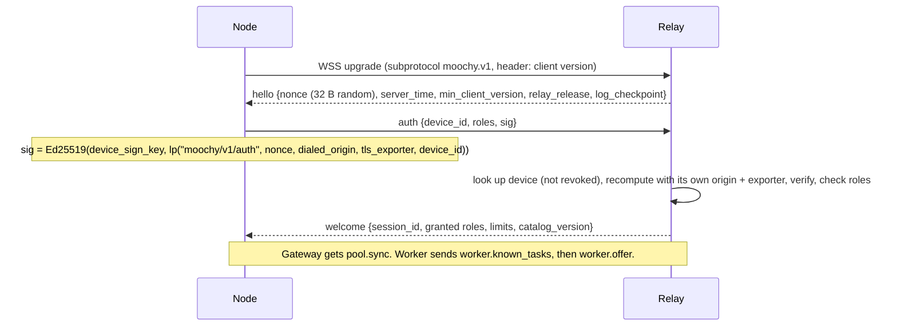
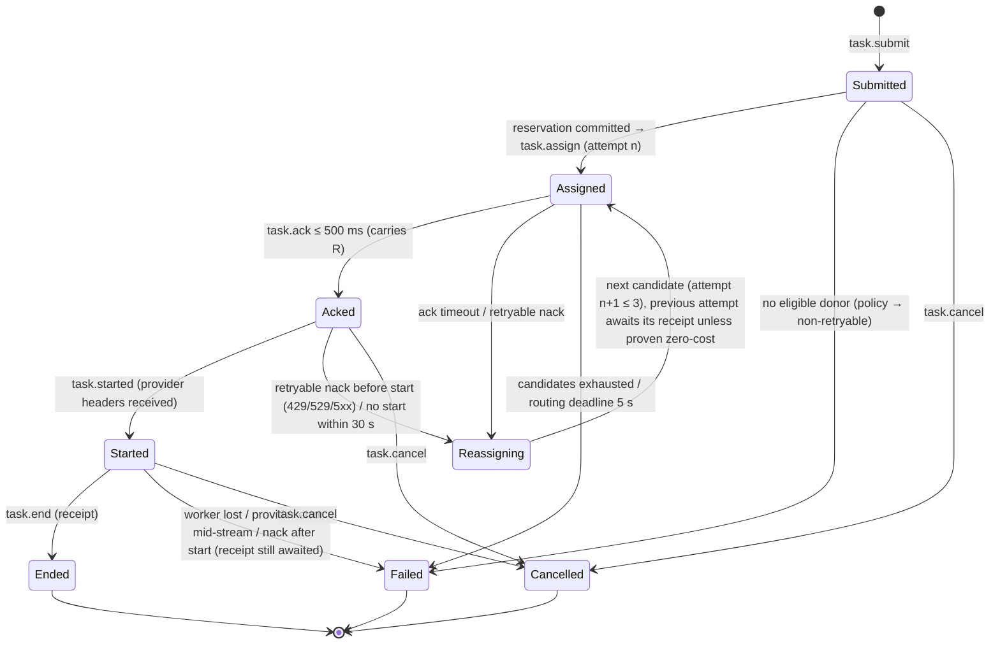

# 03 — Wire Protocol (`moochy.v1`)

> Every byte that crosses the network between Nodes and the Relay: transport, authentication, framing, end-to-end envelopes, task authenticity, streaming, failover, cancellation, receipts, disputes, and versioning.
> Field tables describe semantics only. Exact encodings are fixed by the **golden test vectors** in `spec/vectors/` ([§17](#17-test-vectors)).
> Notation: `lp(a, b, …)` is the **length-prefixed** concatenation (each field preceded by its 4-byte big-endian length). Every signature, hash, and key derivation input uses `lp`, so field boundaries can never be ambiguous.

---

## 1. Design principles

1. **One connection per Node.** A single WSS connection carries all roles (Gateway and Worker) and all concurrent tasks. All local clients share it through the Node.
2. **Text frames for control, binary frames for bulk.** Control messages are small JSON objects. Request bodies and output chunks are binary, so there is no base64 inflation and no JSON parsing of large payloads.
3. **The Relay never needs the plaintext, and never gets to choose keys.** Everything it routes on is in a small plaintext **route header**. Everything else is sealed between the open-source endpoints. Every encryption key is unique per body and per attempt (§6).
4. **Sign bytes, not objects.** Signed artifacts are transmitted and stored as the exact byte strings that were signed. Nobody re-serializes them, so there is no canonical-JSON implementation to get wrong in two languages.
5. **Domain separation everywhere.** Every signature, commitment, and key derivation starts with a distinct label (`moochy/v1/receipt`, `moochy/v1/auth`, …) inside `lp(…)`, so a value made for one purpose can never be replayed as another.
6. **Client-generated identifiers, scoped to their creator.** Task ids are ULIDs created by the Gateway. Deduplication is per `(gateway_device, task_id)`, so retries never double-spend and one device cannot collide with another's tasks.
7. **Fail toward the client's own retry logic.** Errors reach the client as the provider's native error shapes, so existing agent harnesses already know what to do. Policy failures are explicitly **non-retryable** so agents do not loop.

---

> **Update (ADR-33):** the transport is **gRPC over HTTP/2** (`spec/proto/moochy/v1/link.proto`, `spec/CONTRACT.md` §12). The WebSocket subprotocol and the 23-byte binary frame header below are superseded: a gRPC stream identifies each task, `Chunk{attempt, seq, last, ct}` carries ciphertext, and all cryptography, AAD, signatures, receipts and semantics in this document are unchanged.

## 2. Transport

| Property | Value |
|---|---|
| URL | `wss://relay.moochy.dev/v1/node` (or any self-hosted relay) |
| TLS | 1.3 only, terminated **in the Relay process** (required for channel binding, §3) |
| WebSocket subprotocol | `moochy.v1` (the Relay rejects the upgrade without it) |
| Compression | WebSocket `permessage-deflate` **disabled**. Bodies are zstd-compressed before sealing, and ciphertext does not compress |
| Keepalive | WS ping every **15 s**; the peer is considered dead after **2 missed pongs** or on TCP close. Ping RTT feeds the Scheduler's latency estimate (EWMA, α = 0.2) |
| Max frame | 64 KiB including header and AEAD tag (§4.2) |
| Max request body | 32 MiB decompressed (checked by the Worker); the sealed size is checked against the same bound by the Relay |

---

## 3. Authentication handshake

- `dialed_origin` is the origin the **Node itself dialed and verified with TLS**. It is never taken from `hello`, so a phishing or self-hosted relay cannot relay a login to moochy.dev.
- `tls_exporter` is the RFC 9266 `tls-exporter` channel-binding value for this TLS connection. A signature captured on one connection is useless on any other.
- No bearer token on the wire, and **no shared secret stored server-side**. The draft's `mcp_secret` column (plaintext, per repo) is removed. A database leak exposes only public keys.
- A new successful auth for a device **closes that device's previous session** (§14). Events from non-current sessions are ignored.
- Clock skew larger than 5 min (from `server_time`) produces a local warning. Task ids carry timestamps that Workers check (§7).

---

## 4. Frame format

### 4.1 Text frames (control)

A JSON object with a mandatory `t` field (message type) and, when task-scoped, `task` (ULID string) and `attempt` (integer). Unknown fields MUST be ignored. Unknown `t` values MUST be answered with `error{code: "unknown_type"}` and otherwise ignored.

### 4.2 Binary frames (bulk)

| Offset | Size | Field | Meaning |
|---|---|---|---|
| 0 | 1 | `kind` | `0x01` request-body chunk, `0x02` response chunk (`0x03` reserved for delta bodies, §9) |
| 1 | 16 | `task_id` | ULID, binary |
| 17 | 1 | `attempt` | Assignment attempt number (1–3) |
| 18 | 4 | `seq` | Big-endian chunk counter starting at 0 |
| 22 | 1 | `flags` | bit0 = last chunk of this stream |
| 23 | n | `payload` | AEAD ciphertext including its 16-byte tag (opaque to the Relay) |

A frame is at most 64 KiB, so a plaintext chunk is at most **65,536 − 23 − 16 = 65,497 bytes**.

The Edge forwards a binary frame only if it arrives **on the connection registered as that task's expected source**. Frames for a task from any other connection are dropped and counted. A Node cannot inject frames into someone else's task.

---

## 5. Message catalog

### 5.1 Gateway ⇄ Relay

| `t` | Direction | Key fields | Notes |
|---|---|---|---|
| `pool.sync` | R → G | `repo`, `workers[]` = {`worker_device`, `enc_pub`, `key_log_index`, `approval_log_index`, `donor_pseudonym`, `dialects`, `models[]`, `hint`}, `full` or `delta` | After welcome (full) and on change (delta). The Gateway **independently verifies** from its key-log mirror that the key is logged and that the donor has an **owner-signed approval** for this repo ([06 §10](06-security-and-trust.md)). `hint` is a coarse 0–100 score, at most once per second |
| `task.submit` | G → R | `task`, `route` (§7), `wraps[]` = {`worker_device`, `wrap`}, `body_len`, `body_chunks` | Followed by binary `0x01` frames. Deduplicated per `(gateway_device, task)` |
| `task.wraps` | G → R | `task`, `wraps[]` | Answers `task.need_wraps`. The sealed body is not resent |
| `task.need_wraps` | R → G | `task`, `workers[]` | None of the wrapped candidates is eligible; one RTT, only on a stale snapshot |
| `task.accepted` | R → G | `task`, `attempt`, `worker_device`, `R` | `R` = the Worker's per-attempt response salt (§6.3). The Gateway will decrypt only this attempt's stream |
| `task.started` | R → G | `task`, `attempt` | The provider has answered with response headers. **No failover after this point, ever** |
| `task.checkpoint` | R → G | `task`, `attempt`, `seq`, `running_hash`, `sig` | Forwarded Worker progress signature (§12.3) |
| (binary `0x02`) | R → G | response chunks | In order by `seq` |
| `task.end` | R → G | `task`, `attempt`, `receipt`, `donor_sig`, `projection`, `projection_sig` | Stream complete (§12) |
| `task.failed` | R → G | `task`, `code`, `retryable`, `retry_after_ms`, `sealed_detail?` | Converted by the Gateway into a provider-native error (§10.3) |
| `task.cancel` | G → R | `task`, `reason` | The client closed the request |
| `receipt.dispute` | G → R | `task`, `attempt`, `code`, `gateway_sig` | Only when a receipt does not match what the Gateway saw (§12.2) |

### 5.2 Worker ⇄ Relay

| `t` | Direction | Key fields | Notes |
|---|---|---|---|
| `worker.known_tasks` | W → R | `tasks[]` = {`task`, `attempt`, `state`} | Sent right after welcome: everything the Worker has in progress or in its outbox. The Relay releases, at zero cost, any reservation it holds for this Worker that is not listed ([05 §7](05-ledger-and-accounting.md)) |
| `worker.offer` | W → R | `slots_free`, `models[]` = {`dialect`, `model`, `rl_headroom`}, `pledges[]`, `window`, `local_cap_left` | On connect and whenever something changes. Credit-based capacity grant (§11). Only the latest offer per worker is kept |
| `task.assign` | R → W | `task`, `attempt`, `route`, `wrap`, `pledge`, `deadline_ack_ms` | Sent **only after the reservation is durably committed** ([05 §5](05-ledger-and-accounting.md)). Followed by body frames |
| `task.ack` | W → R | `task`, `attempt`, `R` | Within **500 ms** of the last body frame. Means: authentic, decrypted, firewall passed, local caps reserved, provider call starting |
| `task.nack` | W → R | `task`, `attempt`, `R`, `code`, `retryable`, `retry_after_ms`, `sealed_detail?` | §10.2. Details (such as the rejected field name) are sealed to the Gateway, so the Relay sees only the code |
| `task.started` | W → R | `task`, `attempt` | Provider response headers received |
| `task.checkpoint` | W → R | `task`, `attempt`, `seq`, `running_hash`, `sig` | §12.3 |
| (binary `0x02`) | W → R | response chunks | — |
| `task.end` | W → R | `task`, `attempt`, `receipt`, `donor_sig`, `projection`, `projection_sig` | Also replayed from the outbox after reconnects |
| `task.cancel` | R → W | `task`, `attempt` | The Worker MUST abort the provider request immediately |
| `receipt.ack` | R → W | `task`, `attempt` | Sent only **after** the receipt is committed with `synchronous=FULL`. The Worker marks the outbox entry acknowledged and keeps it 7 more days |
| `receipt.replay_since` | R → W | `since` (timestamp) | After a disaster-recovery restore: resend every receipt (acknowledged or not) since that time |

### 5.3 Common

| `t` | Direction | Purpose |
|---|---|---|
| `relay.draining` | R → N | A restart is imminent: `reconnect_after_ms` (Gateways: 0, Workers: jittered 0–10 s) |
| `log.checkpoint` | R → N | Newest signed key-log checkpoint |
| `catalog.update` | R → N | New signed catalog version (Nodes reject version decreases) |
| `error` | both | `code`, `message`, optional `task` |

---

## 6. End-to-end envelopes

### 6.1 Keys and derivations

| Key | Holder | Derivation / use |
|---|---|---|
| Device signing key (Ed25519) | Each Node | Auth, task signatures, receipts, projections, checkpoints, disputes, approvals |
| Device encryption key (X25519) | Each Node acting as Worker | Receiving content keys |
| Content key **CK** (32 bytes random) | Fresh for **every sealed body**, created by the Gateway | Never used directly as an AEAD key, only as HKDF input |
| Request key **K_req** | Both ends | `HKDF-SHA256(ikm = CK, info = lp("moochy/v1/req", task_id))` |
| Response salt **R** (32 bytes random) | Drawn by the Worker for **each attempt** | Sent in `task.ack` / `task.nack` |
| Response key **RK** | Both ends | `HKDF-SHA256(ikm = CK, salt = R, info = lp("moochy/v1/resp", task_id, worker_device, attempt))` |
| Commitment salts | Both ends | `S` (32 bytes random, inside the sealed payload) → `S_req`, `S_resp`, `S_pid` = `HKDF(S, info = lp("moochy/v1/salt", name))` |

**Why per-attempt response keys.** If two Workers (an honest failover, or a Relay deliberately assigning one task twice) ever encrypted under the same key with the same counters, the Relay could XOR the streams and forge chunks. With `R` drawn fresh by each Worker and bound into both the key and the AAD, **no two streams can ever share a key**, whatever the Relay does. If a re-seal is ever needed, it uses a fresh CK with fresh wraps.

### 6.2 Sealing the request

1. The Gateway builds the **inner payload**: `{body (zstd), body_sha256, provider_headers (allowlisted, e.g. API version and beta values), S, gateway_device, task_sig}` where `task_sig` is defined in §7.2.
2. It encrypts it with **ChaCha20-Poly1305** under `K_req`, in chunks of ≤ 65,497 bytes. Nonce = `seq` (96-bit big-endian; unique because `K_req` is used for exactly one body). AAD = `lp("moochy/v1/req", kind, task_id, seq, last_flag)`.
3. For each candidate Worker: `wrap_i = HPKE.Seal(pk = enc_pub_i, info = lp("moochy/v1/wrap", suite_id, task_id), aad = route_header_bytes, pt = CK)`. HPKE base mode, suite DHKEM(X25519, HKDF-SHA256) / HKDF-SHA256 / ChaCha20-Poly1305. About 80 bytes each.

The body is sealed **once** and works for any recipient. Adding a recipient later costs one more 80-byte wrap, never a re-upload. That property is what makes **zero-RTT failover compatible with end-to-end encryption**. Binding `route_header_bytes` as HPKE AAD means a Relay that tampers with the route header (for example, swapping in a cheaper model to steal budget) makes the unwrap fail. Putting `suite_id` in the HPKE info (and in each device's `KEY_ADDED` entry) prevents downgrade across protocol versions.

### 6.3 Sealing the response

Each output chunk is encrypted under **RK** of the current attempt. Nonce = `seq`. AAD = `lp("moochy/v1/resp", task_id, attempt, R, seq, last_flag)`. The Gateway:

- decrypts only frames of the attempt named in `task.accepted`, under that attempt's RK;
- **aborts the task** if response frames ever appear for a second started attempt (only possible through a Relay bug or attack).

Binding `task_id`, `attempt`, `R`, `seq`, and the last-flag prevents reordering, splicing between tasks or attempts, and silent truncation.

### 6.4 What the Relay can and cannot see

| Visible to the Relay | Hidden from the Relay |
|---|---|
| Route header (§7): repo, dialect, model, effort, `max_tokens`, deterministic input estimate, stream flag, affinity key (an opaque HMAC) | System prompt, messages, tools, code, outputs, provider headers |
| Sizes and timings of frames; NACK codes | NACK details (sealed), commitment salts |
| Usage numbers and cost in receipts | Provider request id (only a salted hash) |

---

## 7. Route header and task authenticity

### 7.1 Route header

The plaintext the Relay schedules on. It is bound into every wrap (HPKE AAD), and the **Worker MUST check that it matches the decrypted body**.

| Field | Source | Worker check |
|---|---|---|
| `repo_id` | Gateway's repo for this token | Equals the repo of the assigned pledge (Worker's own pledge table) |
| `dialect` | `anthropic.messages` or `openai.chat` | Exact |
| `model` | Public model id ([05 §2](05-ledger-and-accounting.md)) | Exact (after catalog mapping to the provider's id) |
| `effort` | `output_config.effort` / `reasoning_effort`; when absent, the **model's default from the catalog** | Effective value matches |
| `max_tokens` | `max_tokens` / `max_completion_tokens` | Exact; MUST be present |
| `est_input_tokens` | **Deterministic estimate**: `ceil(text_bytes / 3) + images × catalog.max_image_tokens + pages × catalog.max_page_tokens` | **Recomputed by the Worker and must match exactly** |
| `cache_ttl` | Longest `cache_control.ttl` present (`none`, `5m`, `1h`) | Matches |
| `stream` | `stream` | Exact |
| `affinity` | `HMAC(per-device secret, lp(system, tools, first user message))`, 16 bytes | Not checked (no effect on cost); unguessable by the Relay |
| `flags` | e.g. `fast`, `images`, `documents` | Each requires donor opt-in |

On a mismatch the Worker sends `task.nack{code: "route_mismatch", retryable: false}` and the submitting member gets a strike. This closes the attack of declaring a cheap model or a small input in the header and sending something expensive in the sealed body.

### 7.2 Who created this task?

HPKE base mode means anyone who knows a Worker's public key, including the Relay, could build a valid envelope. So the Gateway **signs every task**, inside the sealed payload:

`task_sig = Ed25519(gateway_sign_key, lp("moochy/v1/task", task_id, repo_id, route_header_bytes, body_sha256, provider_headers_sha256))`

Before acking, the Worker checks:

1. `task_sig` is valid for `gateway_device`, whose key is in the key log and not revoked;
2. the key log has an **owner-signed `MEMBER_ADDED`** for that user and `repo_id` (or the user is the repo's owner);
3. the assigned pledge belongs to this donor and to `repo_id`;
4. the ULID timestamp of `task_id` is within ±10 minutes of the Worker's clock;
5. `(gateway_device, task_id)` has **never been served** by this Worker (a persisted set covering the ±10 minute window).

A malicious Relay therefore cannot run its own inference on donor keys, replay genuine tasks, or move a task to another repo's pledge.

---

## 8. Body handling at the Worker

1. Find the wrap → HPKE-open CK → derive `K_req` → decrypt chunks → zstd-decompress → check `body_sha256`.
2. Verify §7.2, then the **firewall** ([06 §7](06-security-and-trust.md)) and the route-header checks (§7.1).
3. **Reserve locally** against the device cap and per-pledge counters with the same `reserve()` formula as the Relay ([05 §6](05-ledger-and-accounting.md)).
4. Draw `R`, send `task.ack`, call the provider.

---

## 9. Deferred optimization: prefix-delta transfer

Agent harnesses resend the whole conversation every turn. Sending only the new suffix would save upload bandwidth. Review showed the real gain after zstd compression is about 65–100 ms per turn on a 10 Mbit/s uplink, small next to model time-to-first-token. It also adds a frame kind, two messages, a Worker cache, and failure paths. So it is **designed but not built in v1**. Frame kind `0x03` is reserved. **Trigger to build it:** Gateway-measured upload p50 > 150 ms, or Relay egress among the top 3 costs. When built, every delta and every full resend is a separately sealed body with its **own fresh CK** (§6.1), and the Worker's base cache is keyed by `(gateway_device, base_task_id)`.

---

## 10. Streaming, failover, and errors

### 10.1 Task lifecycle (wire view)

Rules:

- **No failover after `task.started`.** Once the provider has accepted the request, any second attempt would be an unrequested hedge (ADR-20) and could bill the donor twice. Mid-stream failures become clean, provider-native, retryable errors. The agent's own retry produces a fresh task.
- **Late messages** from a superseded attempt (late ACK, late start) are answered with `task.cancel` for that attempt and otherwise ignored. Its receipt still settles whatever it actually spent.
- The routing deadline (5 s) starts when the **last body frame has been received** by the Relay, so large uploads on slow links are not penalized.
- The Relay frees its copy of the sealed body at `task.started`. Memory is bounded by tasks that have not started, under global and per-device byte budgets at the Edge (retryable `overloaded` when exceeded).

### 10.2 NACK codes

| Code | Retry elsewhere | Typical cause | Effect |
|---|---|---|---|
| `busy` | yes | Slot race | none |
| `rate_limited` | yes | Provider 429; `retry_after_ms` | Cool down that (worker, model) |
| `overloaded` | yes | Provider 529/503 | Short back-off |
| `provider_error` | yes | Provider 5xx or network before start | Failure penalty |
| `local_cap` | yes | Device cap, pledge counter, or schedule window | Excluded until next offer |
| `model_unavailable` | yes | Key cannot use the model | Model removed from the offer |
| `firewall` | **no** | Disallowed field or feature (detail sealed to the Gateway) | Native `invalid_request_error`; strike |
| `route_mismatch` | **no** | Header ≠ body | Native error; strike |
| `unauthorized_task` | **no** | §7.2 check failed | Alert (possible Relay misbehavior) |
| `bad_envelope` | **no** | Decryption or hash failure | Alert (possible tampering) |

### 10.3 Errors shown to the client

The Gateway converts every `task.failed` into the dialect's native error. For Anthropic: HTTP 429/529 with an `error` body before streaming, or an `event: error` SSE event (`overloaded_error`, `rate_limit_error`, `api_error`) after. For OpenAI-style: the corresponding HTTP status and error object. Policy failures use **non-retryable** shapes with explicit messages: `over_task_cap` and `quota_exceeded` (HTTP 400/403 with "moochy: this request's worst-case cost exceeds the donors' per-task cap"), `model_not_in_pool` (404), `firewall` (400, with the sealed detail, e.g. "field `mcp_servers` is not allowed by the donor pool").

---

## 11. Capacity grants (slots)

Workers **offer** capacity; the Relay never pushes work blindly. `worker.offer.slots_free` is how many more tasks the Worker will accept right now (donor-configured maximum, default 4). The Scheduler decrements its copy when it assigns and subtracts the reservation from `local_cap_left`. The Worker sends a fresh offer when a task ends or when headroom or the schedule window changes. So the 500 ms ACK deadline exists to detect dead or stalled Workers, not busy ones.

---

## 12. Receipts, disputes, and progress signatures

### 12.1 Receipt (the signed byte string)

| Field | Meaning |
|---|---|
| `v` | `1` |
| `task_id`, `attempt`, `repo_id`, `pledge_id` | Identifiers (pseudonymous; no usernames) |
| `worker_device`, `gateway_device` | Device ids |
| `dialect`, `provider`, `model_reported` | `model_reported` is the model string from the provider's response |
| `usage` | `input`, `output`, `cache_write_5m`, `cache_write_1h`, `cache_read`, `estimated` (bool), `provider_cost` (when the provider reports one, e.g. OpenRouter) |
| `catalog_version`, `cost_uusd` | The Relay recomputes cost independently ([05 §3](05-ledger-and-accounting.md)) |
| `req_commit` | `SHA-256(lp("moochy/v1/req-commit", S_req, request body as sent by the Gateway, before any Worker-side safe mutation))` |
| `resp_commit` | `SHA-256(lp("moochy/v1/resp-commit", S_resp, concatenated plaintext response bytes))` |
| `provider_req_hash` | `SHA-256(lp("moochy/v1/provider-req", S_pid, provider request id))` |
| `status` | `ok`, `cancelled`, `provider_error`, `partial`, `not_started` |
| `t_start`, `t_started`, `t_end` | Worker timestamps (ms) |

`donor_sig = Ed25519(worker_sign_key, lp("moochy/v1/receipt", receipt_bytes))`.

The full receipt stays with the two parties and the Relay database. **Publicly** only a **projection** is shown: `{receipt_ref (random), repo_id, donor pseudonym (per the pledge's visibility), model, cost_uusd, UTC day, SHA-256(receipt_bytes)}`, with its own `projection_sig = Ed25519(worker_sign_key, lp("moochy/v1/projection", projection_bytes))`. Projections reveal no device ids, no timestamps finer than a day, and no task ids. They do not publish anyone's online schedule or work timeline, yet anyone can verify them against the donor's logged key.

### 12.2 Acknowledgment by silence, disputes by signature

The Gateway checks every receipt against what it actually sent and received:

- `req_commit` and `resp_commit` recomputed from its own bytes;
- input and cache fields within a band around its own deterministic estimate; `cache_write_1h > 0` only if the request used a 1-hour TTL;
- for **non-reasoning** responses, visible output tokens within ±25% of its own count (reasoning output is bounded only by `max_tokens`, since it is not visible);
- `model_reported` matches the requested model or its catalog alias.

If everything matches, the Gateway does nothing (**silence = acceptance**). Otherwise it sends `receipt.dispute{code}` signed with `lp("moochy/v1/dispute", task_id, attempt, code)`. Disputed receipts still settle money (the donor's provider was billed either way) but are excluded from leaderboards and reviewed ([06 §9](06-security-and-trust.md)). This gives most of the value of countersigning with one message instead of one per task. Full countersigning can be added later if leaderboard fraud appears.

### 12.3 Progress signatures (accountability for streamed tool calls)

A malicious Worker could stream a poisoned tool call and disconnect before signing any receipt. To prevent that, the Worker signs a **checkpoint** at the end of every tool-call block (Anthropic `tool_use` blocks, OpenAI `tool_calls` per index) and on the last chunk:

`sig = Ed25519(worker_sign_key, lp("moochy/v1/resp-progress", task_id, attempt, R, seq, running SHA-256 of plaintext so far))`

The Gateway already holds each tool-call block until its end for the tripwire ([06 §8](06-security-and-trust.md)). It **releases a tool-call block to the client only after verifying a checkpoint that covers it**. Otherwise it substitutes an error tool result. Text still streams immediately. Every tool call a client ever executes is therefore signed by a known donor device.

### 12.4 Verification rules

Ed25519 verification is pinned to **ZIP-215 semantics in both Go and Rust**, with edge-case vectors in `spec/vectors/`, so a signature can never be valid for the Relay and invalid for a Gateway or an auditor.

---

## 13. Cancellation

The client closes its HTTP request (or MCP call) → the Gateway sends `task.cancel` → the Relay forwards it to the Worker of the current attempt → the Worker **aborts the provider HTTP request** (the provider stops generating and stops billing) → it emits a receipt with `status: cancelled` and the usage actually incurred. If the provider's final usage event never arrived, the receipt is `estimated: true` and settles **pessimistically** ([05 §5](05-ledger-and-accounting.md)).

If a **Gateway's connection drops** (outside a planned drain), the Relay cancels all of that Gateway's unfinished tasks the same way. Nobody pays for output that nobody will read.

---

## 14. Reconnect, sessions, and resubmission

- Nodes reconnect with exponential back-off and full jitter (base 250 ms, cap 30 s).
- Presence is keyed by `(device_id, session_id)`. A new session closes the old one. Offers, offline events, and frames from a non-current session are ignored, so a slow-to-die old socket cannot remove a live worker.
- **Resubmission** of the same `task_id` by the same Gateway device after a reconnect: if the task has not started, its route moves to the new connection; if it has, the final state (receipt or failure) is replayed.
- **Worker link loss:** the Worker aborts all its in-flight provider calls (the Gateway's side has lost the stream anyway) and writes a receipt for each to its outbox (`not_started` with zero usage when the provider was never called). On reconnect it sends `worker.known_tasks`, then replays its outbox.
- **No stream resume in v1.** A Gateway that loses its connection mid-stream loses that task's output, and the client retries. (Possible later: the Relay keeps the last 256 KiB of each stream for 30 s. Add it if mid-stream Gateway disconnects exceed 0.5% of tasks.)

---

## 15. Versioning and compatibility

- The subprotocol string carries the major version (`moochy.v1`). A breaking change gets a new subprotocol, and a relay serves both for at least 90 days.
- Within v1, fields are additive and unknown fields are ignored. `hello.min_client_version` lets the Relay refuse Nodes with known security bugs.
- Labels include `v1` and the HPKE info includes the suite id, so v2 values can never be confused with or downgraded to v1.

---

## 16. Limits and quotas (defaults)

| Limit | Default | Enforced by |
|---|---|---|
| Max concurrent tasks per Gateway device | 16 | Relay |
| Max task submissions per member per minute | 120 | Relay (token bucket) |
| Max request body | 32 MiB decompressed | Worker; Relay on sealed size |
| Buffered (not yet started) bodies | global and per-device byte budgets | Relay Edge |
| Per-task response buffer at the Relay | 1 MiB (task fails if the Gateway cannot keep up) | Relay |
| Worker slots | 4 (1–64) | Worker |
| Wraps per submit | ≤ 8 | Relay |
| Attempts per task | 3 | Relay |
| ACK deadline | 500 ms after the last body frame reaches the Worker | Relay |
| Start deadline | 30 s after ACK | Relay |
| Routing deadline | 5 s after the last body frame reaches the Relay | Relay |
| Task-id freshness | ±10 min | Worker |

---

## 17. Test vectors

Golden files live in `spec/vectors/` of the open-source monorepo. The Go relay, the Rust client, and any third-party implementation MUST pass the same files:

- `lp` encoding; every label.
- Auth signature strings with channel binding.
- Envelope: fixed CK, recipients, `R` values → exact wraps, `K_req`, `RK`, chunk ciphertexts. **Includes a vector proving that two attempts of one task derive different response keys.**
- Task signature, receipt, projection, progress-checkpoint, and dispute bytes and signatures.
- Ed25519 ZIP-215 edge cases (non-canonical encodings, small-order points).
- Binary frame headers (round trip, maximum sizes).
- Route-header ↔ body consistency cases, including the deterministic input estimate.
- tlog inclusion and consistency proofs for the key log, and the checkpoint note format.

A protocol change is not done until the vectors are regenerated and every implementation passes them.
