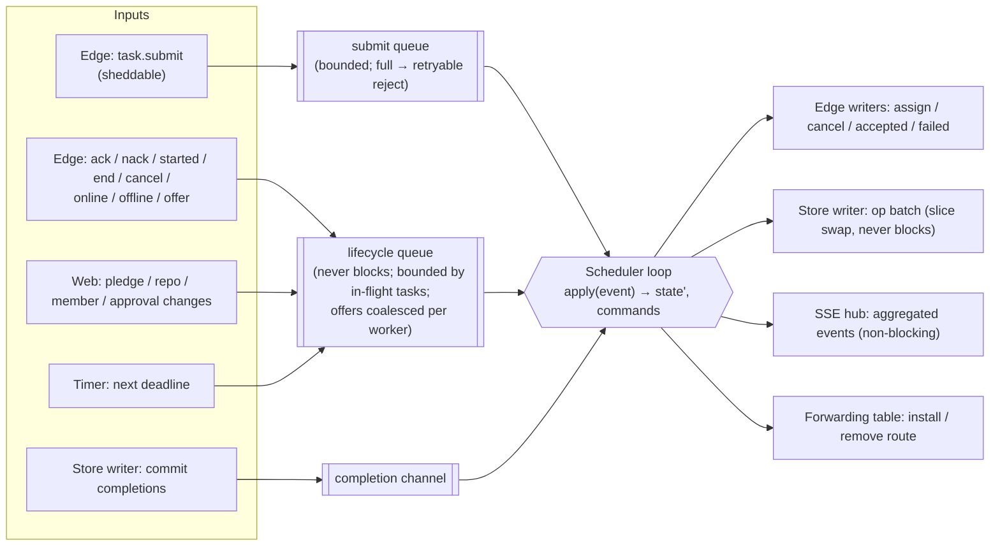
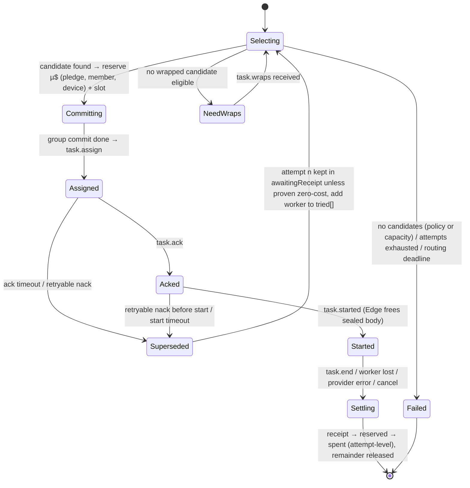

# 04 — Routing Engine (Scheduler)

> How a task finds a donor: data structures, the eligibility predicate, selection, session affinity, capacity, rate-limit awareness, deadlines, failover, fairness, backpressure, and how all of it is tested deterministically.

---

## 1. Why the draft's design changes

The draft proposed a "lock-free `sync.Map` registry indexed by model, effort, balance, RTT". Three problems:

1. **Matching is a read-modify-write across several entities.** Choosing a worker, decrementing its slot, and reserving µ$ against a pledge, a member, and a device must be atomic together. `sync.Map` makes single-key operations atomic, not multi-entity transactions. With it, two concurrent submits can both see "budget left: 10" and both reserve 8. That is exactly the double-spend the draft wants to avoid.
2. **Lock-free multi-index structures are hard to get right** and hard to test.
3. **The workload is tiny for a CPU.** Even at 1,000 task starts per second with ~6 events each, one goroutine spends a few percent of one core.

**Decision: one goroutine owns all control-plane state (the actor pattern).** Every change is a message applied in order. No locks, no races. Every invariant can be checked after every message. The Scheduler is a **pure state machine**: given an event log, it replays deterministically, which gives simulation testing for free (§12).

`sync.Map` keeps one legitimate job, in the **data plane**: the forwarding table `task_id → (expected source connection, destination connection)`, written once per attempt and read for every chunk ([02 §7](02-architecture-overview.md)).

---

## 2. Actor anatomy and backpressure

- **Only submits are sheddable.** When the submit queue is full, the Edge rejects new submits with a retryable error. That is backpressure at the cheapest point, where no money has moved yet.
- **Lifecycle events are never dropped and never block the Edge.** They are naturally bounded (each in-flight task produces a handful), and `worker.offer` is coalesced to the latest one per worker. Edge reader goroutines never stall, so WebSocket pongs keep flowing and a load spike cannot snowball into mass disconnects.
- **The Store writer never back-pressures the Scheduler.** The Scheduler appends ops to a slice that the writer swaps out on each group commit. Commit completions come back on **their own channel**, so there is no cycle between the Scheduler and the writer that could deadlock.
- **Commands to connections** are non-blocking sends to per-connection writer queues. If one overflows, that connection is closed and handled like a disconnect.
- **Timers**: a min-heap of short deadlines (ACK, start, routing) with one `time.Timer` reset to the earliest. Long-horizon items (24 h receipt waits) are **not** timers; they are periodic SQL sweeps (§8).

---

## 3. State

| Structure | Key → Value | Notes |
|---|---|---|
| `sessions` | `(device_id) → {session_id, conn}` | Only the current session counts; events from older sessions are ignored |
| `workers` | `device_id → {donor_id, rtt_ewma, slots_free, slots_max, models{(dialect, model) → rl_state}, pledges_served, window_open, local_cap_left, fail_penalty}` | Updated by offers, pings, outcomes |
| `pledges` | `pledge_id → {donor_id, repo_id, status, approved, budget, spent, reserved, per_task_cap, policy}` | Loaded at boot; live balances authoritative here, persisted by group commit |
| `pools` | `(repo_id, dialect, model) → [pledge_id]` | Rebuilt on pledge changes; usually a few entries |
| `donorWorkers` | `donor_id → [device_id]` | — |
| `members` | `(repo_id, user_id) → {cap, spent, reserved, month}` | Member quotas |
| `devices` | `device_id → {repo_scope, cap, spent, reserved, month}` | Only for devices with a cap (CI / headless agents) |
| `affinity` | `(gateway_device, affinity_key) → {worker_device, expires_at}` | Sliding TTL (§5) |
| `inflight` | `task_id → {gateway_device, repo, member, route, wraps, tried[], attempt, attempts{n → {worker, reservation, state}}, deadlines}` | Removed when every attempt is settled or released |
| `awaitingReceipt` | `(task_id, attempt) → {worker, reservation}` | Small: attempts that may have spent money and whose receipt has not arrived yet |

Memory at the design point (10k workers, 5k in-flight tasks, 50k affinity entries) is about 50 MB. Sealed bodies live in the Edge (under byte budgets), never here.

---

## 4. Eligibility predicate

A worker *w* serving pledge *p* is eligible for task *t* if **all** of the following hold. They are evaluated cheapest-first, and the evaluation records **which rule eliminated the most candidates**, so a policy failure can be reported precisely (§8.3).

1. `p` is in `pools[(t.repo, t.dialect, t.model)]` (the model is allowed by policy and served by this pool).
2. `p.status == ACTIVE` and `p.approved`. (Gateways additionally seal only to donors with an **owner-signed approval** in the key log, [06 §10](06-security-and-trust.md), so the Relay cannot add an unapproved donor even if it lies here.)
3. `w` belongs to `p.donor`, has a current session, `window_open`, and `slots_free > 0`.
4. `w` offers `(t.dialect, t.model)` and its rate-limit state is not cooling down.
5. `t.effort ≤ p.policy.max_effort`, and every flag in `t.flags` is allowed by `p.policy`.
6. `reserve(t, p) ≤ p.per_task_cap`.
7. `reserve(t, p) ≤ p.budget − p.spent − p.reserved` (pledge headroom).
8. `reserve(t, p) ≤ w.local_cap_left` (the donor device's own cap, as reported and decremented on reservation).
9. Member quota: `reserve(t, p) ≤ m.cap − m.spent − m.reserved`, and the same for the submitting device's cap when one is set.
10. `w` is not in `t.tried` (no second attempt on the same worker within one task).
11. `w` has a wrap in `t.wraps` (otherwise it may be proposed in `task.need_wraps`).

`reserve(t, p)` is defined in [05 §5](05-ledger-and-accounting.md). It uses **the candidate's own provider price**, since the same public model id can be served by different providers ([05 §2](05-ledger-and-accounting.md)).

---

## 5. Session affinity: the biggest money lever in the system

Provider prompt caches are **per account and exact-prefix**. An agent session on one donor key can read its cached prefix at about 2.5–10% of the normal input price, depending on the model (for example, $0.20 per MTok instead of $4 on Claude Opus 5.5). OpenAI-style providers with automatic prefix caching (OpenAI, DeepSeek) reward the same stickiness. The same session spread across random donors misses the cache **every turn**.

**Worked example** (Claude Opus 5.5 at $4/$20 per MTok, cache read $0.20, 5-minute cache write 1.25× = $5). A 50-turn agent session with ~80k tokens of context per turn, growing by ~2k per turn:

| Routing | Input cost per turn | 50-turn session |
|---|---|---|
| Random donor every turn (no cache hits) | 80k × $4/M ≈ $0.32 | ≈ $16 |
| Sticky donor (cache hits) | 78k × $0.20/M + 2k × $5/M ≈ $0.026 | ≈ $1.30 |

So **affinity makes donated money go about 10× further on input**, before any other optimization.

**Mechanics**

- The **affinity key** is computed by the Gateway: `HMAC(per-device secret, lp(system, tools, first user message))`, truncated to 16 bytes. It is stable for the lifetime of an agent conversation, and it is **unguessable** by the Relay (an unsalted hash of public harness prompts would let the Relay fingerprint which harness a maintainer uses).
- **TTL**: 5 minutes sliding, matching the provider's default cache TTL. When `route.cache_ttl == 1h`, 60 minutes. Once the cache would have expired, there is nothing left to be sticky for.
- **Selection rule**: if the affinity entry exists and its worker is eligible → choose it, unless its score (§6) is worse than the best alternative by more than an *affinity margin* (default 3×). The margin keeps a saturated or slow donor from holding a session hostage.
- On failover, the affinity entry moves to the new worker. One cache miss, then sticky again.

---

## 6. Selection: budget-weighted power-of-two-choices

Without affinity (or when the affinity worker is not eligible):

1. Collect eligible `(w, p)` pairs (usually under 50; with an affinity hit, 1).
2. Draw **two** at random, **weighted by pledge headroom** (`budget − spent − reserved`).
3. Choose the one with the lower **cost score**:

   `score = rtt_ewma_ms + 40 × (inflight / slots_max) + 200 × rl_pressure + fail_penalty`

   - `rl_pressure` ∈ [0, 1] comes from provider rate-limit headers the Worker reports. It steers traffic away from a key before it hits 429.
   - `fail_penalty` is +100 ms for each failure in the last 5 minutes, decaying linearly.
   - All weights are configuration values with documented defaults (ADR-27).

**Why P2C.** Always choosing "the best" worker sends the whole herd to the same one, because its stats are always slightly stale. Pure random ignores RTT and load. Picking the better of two random choices is a well-studied middle ground: its worst-case load is exponentially better than random, it costs O(1), and it needs no global sorting. Weighting the draw by headroom drains donor budgets **proportionally**, so a small donor is not used up on day 1 while a large one sits idle. Every donor's contribution stays visible all month.

---

## 7. Choosing recipients before the Relay decides (zero-RTT + end-to-end encryption)

The Gateway must seal the content key to specific workers **before** the Relay picks one ([03 §6](03-wire-protocol.md)):

- `pool.sync` gives every Gateway the eligible workers for its repos (keys, models, approval proof) plus a coarse `hint` score, refreshed at most once per second.
- The Gateway wraps for **the affinity worker first** (if known), then the top workers by `hint` for the requested model, up to **8 wraps** (about 640 bytes).
- The Scheduler runs §4–§6 restricted to workers that have a wrap. If none is eligible, it sends `task.need_wraps{workers}` with its own top choices. That costs one RTT, and only when the snapshot was stale.

---

## 8. Commit-before-assign, deadlines, and failover

### 8.1 Commit before assign

A reservation is applied in memory, then the Scheduler emits `task.assign` **only after the group commit containing the reservation and the task row has completed** (completion arrives on the completion channel). That costs at most ~10 ms. In exchange, **a Worker never holds a task the database does not know about**, so a crash can never produce receipts for unknown tasks, and no reservation is lost.

### 8.2 Deadlines

| Deadline | Default | On expiry |
|---|---|---|
| ACK | 500 ms after the last body frame reaches the Worker | Cancel that attempt; it moves to `awaitingReceipt` unless a NACK or zero-usage receipt proves no spend; reassign |
| Start | 30 s after ACK (provider response headers) | Same as above |
| Routing | 5 s after the last body frame reaches the Relay, without an ACK | `task.failed{overloaded, retryable}` |
| Attempts | 3 per task | `task.failed{overloaded, retryable}` |

Long-horizon work is done by **periodic SQL sweeps** (every minute), not by in-memory timers, so restarts never lose it:

- attempts awaiting a receipt for more than 24 h **whose Worker has also been absent** → pessimistic settlement at the reservation;
- receipts older than 24 h without a dispute → final for leaderboards.

### 8.3 Policy failures are not "overloaded"

When no candidate exists, the recorded elimination reason decides the error:

| Dominant reason | Error to the client | Retryable |
|---|---|---|
| No pledge serves the model | `model_not_in_pool` | no |
| Per-task cap (rule 6) | `over_task_cap` (with the worst-case cost and the cap) | no |
| Pledge headroom / member / device quota (rules 7, 9) | `quota_exceeded` | no (until the period resets) |
| Capacity (rules 3, 4, 8, rate limits) | `overloaded` | yes |

Agents stop retrying requests that can never succeed, and the maintainer sees exactly why.

### 8.4 Reassignment state machine (Scheduler view)

**Proof of zero spend** for an attempt is a NACK sent before the provider call (codes `busy`, `local_cap`, `firewall`, `route_mismatch`, `unauthorized_task`, `bad_envelope`) or a `not_started` receipt. Anything else keeps that attempt's reservation until its receipt arrives. This protects the donor's caps from undercounting.

---

## 9. Rate-limit awareness

- Workers parse provider rate-limit headers (remaining requests and tokens with reset times, plus `retry-after`; exact names pinned per adapter) and include a compact `rl_headroom` per model in `worker.offer`. They send an update when headroom crosses 50%, 20%, or 5%, not on every request.
- On a 429 the Worker NACKs with `retry_after_ms`. The Scheduler cools that `(worker, model)` down and immediately reassigns.
- Result: donors' keys are rarely pushed into 429 territory, which matters because repeated 429s can affect a donor's standing with the provider.

---

## 10. Fairness

| Axis | Mechanism |
|---|---|
| **Between donors of one repo** | Headroom-weighted draws (§6) → proportional drain |
| **Between members of one repo** | Per-member monthly caps set by the owner (default: owner unlimited, members 20% of the pool's committed budget); per-member submission rate limit |
| **Autonomous agents (CI devices)** | Their own device caps and a single repo scope ([07 §8.4](07-client-cli.md)) |
| **Between repos sharing a donor** | Separate budgets per pledge; repos compete only for worker slots (first-come). Optional `max_slots` per pledge |
| **Between Moochy and the donor's own use of the key** | Donor-set `slots_max` and schedule windows; rate-limit steering (§9) |

---

## 11. Performance budget and ceilings

| Operation | Target (p99) | Reasoning |
|---|---|---|
| `apply(submit)` incl. eligibility + P2C + reservation | < 50 µs | ≤ 50 candidates × a few checks |
| `apply(ack / started / end)` | < 10 µs | Map updates |
| Chunk forwarding (Edge) | < 5 µs + syscall | One `sync.Map` load, a source check, one channel send |
| Commit-before-assign delay | ≤ 10 ms | One group-commit interval |

> **Ceiling note:** a single Scheduler goroutine tops out somewhere around 100k events/s. At ~6 events per task, the design point (≈ 200 task starts/s with ~5k concurrent streams of ~25 s) needs ~1.2k events/s. Upgrade path: one Scheduler per shard of repos ([02 §12](02-architecture-overview.md)). Same code, partitioned by `repo_id`, correct because tasks never cross repos.

---

## 12. Testing the Scheduler

1. **Pure core.** `apply(state, event) → (state', commands)` has no I/O, no clock reads (time is on the event), and no randomness except a seeded PRNG passed in.
2. **Invariant checks after every event** (always on in tests; cheap enough for a production debug flag):
   - `0 ≤ reserved` and `spent + reserved ≤ budget + overage bound` for every pledge, member, and capped device.
   - `Σ reservations of open attempts == Σ pledge.reserved` (same for members and devices).
   - `slots_free ≥ 0` and `slots_free + open_attempts_on_worker == slots_max` (modulo offers in transit).
   - No attempt is assigned before its reservation's commit completed.
   - No task has two attempts in `Started`.
   - No attempt is assigned to an ineligible worker (re-check §4 at assignment).
3. **Deterministic simulation** (`relay/tools/simulate`): thousands of virtual workers and gateways, injected latency, disconnects, 429 storms, relay restarts, clock jumps, and late or duplicated messages. Same seed → byte-identical runs, so any violation is reproducible from its seed.
4. **Property tests** for selection: proportional drain over 10k tasks within ±5% of the headroom ratios; affinity hit rate ≥ 95% while the affinity worker stays healthy.
5. **Benchmarks** for `apply(submit)` at 10, 100, 1k, and 10k eligible candidates, with a CI regression budget.

---

## 13. Rejected alternatives

| Idea | Why not |
|---|---|
| Global mutex around a shared map | Works, but gives up determinism and replay for no gain |
| Redis / external queue | A network hop and another failure domain for state that fits in one process |
| **Hedged requests** (send to two donors, keep the first) | Doubles donor spend. Donated money is the scarcest resource in the system |
| Failover after the provider started | An unrequested hedge; may bill twice |
| Global "best worker" ranking | Herding and stale scores |
| Latency-only routing | Drains fast donors first, ignores budget fairness, destroys cache affinity |
| Cross-dialect routing (Anthropic-format request → OpenAI-only donor) | Lossy translation (tools, thinking, caching). Mostly unnecessary, because OpenRouter and DeepSeek donors serve both dialects ([07 §6.2](07-client-cli.md)) |
