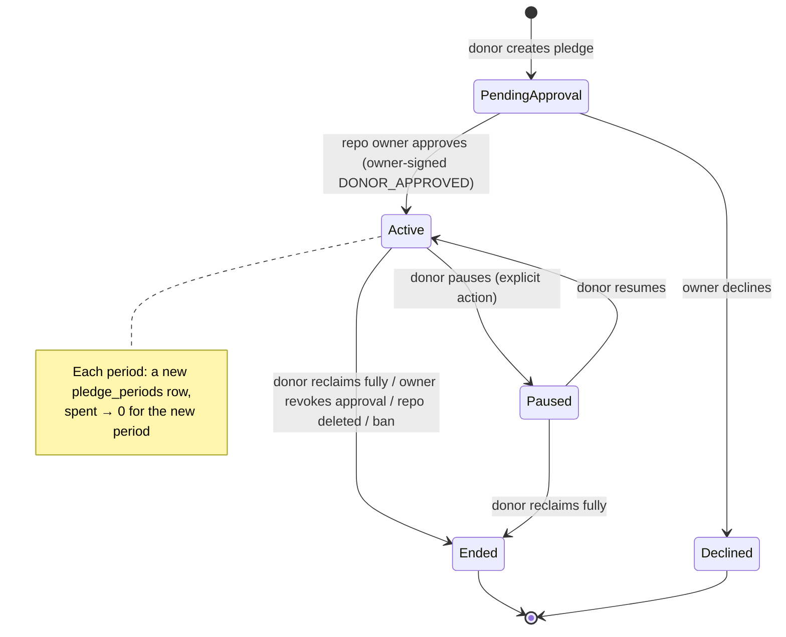

# 05 — Ledger and Accounting

> What a "donation" is, how it is measured, reserved, and settled, how it survives crashes, and how a donor's cap is enforced by three independent mechanisms.

> **Updated 2026-10-01:** aligned with `spec/CONTRACT.md` and ADR-33/34. Changes: adaptive group commit replaces the 10 ms window (ADR-34, C1); a closing schedule window is an eligibility condition, never a pledge status change (C3); `over_task_cap` → 400 `invalid_request_error`, `quota_exceeded` → 403 `permission_error`, never 429 (C4); OpenAI adapter is Phase 1 (D13); public views show model slugs (C11); message names follow the gRPC `NodeLink` (ADR-33).
>
> **Updated 2026-10-02 (main `5f9ccf80`):** D19 ($5 default limit per request wherever a donation is created).

---

## 1. Unit of account: µ$ (micro-US-dollars), not tokens

The draft pledged **tokens**. Tokens are not comparable across models:

| Model (Anthropic API, as of 2026-09) | Input $/MTok | Output $/MTok | Cache read $/MTok |
|---|---|---|---|
| Claude Fable 5.1 | 10.00 | 50.00 | 0.25 |
| Claude Opus 5.5 | 4.00 | 20.00 | 0.20 |
| Claude Sonnet 5.5 | 2.00 | 10.00 | 0.20 |
| Claude Haiku 4.5 | 1.00 | 5.00 | 0.10 |

(Cache writes cost 1.25× input for 5-minute entries and 2× for 1-hour entries. At runtime every value comes from the signed catalog and nothing is hard-coded; this table is illustrative. OpenRouter and DeepSeek prices enter the same catalog.)

"1M tokens" can mean $0.10 or $50, and within one model a cached-read token and an output token differ in price by up to 200×. A goal bar in tokens would be meaningless, and a token pledge would drain 10× faster for an Opus user than for a Haiku user without the donor understanding why.

**Decision:** every balance, cap, reservation, and goal is an **int64 count of µ$** (1 µ$ = $0.000001). Integers mean no floating-point drift; int64 allows about $9.2 trillion.

- **Donors think in dollars** ("$20/month for this project"), which is also how providers bill them.
- **Displays** show dollars first, then token-equivalents for flavor, computed at render time from the current catalog. The single documented formula: **token-equivalents = µ$ ÷ blended price of the pool's most-used model**, where blended price = 0.8 × input + 0.2 × output, uncached. Example: Claude Sonnet 5.5 → 0.8 × $2 + 0.2 × $10 = $3.60/MTok, so $750 ≈ 208M tokens. Cache hits make the real number larger; the display stays conservative.
- **Rounding:** each receipt's cost is rounded **up** to the next µ$ (in the donor's favor for cap safety, ≤ 1 µ$ of error per task).

---

## 2. Model ids and the price catalog

### 2.1 One public model id scheme

The same model is often available from several providers under different names (natively and through OpenRouter, for example). Pools would fragment if each spelling were its own model. So:

- **Public model ids are OpenRouter-style slugs** (`vendor/model`, e.g. `anthropic/claude-sonnet-5.5`, `deepseek/deepseek-chat`). They are already public, stable, and cover hundreds of models.
- The Gateway also **accepts native ids** (`claude-sonnet-5-5`, `deepseek-chat`), because tools like Claude Code send those, and maps them to the slug through the catalog.
- The route header carries the slug. The Worker maps the slug to its own provider's id (native or OpenRouter) through the **signed catalog**, so a request for one model can be served by any donor whose provider offers it in that dialect.
- `/v1/models` and `moochy_pool_status` list the slugs, plus native aliases where they exist.
- **Public views use the slug.** Web pages, projections, leaderboards and the donor/maintainer consoles show `anthropic/claude-sonnet-5.5`; a native id such as `claude-sonnet-5-5` appears only as secondary text. One model, one name, everywhere a human compares numbers.

### 2.2 Catalog entries

| Field | Meaning |
|---|---|
| `version`, `effective_at` | Monotonic version; prices apply to tasks *started* at or after `effective_at`. Nodes reject version decreases |
| `model` (slug), `provider`, `provider_model_id`, `dialects` | Identity and mapping |
| `in`, `out`, `cache_write_5m`, `cache_write_1h`, `cache_read` | µ$ per **million** tokens (integers). For OpenRouter: the **maximum** price across its upstream endpoints for that model (used for reservations) |
| `max_image_tokens`, `max_page_tokens` | For the deterministic input estimate ([03 §7.1](03-wire-protocol.md)) |
| `fast_multiplier` | Premium speed modes (opt-in only) |
| `default_effort` | The model's effort when the request omits it (e.g. `medium` for Claude Opus 5.5, `high` for most others). Needed for the route-header check |
| `max_output` | For validating `max_tokens` |
| `source` | `curated` (Anthropic, OpenAI, DeepSeek price pages) or `openrouter_import` (OpenRouter's public model list) |

- The catalog is **signed** and logged as a `CATALOG` entry in the key log. Every Node verifies it, so a Relay cannot quietly inflate prices for one donor or point a task at an older, cheaper version.
- A catalog update is an operator action with a 24 h `effective_at` delay, except for price decreases, which may apply immediately. OpenRouter imports are reviewed, then signed like any other version.

---

## 3. Cost function

For one receipt, with catalog entry `c` (µ$/MTok) and usage `u`:

`cost_µ$ = ceil( ( u.input × c.in + u.output × c.out + u.cache_write_5m × c.cache_write_5m + u.cache_write_1h × c.cache_write_1h + u.cache_read × c.cache_read ) × fast_multiplier / 1,000,000 )`

**Exception, OpenRouter:** the actual price depends on which upstream endpoint served the request. OpenRouter reports the **charged cost** per request, so for OpenRouter the receipt's cost is `ceil(provider_cost)`, donor-signed. The Relay checks `cost ≤ reservation`. (The Worker also caps the upstream price with OpenRouter's max-price setting at the catalog price, [06 §7.2](06-security-and-trust.md).)

Usage mapping per dialect (the exact field names are pinned per adapter in Phase 0 and covered by fixtures; all four adapters, including OpenAI, ship in Phase 1):

| Receipt field | Anthropic Messages | OpenAI / OpenAI-compatible | DeepSeek | OpenRouter |
|---|---|---|---|---|
| `input` | `input_tokens` (uncached) | prompt tokens − cached | cache-miss prompt tokens | normalized prompt − cached |
| `output` | `output_tokens` (**includes thinking**) | completion tokens (includes reasoning) | completion tokens (includes reasoning) | completion tokens |
| `cache_write_5m` / `_1h` | `cache_creation` breakdown by TTL | 0 (automatic caching) | 0 | per upstream, when reported |
| `cache_read` | `cache_read_input_tokens` | cached prompt tokens | cache-hit prompt tokens | cached tokens, when reported |
| server-side iterations (e.g. compaction) | summed over `usage.iterations` | n/a | n/a | n/a |
| `provider_cost` | — | — | — | charged cost (authoritative) |

For OpenAI-style streams, usage is only included when stream usage reporting is requested, so the Worker **always turns it on** (a safe additive mutation, [06 §7](06-security-and-trust.md)).

The Worker computes `cost_µ$` and signs it. The Relay **recomputes** it from `usage` and `catalog_version` (or checks the OpenRouter bound). A mismatch causes a rejection and an alert, because it means a buggy or tampered Worker.

---

## 4. Pledges

### 4.1 Model

| Field | Meaning |
|---|---|
| `budget_per_period` | µ$ per period (monthly, anchored on the pledge's creation day) |
| `per_task_cap` | Max µ$ a single attempt may reserve. Default **$5** (D19: the same default in `moochy donate`, the web form, and the dev API), enough for large-context requests on top models; donors can lower it (the console shows "requests blocked by task cap" so they can see the effect) |
| `policy.models` | Allowed public model ids; wildcards per family (e.g. `anthropic/claude-sonnet-*`) |
| `policy.max_effort` | `low` … `max` |
| `policy.dialects` | Which API dialects |
| `policy.flags` | Opt-ins: `fast`, `images`, `documents`, `long_context`, … |
| `max_slots` (optional) | Cap on concurrent tasks this pledge may use |
| `schedule` (optional) | Availability windows ("nights and weekends only"). An **eligibility** condition checked at match time, never a status change (§4.2) |
| `visibility` | `public`, `pseudonymous`, or `anonymous` on public pages and projections |

### 4.2 Lifecycle

The draft's states map onto two different things: the **pledge** (a standing commitment) and **per-task money movement** (§5).

| Draft state | New meaning |
|---|---|
| Unallocated | The donor's money not pledged anywhere (not tracked by Moochy) |
| LOCKED in pool | `budget − spent − reserved` of an **Active** pledge (its headroom) |
| RESERVED | Sum of open attempt reservations on the pledge |
| SPENT | Settled cost this period |
| RECLAIMED / FREE | Budget reduced or pledge Ended; headroom released immediately; open attempts settle normally |

**Schedules gate eligibility; they do not move the pledge.** Two kinds of schedule exist: the pledge `schedule` (§4.1) and the device schedule a donor sets on a Worker ([07 §6.4](07-client-cli.md)). The Scheduler checks both at match time: a pledge whose window is closed is not a candidate, and a Worker whose window is closed reports `WorkerOffer.window_open = false` and gets no assignments ([04 §4](04-routing-engine.md)). Neither writes a status change. `Paused` is reached only by an explicit donor action (web console or API); `moochy pause` on a device is a separate local kill switch (§8) that also leaves the pledge status alone. Earlier drafts flipped the pledge to `Paused` whenever its window closed; that turned a clock tick into a database write per pledge and made the public status flap twice a day, so the window became a pure eligibility check.

---

## 5. Per-attempt money movement

### 5.1 Reservation (an upper bound, computed from the route header for a specific candidate)

`reserve(t, p) = ceil( ( est_input × c.in × m_cache + max_tokens × c.out ) × fast_multiplier / 1,000,000 )`

- `c` is the catalog entry of **the candidate pledge's provider** for `t.model` (for OpenRouter, its maximum endpoint price).
- `est_input` is the **deterministic** estimate in the route header (`ceil(text_bytes / 3)` + image and page allowances), which the Worker recomputes and must match exactly ([03 §7.1](03-wire-protocol.md)).
- `m_cache` = 1.25 if `cache_ttl == 5m`, 2.0 if `1h`, else 1.0 (worst case: the whole input is written to the cache).
- `max_tokens` covers all output, including thinking.

**Worked example.** Claude Sonnet 5.5 ($2 / $10 per MTok), 120 KB of text → est_input = 40,000 tokens, `cache_ttl = 5m`, `max_tokens = 32,000`:

- input bound: 40,000 × $2/M × 1.25 = $0.100
- output bound: 32,000 × $10/M = $0.320
- **reserve = $0.420 = 420,000 µ$**

Actual (cache hit on 36k tokens): input 2,000 + cache_read 36,000 + cache_write_5m 2,000 + output 1,800:

- 2,000 × $2/M = $0.004; 36,000 × $0.20/M = $0.0072; 2,000 × $2.50/M = $0.005; 1,800 × $10/M = $0.018
- **cost = $0.0342 = 34,200 µ$** → spent += 34,200, reserved −= 420,000 → **385,800 µ$ returns to headroom**.

### 5.2 Settlement rules

Reservations, settlements, and receipts are **per attempt** (`task_id`, `attempt`).

| Event | Effect (atomic in the Scheduler, then committed) |
|---|---|
| Reserve | `reserved += r` on pledge, member, and capped device; committed **before** the `Assign` is sent ([04 §8.1](04-routing-engine.md)) |
| Settle (receipt, `estimated: false`) | `reserved −= r`, `spent += cost` on all three, attributed to the **period the attempt started in** (§9) |
| Settle (receipt, `estimated: true`) | Settle **pessimistically at `r`**: usage was not reported, so unseen reasoning tokens could not be counted. A later donor-signed correction from `moochy audit --provider` may lower it |
| Release (proof of zero spend: an early NACK or a `not_started` receipt) | `reserved −= r`, nothing spent |
| Superseded attempt without proof (ACK or start timeout) | Stays in `awaitingReceipt` until its receipt arrives |
| No receipt after 24 h **and** the Worker absent all that time | Settle at `r`, flagged `pessimistic` (SQL sweep) |
| Late receipt after a pessimistic settle | Correction into the attempt's start period: `spent += cost − r` (may be negative), flag cleared |

**What if actual cost > reservation?** It cannot happen when output stays within `max_tokens` and the deterministic estimate holds. Should it happen anyway (for example, a provider changes tokenization), the overage is settled honestly and the pledge stops accepting new tasks for that period. The bound on overshoot is therefore **the sum of overages of the attempts open at that moment**, not "one task". The receipt is the truth; caps are enforced **before** spend, not by refusing to record spend.

### 5.3 Cap refusals the client sees

When no candidate passes the money rules ([04 §8.3](04-routing-engine.md)), the Relay sends `Failed{code, retryable: false}` inside the `Submit` stream and the Gateway maps it to the dialect's native error ([03 §10.3](03-wire-protocol.md)):

| Code | Cause | HTTP status / error type | Retryable |
|---|---|---|---|
| `over_task_cap` | The request's worst-case reservation exceeds every eligible pledge's `per_task_cap` | **400** `invalid_request_error` (message names the worst-case cost and the cap) | no |
| `quota_exceeded` | Pledge headroom, member quota, or device quota is used up for the period | **403** `permission_error` | no (until the period resets) |

Neither code ever maps to 429. Coding agents retry 429 automatically and would hammer a cap that cannot move until the donor or the period changes it. E10 verifies both codes, zero spend, and non-retryability.

---

## 6. Three independent layers of cap enforcement

No single layer is trusted alone. The donor's worst case is bounded by the strictest layer, and the strictest one does not involve Moochy at all.

| Layer | Who enforces | Protects against | Trust needed |
|---|---|---|---|
| **1. Relay reservations** | Scheduler (§5) | Over-commitment, concurrency races | The Relay |
| **2. Worker local reservations** | The donor's own Node, **per device**: before acking, it reserves `reserve()` against its monthly device cap (across all pledges) and its per-pledge counters, counting all open attempts; it settles to the receipt cost and persists counters with the outbox. The counters live in memory on the hot path and are persisted asynchronously, always before the receipt is written. The Relay also decrements `local_cap_left_uusd` (from `WorkerOffer`) when it reserves | A buggy or malicious Relay assigning beyond the budget (E11 runs the relay with caps disabled and proves the Worker still refuses) | Only the open-source binary on your own machine. **Per device**: a donor with N devices sets each device's cap knowing they add up |
| **3. Provider spend limit** | The provider. **Strongly recommended in onboarding:** a dedicated API key in a dedicated workspace/project with a monthly spend limit; on OpenRouter, a per-key credit limit | Everything above, including bugs in Moochy | Only your provider |

Onboarding ([07 §8](07-client-cli.md)) walks the donor through layer 3 with deep links to their provider console. **This is the most important safety feature in the product, and it costs zero lines of Moochy code.**

---

## 7. Source of truth, durability, and reconciliation

**The Worker is the source of truth for actual spend.** Only it sees the provider's usage numbers. So:

1. Before sending the final `end` message (the `SignedReceipt`) on its `Serve` stream, the Worker **writes the signed receipt to its outbox** (append-only file, `fsync`). This fsync is once per attempt, never per chunk.
2. The Relay commits the receipt with **`synchronous=FULL`** and only **then** sends `ReceiptAck`. Commits use **adaptive group commit** (ADR-34): the writer commits immediately when it is idle; receipts and reservations that arrive while a commit is in flight are batched into the next commit, which starts as soon as the previous one finishes. No timer ever delays an idle commit, so a quiet relay adds one fsync of latency and a busy one amortizes many writes per fsync. Earlier drafts used a fixed 10 ms window, which capped fsyncs at ≤ 100/s but added up to 10 ms to every assignment; the Submit→Assign budget of ≤ 2 ms p50 / ≤ 8 ms p99 (CONTRACT §13, measured by E22) rules that out.
3. The Worker marks the entry acknowledged and **keeps it 7 more days**. After a disaster-recovery restore that may have lost the last ~1 s of commits, the Relay sends every Worker a `ReceiptReplaySince` for the restore point and the Worker answers with `ReplayReceipt` messages. This happens only on a boot the operator marked as a restore (the file `<db>.restored`, used by one boot, runbook R1.6): an ordinary restart or a blue/green handover lost nothing and rebuilds no attempt.
4. Settlement is idempotent by `(task_id, attempt)`: identical bytes are a no-op; different bytes for the same key are rejected and alerted.

Further rules:

- **Commit before assign** ([04 §8.1](04-routing-engine.md)): every task a Worker can hold is already durable at the Relay. A receipt for a task the Relay does not know is a protocol violation (reject + alert). The only exception is the window lost by a marked disaster-recovery restore (10 minutes after that boot), where the receipt is accepted if its pledge belongs to the signing donor and is active or paused, its gateway device may use the repo, and its cost fits every limit the attempt would have met (pledge, windows, share, member, device). Without these checks any worker could charge another member's limits with a self-signed receipt for an invented task after every restart (F13).
- **Boot reconciliation:** load balances; apply any **missed period rollovers** before scheduling; mark open attempts `orphaned` (their reservations stay). When a Worker reconnects, its `KnownTasks` message lets the Relay release, at zero cost, any orphaned attempt that Worker never actually held. Workers abort and receipt everything on link loss ([03 §14](03-wire-protocol.md)), so orphans resolve within minutes, not 24 hours.
- **Checkpoints of the key log** are signed only for tree sizes Litestream has already replicated, so a crash can never "un-publish" a signed checkpoint. Production runs `relay serve --litestream`: the replicated size is the size committed before Litestream's last heartbeat minus its 60 s interval, so a checkpoint trails the log by one to three minutes (F34). Receipt-log checkpoints are the exception: they go back in the ack (KEYLOG §8), so a restore can lose the last second of them; runbook R1.6 publishes the restore point.
- **Write safety:** each op in a group commit runs inside its own SAVEPOINT. A constraint violation is treated as a fatal bug: the process exits, restarts, reloads from the database, and the outboxes replay. In-memory state and the database can never silently diverge.
- **Nightly audit job** (read-only connection): recomputes `spent` for every pledge-period, member-month, and device-month from the receipts and compares it with the materialized balances. Any difference ≠ 0 pages the operator.

### 7.1 Reconciliation against the provider's real bill

`moochy audit --provider` compares the donor's local journal with what the provider actually charged. The method depends on the provider (pinned per adapter in Phase 0):

| Provider | Method |
|---|---|
| Anthropic | Usage/cost report API (needs an organization admin key, used locally only) or console export |
| OpenRouter | Per-request generation stats or key usage |
| DeepSeek | Balance difference over a window, or console usage export |
| OpenAI | Usage API or console export |

Target: ≤ 0.5% drift ([01 §5](01-vision-scope-and-draft-review.md)). A correction is a donor-signed entry that the Relay applies into the right period.

---

## 8. Reclaim semantics

- **Reclaim (partial):** the donor lowers `budget_per_period`. New headroom = `max(0, new_budget − spent − reserved)`, effective at the next Scheduler event (milliseconds).
- **Reclaim (full) = End pledge:** status → Ended. No new reservations. Open attempts finish and settle. The public page keeps the history.
- **Pause:** an explicit donor action (web console or API), never triggered by a schedule window; same effect on new reservations; reversible. A closed schedule window only makes the pledge ineligible for the moment (§4.2).
- **`moochy pause` on the device** stops *all* serving from that device instantly (the Worker offers zero slots and refuses assigns). It is the local kill switch and needs no web login.

Reclaim is instant because nothing was ever transferred. **"Donated tokens" never leave the donor's account until a task is actually served.** The pledge is a ceiling, not an escrow. Nothing in the product should pretend otherwise (no "locked balances" that imply custody).

---

## 9. Periods and rollover

- Monthly periods anchored per pledge (created on the 17th → periods run 17th to 16th). Member and device counters use calendar months.
- Optional daily and weekly limits per pledge (CONTRACT D19a) use fixed UTC windows: the calendar day, and the ISO week from Monday 00:00 UTC. An attempt counts in the day and week it started in. Reservations open in any window count against every window's headroom.
- At rollover (a timer event, or at boot for missed rollovers), the Scheduler closes the period: it writes the `pledge_periods` row (`budget`, `spent`, `tasks`) and starts the new period with `spent = 0`.
- **Attribution to the start period.** An attempt that started before the rollover settles **into its start period's row**, even if that period is closed. The current period's `spent` changes only for attempts that started in it. Corrections follow the same rule. The nightly audit therefore matches exactly, and no negative values leak into a new period.
- Open reservations from the previous period still count against headroom in the new period until they settle. That is conservative, and they resolve quickly.
- No carry-over of unused budget by default (`rollover = true` is opt-in, capped at 1× budget).

---

## 10. Repo goals and leaderboards

| Metric | Definition | Shown where |
|---|---|---|
| **Monthly goal** | Repo owner sets a target in $/month | Repo page header |
| **Committed** | Σ `budget_per_period` of Active pledges, prorated to the calendar month | Goal bar (primary) |
| **Used** | Σ settled cost of receipts this calendar month | Goal bar (secondary) |
| **Utilization** | Used ÷ Committed | Maintainer console |
| **Leaderboard** | Σ cost of **undisputed** receipts per donor (this month / all time) | Repo page, global page |
| **Donor count** | Distinct donors with an Active pledge | Badge, repo page |

The leaderboard excludes disputed receipts, and every receipt commits to the exact bytes exchanged. A donor cannot farm rank by inflating usage without the maintainer's Gateway flagging it ([03 §12.2](03-wire-protocol.md)).

---

## 11. Member and device quotas

The repo owner sets a monthly µ$ cap per member (default 20% of Committed; owner unlimited) and, for CI or headless agent devices, a per-device cap. Both use the same reserve/settle/release mechanics, are checked in eligibility rule 9 ([04 §4](04-routing-engine.md)), are included in the invariant checks and the nightly audit, and reset on the calendar month.

---

## 12. Invariants and where each is enforced

| # | Invariant | Enforced by |
|---|---|---|
| L1 | `reserved ≥ 0`, `spent ≥ 0` for pledges, members, devices, and period rows | SQLite `CHECK` constraints + Scheduler assertions (a violation is fatal, §7) |
| L2 | New reservations only when `spent + reserved + r ≤ budget` (and the member/device equivalents) | Scheduler eligibility |
| L3 | Every settled attempt has exactly one receipt or a flagged pessimistic settlement | `receipts` primary key `(task_id, attempt)` + audit job |
| L4 | Σ open-attempt reservations = Σ `reserved` (pledges, members, devices) | Scheduler invariant check + boot reconciliation |
| L5 | Σ receipt costs per pledge-period / member-month / device-month = materialized `spent` | Nightly audit job |
| L6 | Receipt cost = cost recomputed from usage × catalog; for OpenRouter, `cost ≤ reservation` and = the provider-reported cost | Relay at settle |
| L7 | A device never exceeds its local monthly cap, counting open attempts | Worker local reservations (independent of the Relay) |
| L8 | No attempt is assigned before its reservation is durable | Commit-before-assign (Scheduler invariant) |

---

## 13. Edge cases

| Case | Handling |
|---|---|
| Provider error after some tokens were streamed | Receipt `status: provider_error` with real usage when reported, else `estimated` → pessimistic |
| Cancelled by the maintainer (or the Gateway disconnected) | Worker aborts the provider call; receipt `status: cancelled`; actual usage or pessimistic |
| Refusal stop reason | Billed per provider usage like any other completion; settle actual |
| Usage missing (stream cut before the final usage event) | `estimated: true` → settle at the reservation; correctable by provider reconciliation |
| Catalog changes mid-task | The version in effect at **attempt start** applies (recorded at reservation) |
| Duplicate receipt (outbox replay) | Identical bytes → no-op `ReceiptAck`; different bytes for the same `(task_id, attempt)` → reject, alert, freeze that device for review |
| Two attempts of one task both reached the provider (start-timeout race) | Both receipts settle (both were billed); the Gateway uses only the first started stream. Rare, bounded by the 3-attempt limit, visible in metrics |
| Pledge Ended mid-task | The attempt completes and settles to the Ended pledge |
| Donor deletes their account | Pledges Ended; open attempts settle; log entries stay (pseudonymous); the pseudonym mapping is deleted ([06 §10.3](06-security-and-trust.md)) |
| Clock skew between Worker and Relay | Period attribution uses the Relay's reservation time |
| Negative correction | Applied to the attempt's start period; never below 0 (L1) |
