# 07 — Client: the `moochy` binary (open source, Rust, free)

> One binary, one background process per machine, two roles, and **two universal entry points** (MCP and a provider-compatible API) so that any client or AI agent can use donated compute. Covers the command surface, process architecture, Gateway, MCP server, Worker and provider adapters (Anthropic, OpenAI, OpenRouter, DeepSeek, any OpenAI-compatible), storage, setup flows, service installation, dependencies, distribution, and tests.

---

## 1. Shape: one binary, one Node, two roles, two entry points

The draft had two executables (`moochy-mcp`, `moochy-daemon`), each holding its own relay connection. Instead:

- **One binary**: `moochy`. Free, open source (Apache-2.0 OR MIT), with no account tier, no telemetry by default, and no paywalled feature.
- **One background process per machine**: the **Node**, started with `moochy up`, as an OS service, or headless in a container or CI job. It holds the **only** relay connection, the unlocked keys, and all state.
- **Roles are capabilities of the Node**: `gateway` (consume pooled compute) and/or `worker` (donate compute). Many people are both.
- **Two universal entry points for consumers**, both on loopback and both backed by the same pipeline:
  1. **The MCP door**: an MCP server over **stdio** (`moochy mcp`) and **Streamable HTTP** (`http://127.0.0.1:<port>/mcp`). Any MCP-capable client or agent can use it: Claude Code, OpenCode, Cursor, Cline, Continue, Zed, Goose, Windsurf, VS Code agent mode, Claude Desktop, or agent frameworks with MCP client support (OpenAI Agents SDK, LangGraph, Pydantic AI, CrewAI, Mastra, custom agents).
  2. **The API door**: a **provider-compatible HTTP API** (Anthropic Messages + OpenAI Chat Completions). Any tool or SDK that accepts a base URL can use donated compute as its *primary* model: OpenCode, Claude Code, Aider, Continue, Cline, Zed, the OpenAI/Anthropic SDKs, LangChain, the Vercel AI SDK, LiteLLM, and so on.
- **Thin front-ends** (the stdio MCP shim, CLI commands) connect to the Node over a local socket.

Why: zero cold start (the client never waits for a TLS + WebSocket + auth handshake, since the Node is already connected), one key-unlock moment, one connection per machine regardless of how many clients are open, and one place to enforce local caps. **If a client speaks MCP or lets you set a base URL, it works with Moochy.**

---

## 2. Command surface

| Command | Purpose |
|---|---|
| `moochy login` | Device-approval flow (code + URL); creates device keys; picks roles |
| `moochy logout` | Revokes this device (`KEY_REVOKED`) and wipes local keys |
| `moochy up` / `down` / `status` | Start, stop, and inspect the Node (connection, roles, slots, budgets, last checkpoint) |
| `moochy service install` / `uninstall` | Register the Node as a user service (launchd / systemd user unit / Windows service) |
| `moochy keys add <provider>` / `list` / `remove` / `rotate` / `revoke <device>` | Provider API keys (interactive prompt, keychain) and device key management |
| `moochy donate` | Interactive pledge creation (also available on the web) |
| `moochy claim <owner/repo>` | Repo owners: confirm a repo claim with a device signature |
| `moochy pledges` | List pledges with budget / spent / reserved |
| `moochy pause` / `resume` | Local kill switch for the Worker role (instant, works offline) |
| `moochy env [--repo owner/name] [--shell]` | Prints the environment for tools: base URL + repo-scoped local token for each dialect. Detects the repo from the git remote of the current directory |
| `moochy mcp [--repo owner/name]` | stdio MCP server (thin shim to the Node). The Streamable HTTP endpoint is always on inside the Node |
| `moochy connect <client> [--write]` | Prints (or, with `--write`, merges into the client's config file after showing a diff) the ready-made MCP and/or base-URL configuration for a known client: `claude-code`, `opencode`, `cursor`, `cline`, `continue`, `zed`, `goose`, `windsurf`, `vscode`, `claude-desktop`, `aider`, `generic-mcp`, `generic-openai`, `generic-anthropic` |
| `moochy journal [--follow] [--full]` | The local audit journal of tasks served or consumed |
| `moochy verify [receipt_ref\|task_id]` | Verify a receipt or public projection against the donor's key in the mirrored key log, and the key log against the public Git anchor |
| `moochy audit --provider` | Reconcile the local journal with the provider's own usage report |
| `moochy report <task_id>` | Package and file an evidence bundle ([06 §9](06-security-and-trust.md)) |
| `moochy doctor` | Diagnose keychain, connectivity, clock skew, provider key health, firewall version, service status |
| `moochy update` | Signed update (verify provenance externally with `gh attestation verify` or `cosign verify-blob`, [06 §12](06-security-and-trust.md)) |
| `moochy approve <donor>` / `moochy members add\|remove <user>` | **Repo owners**: sign donor approvals and memberships with this device ([06 §5](06-security-and-trust.md)). Pending requests also appear in `moochy status` and on the web console |

---

## 3. Process architecture

```mermaid
flowchart TB
  subgraph Node["moochy Node (one process)"]
    LINK["Relay link<br/>WSS, auth, reconnect, frame mux"]
    KS["Keystore<br/>(keychain / encrypted file)"]
    subgraph G["Gateway role"]
      HTTP["Loopback HTTP server<br/>API door: /v1/messages · /v1/chat/completions<br/>/v1/models · count_tokens<br/>MCP door: /mcp (Streamable HTTP)"]
      MCPS["MCP tool engine<br/>(delegate, pool_status)"]
      SESS["Session table<br/>(affinity key, message hashes, last worker)"]
      SCRUB["Secret scrubber"]
      SEAL["Seal / wrap / chunk"]
      TRIP["Tool-call tripwire"]
      VERIFY["Receipt check + signed dispute;<br/>progress-signature check on tool calls"]
    end
    subgraph W["Worker role"]
      OPEN["Unwrap / open / task-signature check"]
      FW["Request firewall"]
      AD["Provider adapters<br/>(warm HTTP/2 pools)"]
      USE["Usage extractor + cost"]
      CAP["Local caps + schedule"]
      OUT["Outbox (fsync)"]
      SEEN["Served-task set<br/>(±10 min window)"]
    end
    MON["Monitor<br/>(checkpoints, key-log mirror)"]
    JRN["Local journal"]
    SOCK["Local control socket<br/>(Unix socket / named pipe)"]
  end
  IDE["Any client / SDK<br/>(base URL)"] -->|HTTP| HTTP
  AG["Any MCP client / agent<br/>(HTTP transport)"] -->|MCP| HTTP
  MCP["moochy mcp<br/>(stdio shim, for stdio-only MCP clients)"] --> SOCK
  SOCK --> MCPS
  HTTP --> MCPS
  CLI["moochy CLI commands"] --> SOCK
  LINK <--> G
  LINK <--> W
  AD --> PROV["Provider API"]
  LINK <--> RELAY["Relay"]
```

Runtime: one multi-threaded tokio runtime. Each task is a lightweight async task. No thread per connection.

---

## 4. Gateway in depth

### 4.1 Endpoints (loopback)

| Path | Dialect | Behavior |
|---|---|---|
| `POST /v1/messages` | Anthropic | Main path. Streaming and non-streaming |
| `POST /v1/messages/count_tokens` | Anthropic | Answered **locally** with the Gateway's deterministic estimate (pessimistic by design). No relay round trip, no donor slot |
| `POST /v1/chat/completions` | OpenAI | Main path for OpenAI-style tools |
| `GET /v1/models` | both | Served **locally** from the pool snapshot: exactly the models donors currently offer to this repo, as public slugs plus native aliases ([05 §2.1](05-ledger-and-accounting.md)). Model pickers show what is actually available |
| `POST/GET /mcp` | MCP (Streamable HTTP) | The MCP door ([§5](#5-mcp-server-the-universal-agent-door)); same local token as a bearer token |

Default port: configurable, chosen at first run and printed by `moochy env` and `moochy connect`.

### 4.2 Request pipeline

1. **Authenticate** the local token → resolve `repo`.
2. **Validate** basic shape; require `max_tokens` (inject the catalog default for the model if the tool omitted it, and tell the user once).
3. **Scrub** secrets ([06 §13](06-security-and-trust.md)).
4. **Optional auto-caching** (Anthropic dialect): if the request is a multi-turn conversation and contains no `cache_control`, add top-level automatic caching (5-minute TTL). This is the donor-friendly default, because cache reads cost 2.5–10% of the input price depending on the model. It can be disabled per repo. (OpenAI-style providers such as OpenAI and DeepSeek cache prefixes automatically, so only affinity is needed there.)
5. **Derive the affinity key** (an HMAC under a per-device secret, [04 §5](04-routing-engine.md)) and look up the session table.
6. **Compute the route header** (repo, dialect, public model id, effective effort including the catalog default, `max_tokens`, the **deterministic** input estimate, `cache_ttl`, stream, flags) and **sign the task** ([03 §7](03-wire-protocol.md)).
7. **Compress** (zstd level 3) → **seal** under a fresh CK → **wrap** for the affinity worker plus top candidates (≤ 8), only to keys the key log shows as **approved by the repo owner**.
8. **Submit** and stream: decrypt response chunks of the accepted attempt only, **write the provider's original bytes** to the client unchanged, and compute `resp_commit` incrementally. Hold each tool call until its end, run the structural checks and the tripwire, and **release it only after verifying the Worker's progress signature** ([06 §8](06-security-and-trust.md)).
9. **Finish**: check the receipt (commitments, usage bands, reported model). Stay silent if it matches, or send a signed dispute. Update the session table and write the journal entry.

### 4.3 Errors and fallback

- `task.failed` → provider-native error ([03 §10.3](03-wire-protocol.md)).
- Pool empty or member quota exhausted → native error with a clear message, *or* the **own-key fallback** if the maintainer enabled it (direct call to the provider with their local key, bypassing Moochy completely).
- The Gateway adds response headers: `x-moochy-task`, `x-moochy-donor` (pseudonym), `x-moochy-cost-uusd`.

### 4.4 Integration matrix: any client, any agent (validated in Phase 0, kept green in CI)

| Client / agent | MCP door | API door | Notes |
|---|---|---|---|
| **OpenCode** | ✓ (local stdio or HTTP MCP entry) | ✓ (custom OpenAI-compatible or Anthropic provider with base URL) | Both doors at once: donated model as primary **and** `moochy_delegate` for sub-tasks. `moochy connect` sets both the main and the small model to ids actually in the pool |
| **Claude Code** | ✓ (user-scoped MCP config / `claude mcp add`) | ✓ (`ANTHROPIC_BASE_URL` + local token) | Supports LLM gateways natively. Works with Anthropic, OpenRouter, and DeepSeek donors (all three serve the Anthropic dialect). `moochy connect` also sets the small/fast model to one in the pool |
| **Cursor** | ✓ | depends | Cursor may route custom-model traffic through its own cloud, where `127.0.0.1` is unreachable. **The MCP door always works** |
| Cline, Continue, Zed, Goose, Windsurf, VS Code agent mode | ✓ | ✓ where a custom base URL is supported | `moochy connect <client>` prints the exact snippet |
| Claude Desktop and other chat apps with MCP | ✓ | — | Delegate long reads and reviews to the pool |
| Aider, LiteLLM, Open WebUI, scripts | — | ✓ | Plain base URL + key |
| **Agent frameworks** (OpenAI Agents SDK, LangGraph, Pydantic AI, CrewAI, Mastra, Claude Agent SDK, …) | ✓ (Streamable HTTP at `/mcp`, or stdio) | ✓ (point the framework's model client at the base URL) | Works in CI and containers with a headless Node (§8.4) |
| Clients that can only reach a **remote HTTPS** MCP server (web chat apps' connectors, provider-hosted MCP connectors, cloud agents that cannot run a binary) | Phase 5, opt-in | — | **Not supported by default** (the doors are loopback-only). Phase 5 adds an opt-in mode where a user exposes **their own Node's** `/mcp` through **their own** tunnel, protected by OAuth 2.1 and a Host allowlist for that hostname. The Relay stays blind; the client vendor sees the prompt, which is the user's choice |
| Any OpenAI or Anthropic SDK | — | ✓ | `base_url = http://127.0.0.1:<port>/v1` |

**The rule**: if a client speaks MCP, it gets the delegate workflow. If it lets you set a base URL, donated compute can be its main model. Most modern clients do both.

---

## 5. MCP server: the universal agent door

One MCP server implementation (built with `rmcp`), exposed over two transports:

| Transport | How it starts | Best for |
|---|---|---|
| **stdio** | The client spawns `moochy mcp`; the shim connects to the running Node over the local control socket (it starts the Node if needed). Startup: a few milliseconds | Desktop IDEs and CLIs whose MCP config uses `command` + `args` |
| **Streamable HTTP** | Always on inside the Node at `http://127.0.0.1:<port>/mcp`, bearer = repo-scoped local token | Agent frameworks, clients configured with MCP URLs, several agents sharing one Node, containers |

Zero-install option for MCP configs: the `moochy` npm package (generated by the release tooling, it just fetches the signed binary), so a config can say `npx -y moochy mcp`, the same way many MCP servers are distributed today.

### 5.1 Tools

| Tool | Input | Output | Purpose |
|---|---|---|---|
| `moochy_delegate` | `prompt` (required), `system?`, `files?` (paths), `model?` (an **enum of the model ids currently in the pool**), `effort?`, `max_tokens?`, `output?` (`text` or `json` with a schema) | The result wrapped as **untrusted content from donor X** + a usage/cost line | Run a self-contained sub-task on donated compute: read and summarize, review a diff, draft tests, explain a module, translate, triage an issue |
| `moochy_pool_status` | — | Pool budget left this month, your member quota, models online (with providers: Anthropic, OpenAI, OpenRouter, DeepSeek, …), donor count | Lets the agent decide whether to delegate and which model to use |

Two tools are enough. Discovery needs no extra round trip: the live model list is in the `moochy_delegate` schema itself (the server sends a tools-changed notification when the pool's models change, where the client supports it), and the server's `instructions` field carries the "when to delegate" guidance that any generic agent reads at connect time. Resources and prompts can be added when a user needs them.

### 5.2 What makes the MCP workflow efficient

- **`files` are read by the Node, not by the calling agent.** The agent passes paths. The Node reads the files itself under strict rules ([06 §13](06-security-and-trust.md)): the allowed root is the git top-level recorded at `moochy connect`, intersected with the client's MCP roots, and **falling back to the shim's working directory or the recorded root when the client sends no roots** (roots are optional in MCP and many clients omit them). Paths are resolved and must stay inside; symlinks, `.git/**`, secret-shaped files, and git-ignored files are refused; total size is capped (default 2 MiB); the secret scrubber runs on file content too. Large content therefore **never enters the calling agent's own (possibly paid) context window**. "Review these 40 files" costs the caller a short result instead of 40 files of input. That is the main reason the MCP door is worth using even when the API door is available.
- **Progress and timeouts**: where the client supports it, long delegations send MCP progress notifications (status messages, which also reset client-side tool timeouts in clients that honor them), and cancellation propagates all the way to the donor's provider call ([03 §13](03-wire-protocol.md)). Some clients time out tool calls after about a minute, so by default a delegation targets that budget (`max_tokens` sized accordingly), and `moochy connect` raises the client's tool-timeout setting where one exists.
- **Parallel fan-out**: where the client and model issue parallel tool calls, several `moochy_delegate` calls run at once and the Scheduler spreads them across donors (P2C), so a 10-file review runs in parallel on several donors' keys.
- **Model choice**: `model` accepts any id from `moochy_pool_status`, including OpenRouter and DeepSeek models. When omitted, the repo's default (set by the owner) is used. The Node builds the request in whichever dialect the chosen model's donors serve (Anthropic Messages for Claude models on Anthropic keys, OpenAI chat otherwise), so the delegating agent never needs to know.
- **Same guarantees as the API door**: same pipeline (scrubber, task signature, sealing, affinity, firewall at the donor, receipts, disputes). Results are framed as untrusted content and scanned like tool calls ([06 §8](06-security-and-trust.md)).
- **Tool descriptions are written for models**: concise, with explicit guidance on when to delegate (large reads, independent sub-tasks, second opinions) and when not to (anything needing local tool execution, since delegated calls run without tools).

---

## 6. Worker in depth

### 6.1 Pipeline per task

1. `task.assign` → find the wrap → HPKE-open CK → derive `K_req` → decrypt chunks → zstd-decompress → **check `body_sha256`**.
2. **Task authenticity** ([03 §7.2](03-wire-protocol.md)): Gateway signature, owner-signed membership, pledge ↔ repo, ULID freshness, never served before (persisted set).
3. **Firewall** ([06 §7](06-security-and-trust.md)) and **route/body consistency**, including recomputing the deterministic input estimate.
4. **Local reservation**: `reserve()` against the device monthly cap and per-pledge counters, counting all open attempts; schedule window; slots.
5. Draw the response salt `R` → `task.ack` (target well under 500 ms; usually about 1 ms).
6. Apply safe mutations (`metadata.user_id`, model-id mapping, stream-usage reporting, `store: false`) → send over the **warm HTTP/2 connection** → `task.started` when response headers arrive.
7. Stream: read provider bytes → seal each chunk under `RK` → send; sign a **progress checkpoint** at the end of every tool-call block and on the last chunk; parse just enough to extract usage and the reported model.
8. End: compute cost with the signed catalog (or OpenRouter's reported cost) → build the receipt and its public projection → **sign → outbox (fsync) → `task.end`** → settle the local reservation → journal.
9. Cancel, or relay link lost, at any time: abort the provider request → receipt with `status: cancelled` (or `not_started` with zero usage if the provider was never called).

### 6.2 Provider adapters

| Adapter | Hosts (allowlisted) | Dialect(s) served | Phase | Notes |
|---|---|---|---|---|
| `anthropic` | `api.anthropic.com` | Anthropic Messages | 1 | Explicit cache control; automatic top-level caching available |
| `openrouter` | `openrouter.ai` (OpenAI-compatible and Anthropic-compatible endpoints) | **OpenAI chat and Anthropic Messages** | 1 | **One donor key gives access to hundreds of models** across vendors. Prices are pulled into the catalog from OpenRouter's public model list. Per-key credit limits on OpenRouter are a ready-made provider-side spend cap (layer 3, [05 §6](05-ledger-and-accounting.md)). The firewall denies paid add-ons such as web-search plugins and "online" model variants unless the pledge opts in |
| `deepseek` | `api.deepseek.com` (OpenAI-compatible and Anthropic-compatible endpoints) | **OpenAI chat and Anthropic Messages** | 1 | Very low prices, so a small pledge goes a long way. Automatic prefix caching with cache-hit/cache-miss usage fields (exact names pinned in Phase 0) |
| `openai` | `api.openai.com` | OpenAI chat | 2 | Automatic prefix caching; `store: false` forced |
| `openai_compatible` | Donor-configured base URL from a **vetted list** (Gemini's OpenAI-compatible endpoint, Groq, Together, Fireworks, Mistral, xAI, …) | OpenAI chat | 2–5 | One adapter definition per vetted host; a non-listed host requires `--allow-unvetted-host`, shown with a warning |
| `local` | `127.0.0.1` (vLLM / Ollama / llama.cpp server) | OpenAI chat | Research | GPU owners donate local inference; price 0, goals counted in tokens |

An adapter is a **data definition** (hosts, auth header, firewall table, usage mapping, rate-limit header names, error mapping, catalog source) plus a small amount of code for special cases. Adding a provider is mostly adding a table and its test fixtures, which makes it an easy first contribution.

Because OpenRouter and DeepSeek both serve the Anthropic dialect as well as the OpenAI one, Anthropic-format clients such as Claude Code and the Claude Agent SDK can run on **any** of the three Phase 1 providers. Exact endpoints are confirmed in Phase 0.

**One model id scheme (Phase 1).** Public model ids are OpenRouter-style slugs, the Gateway also accepts native ids, and the Worker maps a slug to its own provider's id through the signed catalog ([05 §2.1](05-ledger-and-accounting.md)). A request for a model can therefore be served by **any** donor whose provider offers it, natively or through OpenRouter, and the Scheduler reserves with each candidate's own price.

### 6.3 Connection warming

- At startup and on key add, open an HTTP/2 connection to each configured provider and keep it alive (HTTP/2 PINGs while idle, re-dial before the provider's idle timeout).
- This removes the cold DNS + TCP + TLS handshake (≈ 100–150 ms) from every first request after an idle period.

### 6.4 Local controls (independent of the Relay)

| Control | Default |
|---|---|
| `device_monthly_cap` (µ$, across all pledges) | **Required at setup** (no default; the donor must choose) |
| `slots_max` | 4 |
| `schedule` | always |
| `firewall_level` | `strict` |
| `journal_full_text` | off (metadata only) |
| `models_override` | Restrict the models offered below what the key allows |

### 6.5 Outbox and journal

- **Outbox**: append-only file of signed receipts; `fsync` before `task.end`. An entry is marked acknowledged on `receipt.ack` (sent only after the Relay's durable commit) and **kept 7 more days**, so the Worker can answer `receipt.replay_since` after a relay disaster recovery. Local reservation counters are persisted with it.
- **Served-task set**: `(gateway_device, task_id)` pairs seen within the ±10 minute freshness window, persisted, so a replayed task is never executed twice.
- **Journal**: daily-rotated append-only file: task id, repo, member pseudonym, model, usage, cost, status, timings, and (if opted in) full request and response text. Retained 90 days by default. This is the donor's answer to "what was my key used for?", and it is the maintainer's evidence store.

---

## 7. Local storage layout

| Item | macOS | Linux | Windows |
|---|---|---|---|
| Config | `~/Library/Application Support/moochy/config.toml` | `$XDG_CONFIG_HOME/moochy/config.toml` | `%APPDATA%\moochy\config.toml` |
| State (outbox, journal, key-log mirror, sessions) | `~/Library/Application Support/moochy/state/` | `$XDG_STATE_HOME/moochy/` | `%LOCALAPPDATA%\moochy\state\` |
| Secrets | Keychain | Secret Service or encrypted file / systemd-creds | Credential Manager |
| Control socket | `$TMPDIR/moochy-<uid>.sock` (0600) | `$XDG_RUNTIME_DIR/moochy.sock` (0600) | Named pipe with a user-only ACL |

Config holds no secrets. It can be committed to dotfiles safely.

---

## 8. Setup flows (UX targets)

### 8.1 Donor: first served task in under 5 minutes

1. Install (`brew install moochy`, a shell installer, or a release binary).
2. `moochy login` → approve in the browser → choose the role **Donate**.
3. `moochy keys add <provider>` (`anthropic`, `openrouter`, `deepseek`, …) → paste key → validated → models listed.
4. **Safety step (required screen):** "Set a monthly cap for this machine" (for example $25) **and** "We strongly recommend a dedicated API key with a provider-side spend limit". Deep links to the provider console pages. A checkbox is required to continue.
5. `moochy donate` (or the web) → pick repo(s) → budget, models, max effort → submitted (pending owner approval).
6. `moochy service install` → runs at boot. Done. `moochy status` shows "waiting for approval" → "serving".

### 8.2 Maintainer: agent running on donated compute in under 3 minutes

1. Owner claims the repo on the web (after GitHub login) and confirms the claim with their Node (`moochy claim owner/repo` signs `REPO_CLAIMED`), then sets a monthly goal and a default model.
2. Owner approves donors and adds members with `moochy approve` / `moochy members add` (pending requests are listed in `moochy status` and on the console).
3. Install, then `moochy login` → choose the role **Use pooled compute**.
4. In the repo directory: `moochy connect <client>` (for example `opencode`, `claude-code`, `cursor`) → prints the MCP entry and/or the base-URL settings for that client (main and small model set to ids in the pool), or merges them into the client's **user-scoped** config with `--write` after showing a diff. Tokens are never written into git-tracked files.
5. Start the agent as usual. `moochy status` shows tasks flowing.

### 8.3 One-click always-on donor

Templates for common hosts (a small VPS or container platform) that run `moochy` headless with the encrypted-file keystore. Donors without an always-on machine can still provide reliable capacity, and the key stays on infrastructure **they** control (Moochy never hosts donor keys; see [12](12-decisions-and-open-questions.md)).

### 8.4 Headless agents (CI, containers, servers)

Autonomous agents running in CI or in a container use the same binary:

- `moochy login --headless` prints a device code once. The owner approves it in the browser, grants the device the `gateway` role scoped to one repo, and adds it as a member with its own cap (`moochy members add --device`). The device key goes into the CI secret store as an encrypted keystore file plus its passphrase.
- The job starts `moochy up --headless`, then points the agent at the MCP door (`http://127.0.0.1:<port>/mcp`) or the API door. Both are loopback-only inside the job.
- CI devices have their **own device cap**, so an autonomous agent cannot drain the pool.
- **No relay-hosted MCP endpoint**: a hosted endpoint would require the relay to see plaintext and would break end-to-end encryption. Running the small binary next to the agent keeps the guarantee everywhere. (Clients that can only reach a remote HTTPS MCP server get the opt-in self-tunnel mode in Phase 5, §4.4.)

---

## 9. Service installation

| OS | Mechanism | Notes |
|---|---|---|
| macOS | launchd user agent (`~/Library/LaunchAgents/dev.moochy.node.plist`) | Starts at login; the Keychain is available |
| Linux desktop | systemd **user** unit | Secret Service available with the session |
| Linux server | systemd user unit with lingering, or a system unit with a dedicated user | Encrypted-file or `systemd-creds` keystore |
| Windows | Per-user scheduled task at logon or a Windows service | Credential Manager |

---

## 10. Dependency and size budget

| Concern | Crates | Note |
|---|---|---|
| Async + network | `tokio`, `tokio-tungstenite` (rustls), `reqwest` (rustls, http2, stream), `hyper` (server) | No OpenSSL |
| Crypto | `ed25519-dalek`, `x25519-dalek`, `hpke`, `chacha20poly1305`, `sha2`, `hkdf`, `scrypt` | All audited or widely reviewed |
| Encoding | `serde`, `serde_json`, `zstd`, `ulid`, `base64` | — |
| Platform | `keyring`, `directories` | — |
| MCP / CLI | `rmcp`, `clap` | — |
| Observability | `tracing` | — |

Budget: **≤ 25 direct dependencies; release binary ≤ 15 MB** stripped with LTO. Dropped from the draft: `simd-json` (no measurable benefit), GPG tooling.

---

## 11. Distribution

- **cargo-dist** builds for macOS (arm64, x86_64), Linux (x86_64, arm64; glibc and musl), and Windows (x86_64, arm64). It produces a shell installer, a PowerShell installer, a Homebrew tap, an **npm package** (`npx -y moochy mcp` for zero-install MCP configs), and archives.
- A minimal **container image** (static musl binary, non-root) for headless donors and CI agents.
- Every artifact is **Sigstore-signed with SLSA provenance**. **Reproducible builds** are checked in CI ([06 §12](06-security-and-trust.md)).
- License: **Apache-2.0 OR MIT**, the same as the relay and the rest of the monorepo. Free forever: no paid edition, no feature gating, no fee on donated compute.

---

## 12. Module layout (single crate)

| Module | Contents |
|---|---|
| `link` | Relay connection, handshake, frames, reconnect, mux |
| `crypto` | Envelope seal/open, wraps, response key, receipts, signatures, tlog proof verification |
| `gateway` | Loopback server, dialect handling, sessions, task signing, scrubber, tool-call checks and tripwire, native errors |
| `worker` | Task authenticity, firewall tables + validator, adapters, usage, local reservations, outbox, progress checkpoints |
| `mcp` | MCP tool engine + stdio shim + Streamable HTTP transport; MCP roots enforcement for `files` |
| `keystore` | Keychain + encrypted-file backends |
| `monitor` | Checkpoint follower, key-log mirror, alerts |
| `journal` | Local audit journal |
| `cli` | Commands, output formatting |

---

## 13. Testing the client

| Test | What it proves |
|---|---|
| **Golden vectors** ([03 §17](03-wire-protocol.md)) | Bit-compatibility with the Relay's Go implementation |
| **Fake providers** (local mock Anthropic, OpenRouter, DeepSeek, and generic OpenAI-compatible servers with scripted SSE, usage, 429s, 529s, mid-stream disconnects, slow response start) | Adapters, usage extraction, cancellation, rate-limit parsing |
| **Recorded harness traffic** (sanitized captures from Claude Code, OpenCode, Aider, Cline, etc.) | The firewall accepts real-world traffic |
| **MCP conformance** (official MCP inspector/test clients over stdio and Streamable HTTP; scripted sessions from OpenCode, Claude Code, and one agent framework) | The MCP door works with any compliant client; roots enforcement blocks paths outside the workspace |
| **Fuzzing** (firewall validator incl. nested content, frame parser, SSE parser, MCP `files` path handling) | No panics or bypasses on hostile input |
| **End-to-end in CI** (Relay + 2 Gateways + 3 Workers + fake providers in one test harness) | Full flows incl. failover, outbox replay, disputes, relay restart, `known_tasks` reconciliation |
| **Redaction tests** | API keys and scrubbed secrets never appear in logs, journals, crash reports, or receipts |
| **Keystore tests per OS** (CI matrix) | Keys persist and survive restarts; fallback paths work headless |
