# 07 — Client: the `moochy` binary (open source, Rust, free)

> One binary, one background process per machine, two roles, and **two universal entry points** (MCP and a provider-compatible API) so that any client or AI agent can use donated compute. Covers the command surface, process architecture, Gateway, MCP server, Worker and provider adapters (Anthropic, OpenAI, OpenRouter, DeepSeek, xAI, any OpenAI-compatible), storage, setup flows, service installation, dependencies, distribution, and tests.

> **Updated 2026-10-01:** the client design now matches `spec/CONTRACT.md` (§0, §0a, §6, §11–§14) and ADR-01/33/34. Changes: the relay link is gRPC `NodeLink` (Session/Submit/Serve) over TLS 1.3 with channel binding, no WebSocket (ADR-33); CLI and MCP shim reach the Node via gRPC `LocalControl` on `<home>/state/node.sock` (0600, peer uid checked); three crates `moochy-proto`, `moochy-worker`, `moochy` plus `moochy-keylog` replace the single-crate module table; `ed25519-zebra` (ZIP-215), `tonic` + `prost` + own `tokio-rustls` connector replace `ed25519-dalek` and `tokio-tungstenite`; command list and exit codes per CONTRACT §6; Gateway port picked once and persisted (C5); OpenAI adapter is Phase 1 (D13); `slots_max` ≤ 64 and Gateway ≤ 16 concurrent tasks within `MaxConcurrentStreams` 128 (D9); schedule closing sets `window_open`, never a pledge status (C3); served-task set in memory with a boot-time floor (D18); relay-asserted membership only under `MOOCHY_INSECURE_DEV=1` (D14); policy errors mapped per C4; CLI escapes control characters in server strings (CONTRACT §11); Node responsiveness budgets (§14, CONTRACT §13); client is open source under Apache-2.0 as `moochy-cli` (ADR-01).
>
> **Updated again 2026-10-01 (main `b65289e7`):** §2 command table as on main (`run`, `pending`, `accept`/`approve`, `config set monthly_limit`, `--cap`/`--cap-uusd`, `allow_unsandboxed_tools`, `keys add … xai`, planned commands marked), `files` read by the stdio shim (§5.2), `moochy-sandbox` crate and the mo-node / mo-donor ownership split (§12), new §15 Sandboxing.

---

## 1. Shape: one binary, one Node, two roles, two entry points

The draft had two executables (`moochy-mcp`, `moochy-daemon`), each holding its own relay connection. Instead:

- **One binary**: `moochy`. Free and open source (Apache-2.0, published as `moochy-cli`), with no account tier, no telemetry by default, and no paywalled feature. Everything that touches keys, code, and cryptography lives here, so users can verify what they run (ADR-01, [06 §12](06-security-and-trust.md)).
- **One background process per machine**: the **Node**, started with `moochy up`, as an OS service, or headless in a container or CI job. It holds the **only** relay connection, the unlocked keys, and all state.
- **Roles are capabilities of the Node**: `gateway` (consume pooled compute) and/or `worker` (donate compute). Many people are both.
- **Two universal entry points for consumers**, both on loopback and both backed by the same pipeline:
  1. **The MCP door**: an MCP server over **stdio** (`moochy mcp`) and **Streamable HTTP** (`http://127.0.0.1:<port>/mcp`). Any MCP-capable client or agent can use it: Claude Code, OpenCode, Cursor, Cline, Continue, Zed, Goose, Windsurf, VS Code agent mode, Claude Desktop, or agent frameworks with MCP client support (OpenAI Agents SDK, LangGraph, Pydantic AI, CrewAI, Mastra, custom agents).
  2. **The API door**: a **provider-compatible HTTP API** (Anthropic Messages + OpenAI Chat Completions). Any tool or SDK that accepts a base URL can use donated compute as its *primary* model: OpenCode, Claude Code, Aider, Continue, Cline, Zed, the OpenAI/Anthropic SDKs, LangChain, the Vercel AI SDK, LiteLLM, and so on.
- **Thin front-ends** (the stdio MCP shim, CLI commands) talk to the Node through the gRPC `moochy.v1.LocalControl` service on the Unix socket `<home>/state/node.sock` (mode 0600, peer uid checked).

Why: zero cold start (the client never waits for a TLS + HTTP/2 + gRPC auth handshake, since the Node is already connected), one key-unlock moment, one connection per machine regardless of how many clients are open, and one place to enforce local caps. **If a client speaks MCP or lets you set a base URL, it works with Moochy.**

---

## 2. Command surface

Global flag: `moochy --home <dir> <command>` puts all config and state under `<dir>` (tests, CI, several Nodes on one machine). Without it the OS-specific paths of §7 apply.

| Command | Purpose |
|---|---|
| `moochy login [--relay URL] [--ca-file PEM] [--roles gateway,worker] [--name NAME] [--headless]` | Device-approval flow over gRPC `DeviceStart` / `DevicePoll` (code + URL); creates device keys (with the key-log `pop_sig`); picks roles. `--headless` prints `{"event":"device_code","user_code":"XXXX-XXXX"}`, blocks until approved, then prints `{"event":"logged_in","device_id":"d_…"}`. `--relay` defaults to `https://relay.moochy.dev:8443` (R2); any other relay, and `--ca-file`, need `MOOCHY_INSECURE_DEV=1` and print a warning (one keystore per relay) |
| `moochy logout` | Revokes this device (`KEY_REVOKED`), then wipes its local keys |
| `moochy up [--foreground]` / `down` / `status [--json]` | Start, stop, and inspect the Node (connection, roles, slots in use, donations available per project). When ready, `up` writes `<home>/state/node.json` (`device_id`, `gateway_url`, `mcp_url`, `pid`) and, with `--foreground`, prints `{"event":"ready",…}` |
| `moochy pause` / `resume` | Local kill switch for the Worker role (instant, works offline): the Worker offers zero slots |
| `moochy journal [--follow]` | The local journal of requests served or used (details only; text only with `journal_full_text`) |
| `moochy env [--repo owner/name] [--json] [--rotate]` | Shell exports (`ANTHROPIC_BASE_URL`, `ANTHROPIC_AUTH_TOKEN`, `OPENAI_BASE_URL`, `OPENAI_API_KEY`, `MOOCHY_MCP_URL`), or with `--json` `{"anthropic_base_url","openai_base_url","token"}`. The token is repo-scoped; `--rotate` replaces it. Detects the repo from the git remote and records the workspace root for `files` |
| `moochy mcp [--repo owner/name]` | stdio MCP server (JSON-RPC 2.0, newline-delimited; thin shim to the Node over `LocalControl`). **The shim, not the Node, reads `files`** and sends their checked contents as `file_contents` (CONTRACT §15.2; §5.2). The Streamable HTTP endpoint is always on inside the Node and accepts only `file_contents` |
| `moochy run [--repo owner/name] [--worktree DIR] [--unsafe-no-sandbox] -- <command> [args]` | Runs the coding agent and everything it spawns in the `moochy-sandbox` sandbox, pre-wired to the gateway with a run token (§15). Tool calls from donated tokens are released only to such sandboxed sessions. Fails closed when the sandbox cannot be built; `--unsafe-no-sandbox` is for debugging only and warns loudly. Planned: `--allow-host <domain>` (CONNECT-proxy allowlist, off by default) |
| `moochy keys add <anthropic\|openai\|openrouter\|deepseek\|xai> --key-stdin [--base-url URL]` / `keys list` / `keys remove <provider>` | Provider API keys: stdin only (never an argument), keychain or encrypted file, checked with the provider's free models call. `--base-url` only for loopback hosts **and** only with `MOOCHY_INSECURE_DEV=1` (fake providers in tests). `keys rotate` (device keys) is not implemented yet |
| `moochy config set <key> <value>` / `config show` | `monthly_limit` (dollars, e.g. `20` or `12.50`; stored as `device_monthly_cap_uusd`, which tests may still set directly), `slots_max` (1–64), `gateway_addr` (§4.1), `journal_full_text`, `auto_cache`, `firewall_level` (`strict` or `paranoid`), `allow_unsandboxed_tools` (comma-separated `owner/name` list: tool calls reach clients outside `moochy run` for those projects; warned at every start) |
| `moochy connect <client> [--repo owner/name] [--write]` / `connect list` | Prints (or, with `--write`, merges into the client's user-level JSON config after showing a diff; refuses git-tracked files) the MCP and/or base-URL configuration for a known client: `claude-code`, `opencode`, `cursor`, `cline`, `continue`, `zed`, `goose`, `windsurf`, `vscode`, `claude-desktop`, `aider`, `generic-mcp`, `generic-openai`, `generic-anthropic` |
| `moochy report <task> [--reason TEXT]` | Save a signed evidence bundle about a bad response ([06 §9](06-security-and-trust.md)) |
| `moochy doctor` | Keystore, connectivity, clock skew, provider keys, local socket, donor lockdown, sandbox host checks (including the Ubuntu AppArmor user-namespace restriction and its per-binary fix) |
| `moochy update --from-file BINARY` | Install a signed release; unsigned files are refused (verify provenance externally with `gh attestation verify` or `cosign verify-blob`, [06 §12](06-security-and-trust.md)) |
| `moochy pending` | **Repo owners**: requests waiting for a signature (`ApprovalRequests`: donor approvals, members, claims) |
| `moochy accept <donor> --repo owner/name [--revoke] [--yes]` (alias `moochy approve`) | **Repo owners**: sign `DONOR_APPROVED` (or `DONOR_REVOKED`) for a donor named by handle or `ps_` pseudonym. Shows what will be signed and asks for confirmation (`--yes` for scripts). The website never approves |
| `moochy members add\|remove <user> --repo owner/name [--device] [--cap '$N' \| --cap-uusd N] [--yes]` | **Repo owners**: sign `MEMBER_ADDED` / `MEMBER_REMOVED` for a person or (with `--device`) a CI device, with a monthly cap. `--cap` takes dollars with a `$`; without `$` the value is read as µ$ (see the note below) |
| `moochy claim --repo owner/name [--yes]` | **Repo owners**: sign `REPO_CLAIMED` after the web admin check |
| Planned, not on main yet | `moochy owner init` / `owner rotate` (the separate owner key, `spec/KEYLOG.md` §4), `service install` / `uninstall`, `donate` (pledges are created on the web today), `pledges`, `verify`, `audit --provider`, `keys rotate`, `keys revoke <device>` |

**Owner signatures.** CONTRACT §15.4 and `spec/KEYLOG.md` §4 require approvals to be signed with a separate **owner key**, loaded only by the foreground CLI after an explicit confirmation and never by the background Node. On main today, `accept` / `members` / `claim` show the entry and ask for confirmation in the foreground, but the signature is made through `LocalControl` with this device's key; the owner-key commands above are still to come.

**Amount parsing.** `monthly_limit` and `--cap '$N'` take dollars; `--cap-uusd` and `device_monthly_cap_uusd` take µ$. A bare `--cap 20` is read as 20 µ$, which is almost never what a user means (and an unquoted `$20` is expanded by the shell): the CLI should refuse a bare number for `--cap` or treat it as dollars.

Commands that act on a running Node (`status`, `pause`, `resume`, `pending`, `accept`/`approve`, `members`, `claim`, `journal`, `env`, `run`, and the `mcp` shim) all go through `LocalControl` on `<home>/state/node.sock`, which keeps them within the ≤ 20 ms budget of §14.

**Exit codes:** 0 ok, 2 usage, 3 auth or approval refused, 4 network, 10 internal. Machine-readable output (`--json`, `--headless`, `--foreground`) is one JSON object per line.

**Output safety:** the CLI and logs never print a handle, repo name, model name, error detail, or any other server-provided string raw. Control characters are escaped before printing, so a hostile string cannot inject terminal escape sequences (CONTRACT §11, [06 §5.1](06-security-and-trust.md)). Handles are validated with the same rules and shared vectors as the Relay (`spec/vectors/usernames.json`).

---

## 3. Process architecture

```mermaid
flowchart TB
  subgraph Node["moochy Node (one process)"]
    LINK["Relay link: gRPC NodeLink<br/>TLS 1.3 h2 + channel binding<br/>Session · Submit · Serve · reconnect"]
    KS["Keystore<br/>(keychain / encrypted file)"]
    subgraph G["Gateway role"]
      HTTP["Loopback HTTP server<br/>API door: /v1/messages · /v1/chat/completions<br/>/v1/models · count_tokens<br/>MCP door: /mcp (Streamable HTTP)"]
      MCPS["MCP tool engine<br/>(delegate, pool_status)"]
      SESS["Session table<br/>(affinity key, message hashes, last worker)"]
      SCRUB["Secret scrubber"]
      SEAL["Seal / wrap / chunk"]
      TRIP["Tool-call tripwire"]
      VERIFY["Receipt check + signed dispute;<br/>progress-signature check on tool calls"]
    end
    subgraph W["Worker role"]
      OPEN["Unwrap / open / task-signature check"]
      FW["Request firewall"]
      AD["Provider adapters<br/>(warm HTTP/2 pools)"]
      USE["Usage extractor + cost"]
      CAP["Local caps + schedule"]
      OUT["Outbox (fsync)"]
      SEEN["Served-task set<br/>(memory, ±10 min + boot floor)"]
    end
    MON["Monitor<br/>(checkpoints, key-log mirror)"]
    JRN["Local journal"]
    SOCK["LocalControl (gRPC)<br/>state/node.sock, 0600, peer uid"]
  end
  IDE["Any client / SDK<br/>(base URL)"] -->|HTTP| HTTP
  AG["Any MCP client / agent<br/>(HTTP transport)"] -->|MCP| HTTP
  MCP["moochy mcp<br/>(stdio shim, for stdio-only MCP clients)"] --> SOCK
  SOCK --> MCPS
  HTTP --> MCPS
  CLI["moochy CLI commands"] --> SOCK
  LINK <--> G
  LINK <--> W
  AD --> PROV["Provider API"]
  LINK <--> RELAY["Relay"]
```

Runtime: one multi-threaded tokio runtime. Each task is a lightweight async task. No thread per connection.

**Relay link (ADR-33).** The Node holds one HTTP/2 connection to the Relay's gRPC listener (`moochy.v1.NodeLink`, `spec/proto/moochy/v1/link.proto`), TLS 1.3 only, ALPN `h2`. Earlier drafts used a WebSocket with custom binary frames; gRPC replaced it because it gives one typed schema for Go and Rust, plus per-task HTTP/2 flow control, cancellation, and deadlines for free.

- **`Session`**: exactly one long-lived stream per connection. The Relay sends `Hello{nonce}`; the Node answers `Auth` signed over `lp("moochy/v1/auth", nonce, dialed_origin, tls_exporter, device_id)`, where `dialed_origin` is the exact `https://host:port` the Node dialed and `tls_exporter` is the RFC 9266 channel binding of this connection; the Relay replies `Welcome{session_id}`. Control traffic follows: `WorkerOffer` (slots, models, `window_open`, local cap left), `KnownTasks`, `AssignNotice`, disputes, receipt acks, checkpoints, pings.
- **`Submit`** (Gateway): one stream per task. The first message, `SubmitOpen`, carries the exact route-header JSON bytes and the wraps; body ciphertext follows as `Chunk{attempt, seq, last, ct}`; response chunks come back on the same stream. Closing the client request cancels the stream, and the cancel propagates to the donor's provider call.
- **`Serve`** (Worker): one stream per assigned attempt, opened after an `AssignNotice`; the Relay's first message is `Assign` (route bytes forwarded verbatim, the wrap for this Worker, body chunks); the Worker answers `Ack` or `Nack`, then `Started`, response `Chunk`s, and the receipt.
- **Connection binding**: `Submit` and `Serve` streams must arrive on the same connection as the authenticated `Session` and carry the `x-moochy-session` metadata.
- **Reconnect**: on any transport error the Node rebuilds the `Channel` (new TLS connection, new exporter) and authenticates again; it then reconciles with `KnownTasks`.
- **Implementation**: `tonic` + `prost` with generated code committed under `cli/crates/proto/src/pb/` (regenerate with `spec/proto/gen.sh`); `tonic` without its default TLS features, and our own `tokio-rustls` connector (`Endpoint::connect_with_connector`) so the Node can read `export_keying_material` for channel binding. Message-size caps 128 KiB, `http2_max_header_list_size`, connect and request timeouts, bounded per-stream buffers, no gRPC compression, `TCP_NODELAY`.

Policy errors arrive as `Failed{code, retryable}` inside the stream (never as gRPC status codes, which are reserved for transport and auth), so the Gateway can map them to provider-native errors (§4.3).

---

## 4. Gateway in depth

### 4.1 Endpoints (loopback)

| Path | Dialect | Behavior |
|---|---|---|
| `POST /v1/messages` | Anthropic | Main path. Streaming and non-streaming |
| `POST /v1/messages/count_tokens` | Anthropic | Answered **locally** with the Gateway's deterministic estimate (pessimistic by design). No relay round trip, no donor slot |
| `POST /v1/chat/completions` | OpenAI | Main path for OpenAI-style tools |
| `GET /v1/models` | both | Served **locally** from the pool snapshot: exactly the models donors currently offer to this repo, as public slugs plus native aliases ([05 §2.1](05-ledger-and-accounting.md)). Model pickers show what is actually available |
| `POST/GET /mcp` | MCP (Streamable HTTP) | The MCP door ([§5](#5-mcp-server-the-universal-agent-door)); same local token as a bearer token |

Default port: when `gateway_addr` is unset, the first `moochy up` picks a free loopback port, **persists it** in the config, and reuses it on every later start, so clients configured once keep a stable base URL. `moochy config set gateway_addr 127.0.0.1:PORT` pins a specific port; `127.0.0.1:0` (a fresh port each start) is used only when set explicitly, as the tests do. The port is printed by `moochy env` and `moochy connect` and written to `state/node.json`. When the Node runs as a service, the OS service manager can hold the persisted port ([06 §13](06-security-and-trust.md)).

### 4.2 Request pipeline

1. **Authenticate** the local token → resolve `repo`.
2. **Validate** basic shape; require `max_tokens` (inject the catalog default for the model if the tool omitted it, and tell the user once).
3. **Scrub** secrets ([06 §13](06-security-and-trust.md)).
4. **Optional auto-caching** (Anthropic dialect): if the request is a multi-turn conversation and contains no `cache_control`, add top-level automatic caching (5-minute TTL). This is the donor-friendly default, because cache reads cost 2.5–10% of the input price depending on the model. It can be disabled per repo. (OpenAI-style providers such as OpenAI and DeepSeek cache prefixes automatically, so only affinity is needed there.)
5. **Derive the affinity key** (an HMAC under a per-device secret, [04 §5](04-routing-engine.md)) and look up the session table.
6. **Compute the route header** (repo, dialect, public model id, effective effort including the catalog default, `max_tokens`, the **deterministic** input estimate, `cache_ttl`, stream, flags) and **sign the task** ([03 §7](03-wire-protocol.md)).
7. **Compress** the whole inner payload JSON (`{"v":1,"body_b64","body_sha256","headers","S","gateway_device","task_sig"}`, zstd level 3, or level 1–3 chosen by size) → **seal** chunk by chunk under a fresh CK while compressing (no full-body copies; plaintext chunk ≤ 65,497 B) → **wrap** for the affinity worker plus top candidates (≤ 8), only to keys the key log shows as **approved by the repo owner**.
8. **Submit** on a new `Submit` stream (`SubmitOpen` with the route bytes and wraps, then body `Chunk`s) and stream back: decrypt response chunks of the accepted attempt only, **write the provider's original bytes** to the client unchanged, and compute `resp_commit` incrementally. Hold each tool call until its end, run the structural checks and the tripwire, and **release it only after verifying the Worker's progress signature** ([06 §8](06-security-and-trust.md)).
9. **Finish**: check the receipt (commitments, usage bands, reported model). Stay silent if it matches, or send a signed dispute. Update the session table and write the journal entry.

### 4.3 Errors and fallback

- `Failed{code, retryable}` → provider-native error ([03 §10.3](03-wire-protocol.md)). Policy refusals are never mapped to 429, because agents retry 429: `over_task_cap` → HTTP 400 `invalid_request_error`, `quota_exceeded` → HTTP 403 `permission_error`, both non-retryable (E10).
- A response chunk that fails AEAD (for example a forged `Chunk` injected by a malicious relay) fails the task at once: the Gateway logs `bad_envelope`, returns a native retryable error, and never writes the forged bytes to the client (E17).
- Pool empty or member quota exhausted → native error with a clear message, *or* the **own-key fallback** if the maintainer enabled it (direct call to the provider with their local key, bypassing Moochy completely).
- The Gateway adds response headers: `x-moochy-task`, `x-moochy-donor` (pseudonym), `x-moochy-cost-uusd`.

### 4.4 Integration matrix: any client, any agent (validated in Phase 0, kept green in CI)

| Client / agent | MCP door | API door | Notes |
|---|---|---|---|
| **OpenCode** | ✓ (local stdio or HTTP MCP entry) | ✓ (custom OpenAI-compatible or Anthropic provider with base URL) | Both doors at once: donated model as primary **and** `moochy_delegate` for sub-tasks. `moochy connect` sets both the main and the small model to ids actually in the pool |
| **Claude Code** | ✓ (user-scoped MCP config / `claude mcp add`) | ✓ (`ANTHROPIC_BASE_URL` + local token) | Supports LLM gateways natively. Works with Anthropic, OpenRouter, and DeepSeek donors (all three serve the Anthropic dialect). `moochy connect` also sets the small/fast model to one in the pool |
| **Cursor** | ✓ | depends | Cursor may route custom-model traffic through its own cloud, where `127.0.0.1` is unreachable. **The MCP door always works** |
| Cline, Continue, Zed, Goose, Windsurf, VS Code agent mode | ✓ | ✓ where a custom base URL is supported | `moochy connect <client>` prints the exact snippet |
| Claude Desktop and other chat apps with MCP | ✓ | — | Delegate long reads and reviews to the pool |
| Aider, LiteLLM, Open WebUI, scripts | — | ✓ | Plain base URL + key |
| **Agent frameworks** (OpenAI Agents SDK, LangGraph, Pydantic AI, CrewAI, Mastra, Claude Agent SDK, …) | ✓ (Streamable HTTP at `/mcp`, or stdio) | ✓ (point the framework's model client at the base URL) | Works in CI and containers with a headless Node (§8.4) |
| Clients that can only reach a **remote HTTPS** MCP server (web chat apps' connectors, provider-hosted MCP connectors, cloud agents that cannot run a binary) | Phase 5, opt-in | — | **Not supported by default** (the doors are loopback-only). Phase 5 adds an opt-in mode where a user exposes **their own Node's** `/mcp` through **their own** tunnel, protected by OAuth 2.1 and a Host allowlist for that hostname. The Relay stays blind; the client vendor sees the prompt, which is the user's choice |
| Any OpenAI or Anthropic SDK | — | ✓ | `base_url = http://127.0.0.1:<port>/v1` |

**The rule**: if a client speaks MCP, it gets the delegate workflow. If it lets you set a base URL, donated compute can be its main model. Most modern clients do both.

---

## 5. MCP server: the universal agent door

One MCP server implementation (built with `rmcp`), exposed over two transports:

| Transport | How it starts | Best for |
|---|---|---|
| **stdio** | The client spawns `moochy mcp`; the shim talks to the running Node through gRPC `LocalControl` on `<home>/state/node.sock` (it starts the Node if needed). Startup: ≤ 20 ms (§14) | Desktop IDEs and CLIs whose MCP config uses `command` + `args` |
| **Streamable HTTP** | Always on inside the Node at `http://127.0.0.1:<port>/mcp`, bearer = repo-scoped local token | Agent frameworks, clients configured with MCP URLs, several agents sharing one Node, containers |

Zero-install option for MCP configs: the `moochy` npm package (generated by the release tooling, it just fetches the signed binary), so a config can say `npx -y moochy mcp`, the same way many MCP servers are distributed today.

### 5.1 Tools

| Tool | Input | Output | Purpose |
|---|---|---|---|
| `moochy_delegate` | `prompt` (required), `system?`, `files?` (paths), `model?` (an **enum of the model ids currently in the pool**), `effort?`, `max_tokens?`, `output?` (`text` or `json` with a schema) | The result wrapped as **untrusted content from donor X** + a usage/cost line | Run a self-contained sub-task on donated compute: read and summarize, review a diff, draft tests, explain a module, translate, triage an issue |
| `moochy_pool_status` | — | Pool budget left this month, your member quota, models online (with providers: Anthropic, OpenAI, OpenRouter, DeepSeek, xAI, …), donor count | Lets the agent decide whether to delegate and which model to use |

Two tools are enough. Discovery needs no extra round trip: the live model list is in the `moochy_delegate` schema itself (the server sends a tools-changed notification when the pool's models change, where the client supports it), and the server's `instructions` field carries the "when to delegate" guidance that any generic agent reads at connect time. Resources and prompts can be added when a user needs them.

### 5.2 What makes the MCP workflow efficient

- **`files` are read by the stdio shim, not by the calling agent, and never by the background Node.** The agent passes paths. `moochy mcp` (which runs next to the agent, inside its sandbox when started under `moochy run`) reads the files under strict rules and sends their checked contents to the Node as `file_contents`; the background Node never opens repository files, which lets it lock itself down (§15, CONTRACT §15.2). Over Streamable HTTP the client must send `file_contents` itself. The rules ([06 §13](06-security-and-trust.md)): the allowed root is the git top-level recorded by `moochy env` for the repo, intersected with the client's MCP roots, and **falling back to the shim's working directory or the recorded root when the client sends no roots** (roots are optional in MCP and many clients omit them). Paths are resolved and must stay inside; symlinks, `.git/**`, secret-shaped files, and git-ignored files are refused; total size is capped (default 2 MiB); the secret scrubber runs on file content too. Large content therefore **never enters the calling agent's own (possibly paid) context window**. "Review these 40 files" costs the caller a short result instead of 40 files of input. That is the main reason the MCP door is worth using even when the API door is available.
- **Progress and timeouts**: where the client supports it, long delegations send MCP progress notifications (status messages, which also reset client-side tool timeouts in clients that honor them), and cancellation propagates all the way to the donor's provider call ([03 §13](03-wire-protocol.md)). Some clients time out tool calls after about a minute, so by default a delegation targets that budget (`max_tokens` sized accordingly), and `moochy connect` raises the client's tool-timeout setting where one exists.
- **Parallel fan-out**: where the client and model issue parallel tool calls, several `moochy_delegate` calls run at once and the Scheduler spreads them across donors (P2C), so a 10-file review runs in parallel on several donors' keys.
- **Model choice**: `model` accepts any id from `moochy_pool_status`, including OpenRouter and DeepSeek models. When omitted, the repo's default (set by the owner) is used. The Node builds the request in whichever dialect the chosen model's donors serve (Anthropic Messages for Claude models on Anthropic keys, OpenAI chat otherwise), so the delegating agent never needs to know.
- **Same guarantees as the API door**: same pipeline (scrubber, task signature, sealing, affinity, firewall at the donor, receipts, disputes). Results are framed as untrusted content and scanned like tool calls ([06 §8](06-security-and-trust.md)).
- **Tool descriptions are written for models**: concise, with explicit guidance on when to delegate (large reads, independent sub-tasks, second opinions) and when not to (anything needing local tool execution, since delegated calls run without tools).

---

## 6. Worker in depth

### 6.1 Pipeline per task

1. `AssignNotice` on `Session` → open a `Serve` stream → receive `Assign` (route bytes, this Worker's wrap, pledge, repo) and the body `Chunk`s → HPKE-open CK → derive `K_req` → decrypt chunks → zstd-decompress the inner payload → **check `body_sha256`**.
2. **Task authenticity** ([03 §7.2](03-wire-protocol.md)): Gateway signature, owner-signed membership, pledge ↔ repo, ULID freshness, never served before (served-task set with boot-time floor, §6.5). A route header that does not match the signed one fails as `bad_envelope` (E15); a replayed task fails as `unauthorized_task` (E16). Until the key log ships, relay-asserted membership is accepted **only** when the Node runs with `MOOCHY_INSECURE_DEV=1` (D14, [06 §5](06-security-and-trust.md)). Every check reads the signed JSON bytes with the strict parser, never protobuf fields.
3. **Firewall** ([06 §7](06-security-and-trust.md)) and **route/body consistency**, including recomputing the deterministic input estimate.
4. **Local reservation**: `reserve()` against the device monthly cap and per-pledge counters, counting all open attempts, in memory; schedule window; slots. The Worker enforces its local cap even if the Relay ignores caps (E11).
5. Draw the response salt `R` → `Ack` (budget ≤ 1 ms p50 / ≤ 3 ms p99 from the last body chunk, §14; no re-copying, no fsync).
6. Apply safe mutations (`metadata.user_id`, model-id mapping, stream-usage reporting, `store: false`) → send over the **warm HTTP/2 connection** → `Started` when response headers arrive.
7. Stream: read provider bytes → seal each chunk under `RK` → send it at once as a `Chunk` (no batching, flushed per chunk); sign a **progress checkpoint** at the end of every tool-call block and on the last chunk; parse just enough to extract usage and the reported model.
8. End: compute cost with the signed catalog (or OpenRouter's reported cost) → build the receipt and its public projection → **sign → outbox (fsync) → send the receipt** → settle the local reservation → journal. The fsync happens once per task, never per chunk.
9. Cancel (the Relay cancels the `Serve` stream), or relay link lost, at any time: abort the provider request → receipt with `status: cancelled` (or `not_started` with zero usage if the provider was never called).

### 6.2 Provider adapters

| Adapter | Hosts (allowlisted) | Dialect(s) served | Phase | Notes |
|---|---|---|---|---|
| `anthropic` | `api.anthropic.com` | Anthropic Messages | 1 | Explicit cache control; automatic top-level caching available |
| `openrouter` | `openrouter.ai` (OpenAI-compatible and Anthropic-compatible endpoints) | **OpenAI chat and Anthropic Messages** | 1 | **One donor key gives access to hundreds of models** across vendors. Prices are pulled into the catalog from OpenRouter's public model list. Per-key credit limits on OpenRouter are a ready-made provider-side spend cap (layer 3, [05 §6](05-ledger-and-accounting.md)). The firewall denies paid add-ons such as web-search plugins and "online" model variants unless the pledge opts in |
| `deepseek` | `api.deepseek.com` (OpenAI-compatible and Anthropic-compatible endpoints) | **OpenAI chat and Anthropic Messages** | 1 | Very low prices, so a small pledge goes a long way. Automatic prefix caching with cache-hit/cache-miss usage fields (exact names pinned in Phase 0) |
| `openai` | `api.openai.com` | OpenAI chat | 1 | Automatic prefix caching; `store: false` forced. Promoted from Phase 2 because the OpenAI-style fake and `moochy keys add openai` are part of the current E2E table (D13) |
| `xai` | `api.x.ai` | OpenAI chat | 1 | xAI (Grok) models; supported donor provider by product-owner decision (CONTRACT §9): adapter, `moochy keys add xai`, catalog entries, fake provider and E2E scenarios. Provider-side cap: prepaid credits on a dedicated team plus the team's spending limit |
| `openai_compatible` | Donor-configured base URL from a **vetted list** (Gemini's OpenAI-compatible endpoint, Groq, Together, Fireworks, Mistral, …) | OpenAI chat | 2–5 | One adapter definition per vetted host; a non-listed host requires `--allow-unvetted-host`, shown with a warning |
| `local` | `127.0.0.1` (vLLM / Ollama / llama.cpp server) | OpenAI chat | Research | GPU owners donate local inference; price 0, goals counted in tokens |

An adapter is a **data definition** (hosts, auth header, firewall table, usage mapping, rate-limit header names, error mapping, catalog source) plus a small amount of code for special cases. Adding a provider is mostly adding a table and its test fixtures, which makes it an easy first contribution.

Because OpenRouter and DeepSeek both serve the Anthropic dialect as well as the OpenAI one, Anthropic-format clients such as Claude Code and the Claude Agent SDK can run on Anthropic, OpenRouter, or DeepSeek donors; OpenAI-format clients can run on OpenAI, OpenRouter, or DeepSeek donors. Exact endpoints are confirmed in Phase 0.

**One model id scheme (Phase 1).** Public model ids are OpenRouter-style slugs, the Gateway also accepts native ids, and the Worker maps a slug to its own provider's id through the signed catalog ([05 §2.1](05-ledger-and-accounting.md)). A request for a model can therefore be served by **any** donor whose provider offers it, natively or through OpenRouter, and the Scheduler reserves with each candidate's own price.

### 6.3 Connection warming

- At startup and on key add, open an HTTP/2 connection to each configured provider and keep it alive (HTTP/2 PINGs while idle, re-dial before the provider's idle timeout).
- This removes the cold DNS + TCP + TLS handshake (≈ 100–150 ms) from every first request after an idle period.

### 6.4 Local controls (independent of the Relay)

| Control | Default |
|---|---|
| `monthly_limit` (dollars; stored as `device_monthly_cap_uusd` in µ$, across all pledges) | **Required at setup** (no default; the donor must choose) |
| `slots_max` | 4; at most **64** |
| `schedule` | always. Outside the window the Worker advertises `WorkerOffer.window_open = false` and gets no new tasks; this is an **eligibility** condition only and never changes a pledge's status (pledges are paused only by explicit donor action). Pledge schedules on the web work the same way |
| `firewall_level` | `strict` |
| `journal_full_text` | off (metadata only) |
| `auto_cache` | on: add automatic prompt caching to multi-turn Anthropic requests (also a project setting in `PoolSync`) |
| `allow_unsandboxed_tools` | empty: tool calls from donated tokens reach only `moochy run` sessions; listed projects also release them to other clients, with a warning at every start |
| `models_override` | Restrict the models offered below what the key allows |

**Stream budget.** All of a Node's traffic shares one HTTP/2 connection, and the Relay allows `MaxConcurrentStreams` 128 per connection. A Worker's `slots_max` is capped at 64 (one `Serve` stream per slot) and a Gateway runs at most 16 concurrent tasks (`Welcome.max_concurrent_tasks`, one `Submit` stream each), so a Node with both roles needs at most 64 + 16 + 1 `Session` = 81 streams, well inside the limit (D9). The Gateway never opens more `Submit` streams than that limit (how excess requests wait or fail is still being settled on main; a first local queue was reverted).

### 6.5 Outbox and journal

- **Outbox**: append-only file of signed receipts; `fsync` before the receipt is sent. An entry is marked acknowledged on `ReceiptAck` (sent only after the Relay's durable commit) and **kept 7 more days**, so the Worker can answer `ReceiptReplaySince` after a relay disaster recovery. Local reservation counters are persisted with it, asynchronously but before the receipt.
- **Served-task set** (D18): `(gateway_device, task_id)` pairs seen within the ±10 minute freshness window, kept **in memory**, plus a **boot-time floor**: the Worker refuses any task whose ULID timestamp is earlier than its own process start. A replayed task is never executed twice, even across restarts, and there is no fsync in the hot path. (Earlier drafts persisted the set; the floor gives the same guarantee without disk writes before `Ack`.)
- **Journal**: daily-rotated append-only file: task id, repo, member pseudonym, model, usage, cost, status, timings, and (if opted in) full request and response text. Retained 90 days by default. This is the donor's answer to "what was my key used for?", and it is the maintainer's evidence store.

---

## 7. Local storage layout

| Item | macOS | Linux | Windows |
|---|---|---|---|
| Config | `~/Library/Application Support/moochy/config.toml` | `$XDG_CONFIG_HOME/moochy/config.toml` | `%APPDATA%\moochy\config.toml` |
| State (outbox, journal, key-log mirror, sessions) | `~/Library/Application Support/moochy/state/` | `$XDG_STATE_HOME/moochy/` | `%LOCALAPPDATA%\moochy\state\` |
| Secrets | Keychain | Secret Service or encrypted file / systemd-creds | Credential Manager |
| Control socket (`LocalControl`) | `<state>/node.sock` (0600, peer uid checked) | `<state>/node.sock` (0600, peer uid checked) | Named pipe with a user-only ACL |
| Ready file | `<state>/node.json` (`device_id`, `gateway_url`, `mcp_url`, `pid`) | same | same |

With `moochy --home <dir>`, config lives under `<dir>` and state under `<dir>/state/` on every OS (so the socket is `<dir>/state/node.sock`, as CONTRACT §6 specifies). Config holds no secrets. It can be committed to dotfiles safely.

---

## 8. Setup flows (UX targets)

### 8.1 Donor: first served task in under 5 minutes

1. Install (`brew install moochy`, a shell installer, or a release binary).
2. `moochy login` → approve in the browser → choose the role **Donate**.
3. `moochy keys add <provider>` (`anthropic`, `openrouter`, `deepseek`, `openai`) → paste key → validated → models listed.
4. **Safety step (required screen):** "Set a monthly cap for this machine" (for example $25) **and** "We strongly recommend a dedicated API key with a provider-side spend limit". Deep links to the provider console pages. A checkbox is required to continue.
5. `moochy donate` (or the web) → pick repo(s) → budget, models, max effort → submitted (pending owner approval).
6. `moochy service install` → runs at boot. Done. `moochy status` shows "waiting for approval" → "serving".

### 8.2 Maintainer: agent running on donated compute in under 3 minutes

1. Owner claims the repo on the web (after GitHub login) and confirms the claim with their Node (`moochy claim owner/repo` signs `REPO_CLAIMED`), then sets a monthly goal and a default model.
2. Owner approves donors and adds members with `moochy approve` / `moochy members add` (pending requests are listed in `moochy status` and on the console).
3. Install, then `moochy login` → choose the role **Use pooled compute**.
4. In the repo directory: `moochy connect <client>` (for example `opencode`, `claude-code`, `cursor`) → prints the MCP entry and/or the base-URL settings for that client (main and small model set to ids in the pool), or merges them into the client's **user-scoped** config with `--write` after showing a diff. Tokens are never written into git-tracked files.
5. Start the agent as usual. `moochy status` shows tasks flowing.

### 8.3 One-click always-on donor

Templates for common hosts (a small VPS or container platform) that run `moochy` headless with the encrypted-file keystore. Donors without an always-on machine can still provide reliable capacity, and the key stays on infrastructure **they** control (Moochy never hosts donor keys; see [12](12-decisions-and-open-questions.md)).

### 8.4 Headless agents (CI, containers, servers)

Autonomous agents running in CI or in a container use the same binary:

- `moochy login --headless` prints a device code once. The owner approves it in the browser, grants the device the `gateway` role scoped to one repo, and adds it as a member with its own cap (`moochy members add --device`). The device key goes into the CI secret store as an encrypted keystore file plus its passphrase.
- The job starts `moochy --home <dir> up --foreground` (it waits for the `ready` line or `<dir>/state/node.json`), then points the agent at the MCP door (`http://127.0.0.1:<port>/mcp`) or the API door. Both are loopback-only inside the job.
- CI devices have their **own device cap**, so an autonomous agent cannot drain the pool.
- **No relay-hosted MCP endpoint**: a hosted endpoint would require the relay to see plaintext and would break end-to-end encryption. Running the small binary next to the agent keeps the guarantee everywhere. (Clients that can only reach a remote HTTPS MCP server get the opt-in self-tunnel mode in Phase 5, §4.4.)

---

## 9. Service installation

| OS | Mechanism | Notes |
|---|---|---|
| macOS | launchd user agent (`~/Library/LaunchAgents/dev.moochy.node.plist`) | Starts at login; the Keychain is available |
| Linux desktop | systemd **user** unit | Secret Service available with the session |
| Linux server | systemd user unit with lingering, or a system unit with a dedicated user | Encrypted-file or `systemd-creds` keystore |
| Windows | Per-user scheduled task at logon or a Windows service | Credential Manager |

---

## 10. Dependency and size budget

| Concern | Crates | Note |
|---|---|---|
| Async + network | `tokio`, `tonic` (no default TLS features) + our own `tokio-rustls` connector, `rustls` (ring provider), `reqwest` (rustls, http2, stream), `hyper` (server) | No OpenSSL. The custom connector exists to read the RFC 9266 exporter for channel binding. `tokio-tungstenite` is gone with the WebSocket link (ADR-33) |
| Crypto | `ed25519-zebra` (ZIP-215 verification, same rules as Go's `ed25519consensus`), `x25519-dalek`, `hpke`, `chacha20poly1305`, `sha2`, `hkdf`, `scrypt`, `zeroize`, `subtle` | All audited or widely reviewed. `ed25519-dalek`'s strict verification is not ZIP-215, so Go and Rust could disagree on edge-case signatures |
| Encoding | `prost` (generated code committed, no `protoc` at build time), `serde`, `serde_json` (strict parsing: duplicate keys rejected), `zstd`, `ulid`, `base64` | — |
| Platform | `keyring`, `directories` | — |
| MCP / CLI | `rmcp`, `clap` | — |
| Observability | `tracing` | — |

Budget: **≤ 25 direct dependencies; release binary ≤ 15 MB** stripped with LTO; idle RSS ≤ 20 MB. Every new crate justifies itself in its commit message and prefers `default-features = false`. The open client depends only on open crates and `spec/`, never on closed code (CONTRACT §0a). Dropped from the draft: `simd-json` (no measurable benefit), GPG tooling.

---

## 11. Distribution

- **cargo-dist** builds for macOS (arm64, x86_64), Linux (x86_64, arm64; glibc and musl), and Windows (x86_64, arm64). It produces a shell installer, a PowerShell installer, a Homebrew tap, an **npm package** (`npx -y moochy mcp` for zero-install MCP configs), and archives.
- A minimal **container image** (static musl binary, non-root) for headless donors and CI agents.
- Every artifact is **Sigstore-signed with SLSA provenance**. **Reproducible builds** are checked in CI ([06 §12](06-security-and-trust.md)).
- Source: the public **`moochy-cli`** repository (the client, `spec/proto`, `spec/vectors`, the public protocol spec, user guides, and client release tooling), published at release. The relay and web are closed source in a separate repository; open code never imports or copies closed code (ADR-01, CONTRACT §0a).
- License: **Apache-2.0**; contributions carry a DCO sign-off (`Signed-off-by:`). Free forever: no paid edition, no feature gating, no fee on donated compute. Public wording: "Open-source client (Apache-2.0) · 100% free".

---

## 12. Module layout (Cargo workspace)

Earlier drafts had one crate with modules. The client is now a Cargo workspace (`cli/Cargo.toml`, members and release profile only) of four crates (CONTRACT §0). The split is about blast radius: the code that parses hostile provider bytes never links the sealing keys' code, and each crate can be fuzzed and reviewed alone.

| Crate | Kind | Contents |
|---|---|---|
| `cli/crates/proto` → `moochy-proto` | lib | Wire types (generated `tonic`/`prost` code under `src/pb/`), `lp`, labels, crypto (envelope seal/open, wraps, response keys, signatures), receipts and projections, strict JSON parsing, test-vector generator for `spec/vectors/` |
| `cli/crates/worker` → `moochy-worker` | lib | Provider-facing logic with **no dependency on `moochy-proto`**: firewall tables + recursive validator, adapters (anthropic, openrouter, deepseek, openai), safe mutations, SSE and usage parsers for both dialects, tool-call inspection (structural checks + tripwire), outbox file, served-task set, local reservation counters |
| `cli/crates/node` → `moochy` | lib + bin | The binary: CLI commands and output escaping, config, keystore (keychain + encrypted file), relay link (gRPC `NodeLink`, TLS + channel binding, reconnect), `LocalControl` server, Gateway API door + MCP door (stdio + Streamable HTTP, roots enforcement for `files`), local security (tokens, Host check), journal, and the wiring of `moochy-proto` (sealing) with `moochy-worker` (execution) |
| `cli/crates/keylog` → `moochy-keylog` | lib | Key-log verifier and monitor: mirror, tlog proof and consistency checks, checkpoint follower, own-key and owner alerts |
| `cli/crates/sandbox` → `moochy-sandbox` | lib | `moochy run` sandbox (Linux namespaces + Landlock + seccomp; macOS Seatbelt), the donor process's `lockdown_self`, and the single-use request validator child (§15). The only crate allowed a small, documented, fuzzed `unsafe` syscall module |

**Owners (CONTRACT §0).** `moochy-proto`: mo-proto. `moochy-worker`: mo-worker. `moochy-keylog`: mo-keylog. `moochy-sandbox`: mo-sandbox. The `moochy` crate is split between two owners since 2026-10-01: **mo-donor** owns the donor and key side (`worker`, `link`, `node`, `keylog`, `keystore`, `approve`, `ctl`, `login`, `keycheck` modules, and the lockdown, validator and monitor wiring); **mo-node** keeps the gateway side (`gate`, `gateway`, `task`, `engine`, `mcp`, `files`, `scrub`, `connect`, `native`, `run`) and `cli.rs` / `config.rs`. Both may add small, separate hunks to `cli.rs` and `lib.rs`.
---

## 13. Testing the client

| Test | What it proves |
|---|---|
| **Golden vectors** ([03 §17](03-wire-protocol.md)) | Bit-compatibility with the Relay's Go implementation |
| **Fake providers** (local mock Anthropic, OpenAI, OpenRouter, DeepSeek, xAI, and generic OpenAI-compatible servers with scripted SSE, usage, 429s, 529s, mid-stream disconnects, slow response start) | Adapters, usage extraction, cancellation, rate-limit parsing |
| **Recorded harness traffic** (sanitized captures from Claude Code, OpenCode, Aider, Cline, etc.) | The firewall accepts real-world traffic |
| **MCP conformance** (official MCP inspector/test clients over stdio and Streamable HTTP; scripted sessions from OpenCode, Claude Code, and one agent framework) | The MCP door works with any compliant client; roots enforcement blocks paths outside the workspace |
| **Fuzzing** (firewall validator incl. nested content, strict JSON parser, protobuf message and `Chunk` handling, SSE parser, MCP `files` path handling, handle validation) | No panics or bypasses on hostile input |
| **End-to-end in CI** (real `relay` and `moochy` binaries + fake providers; the CONTRACT §8 table E01–E22 is the definition of "working") | Full flows incl. failover (E06), 429 reroute (E07), cancel (E08), local caps under a cap-ignoring relay (E11), outbox replay after relay `kill -9` (E12), route tamper, replay, and chunk injection (E15–E17), tool-call gating (E18), throughput (E20), usernames (E21), responsiveness budgets (E22) |
| **Redaction tests** | API keys and scrubbed secrets never appear in logs, journals, crash reports, or receipts |
| **Keystore tests per OS** (CI matrix) | Keys persist and survive restarts; fallback paths work headless |

---

## 14. Responsiveness budgets (Node)

Responsiveness is a product requirement with numbers (ADR-34, CONTRACT §13). The rows below are the Node's share; each is a release blocker measured by E22 on the dev box (instant fake provider, loopback network).

| Path | Budget (p50 / p99) | How the Node meets it |
|---|---|---|
| Gateway: client request accepted → first sealed byte on the `Submit` stream (100 KB body) | ≤ 1 ms / ≤ 3 ms | zstd level 1–3 chosen by size; sealing streamed chunk by chunk while compressing; no full-body copies |
| Worker: last body chunk of `Assign` → `Ack` | ≤ 1 ms / ≤ 3 ms | Open, verify, and firewall without re-copying; local reservation in memory; served-task set in memory (no fsync before `Ack`) |
| Per response chunk, provider byte → client byte (Worker seal + Relay forward + Gateway open + write) | ≤ 300 µs / ≤ 1 ms added | No batching of tokens anywhere: every chunk sealed and sent at once, each gRPC message flushed per chunk, SSE flushed per event, `TCP_NODELAY` on every socket |
| `moochy status` / MCP shim start / `moochy env` | ≤ 20 ms | Unix-socket gRPC (`LocalControl`) to the warm Node; no relay round trip |
| `moochy up` → ready (relay reachable) | ≤ 300 ms | Keys cached in memory after one unlock; relay connection and provider HTTP/2 pools pre-warmed |

Mandatory techniques: warm connections everywhere (provider HTTP/2 pools, the relay link, the local socket); HTTP/2 windows sized so a 1 MiB body never stalls (initial stream window ≥ 1 MiB, connection window ≥ 4 MiB); `bytes::Bytes` zero-copy in the data plane, no avoidable allocation or lock per chunk; no synchronous fsync in the per-chunk path (the outbox fsync happens once per task, after the last chunk). A change that regresses a budget shows the measurement in its commit message.

---

## 15. Sandboxing: the donor computes, the maintainer executes

The principle (CONTRACT §15.0): a donor's machine only ever opens a sealed request, validates it, makes one HTTPS inference call with the donor's key, and seals the output back. It never runs a command, a tool, a script, or a provider-side execution feature. Tool calls in the output go back to the maintainer and are executed only there, inside a sandbox. A malicious donor can fabricate any output, so every execution safeguard lives on the maintainer side; donor-side output checks are hints, never a security control.

### 15.1 Maintainer side: `moochy run`

`moochy run -- <agent>` runs the coding agent and everything it spawns in a sandbox built into the client (no Docker, no daemon), wired to the gateway:

| Aspect | Rule |
|---|---|
| Filesystem | Read-write: the project worktree only, plus a private tmpfs `$HOME` and `/tmp`. Read-only: system paths and the agent's own install dir (resolved on the host). Absent: the real home, `~/.ssh`, `~/.aws`, keychains, browser profiles, other repos, the Moochy keystore and state. Secret-shaped and git-ignored files in the worktree are overmounted with empty read-only files; `.git/hooks` and `.git/config` are read-only so nothing written inside runs on the host's next commit |
| Network | An empty network namespace with only `lo`; the gateway reaches it through a Unix-socket bridge on `127.0.0.1:<port>`. Landlock (ABI ≥ 4) also restricts TCP connect to that port. `--allow-host` (CONNECT-proxy allowlist) is planned, off by default |
| Process | Clean environment (allowlist + gateway variables), `no_new_privs`, no capabilities, seccomp deny-list (`ptrace`, `mount`, `bpf`, `keyctl`, `perf_event_open`, `userfaultfd`, `kexec*`, modules, namespace re-entry, `TIOCSTI`), rlimits, `setsid`; the whole tree dies with `moochy run` (`PR_SET_PDEATHSIG` at each step) |
| Linux | User, mount, PID, net, IPC and UTS namespaces, `pivot_root` into a minimal view, Landlock as a second layer. Ubuntu ≥ 23.10 restricts unprivileged user namespaces through AppArmor: `moochy run` and `moochy doctor` print a per-binary AppArmor profile as the fix, never the global sysctl |
| macOS | Seatbelt: a generated deny-by-default profile (reads of system paths and the worktree, writes to the worktree and a scratch dir, network only to the gateway port, `mach-lookup` denied by default) |
| Windows | Later (AppContainer + Job objects). `moochy run` refuses to run unsandboxed |
| Failure | Fails closed with the reason. `--unsafe-no-sandbox` exists only for debugging and warns loudly |

**Run tokens.** The gateway releases pooled tool calls only to sessions it knows are inside `moochy run`. `moochy run` obtains a run token from the gateway (`POST /moochy/run`, authenticated with the project token **and** a run key in `<home>/state/run.key`, 0600, outside every sandbox's view), passes it to the agent only through the sandbox environment, and holds the response open for the life of the run: the token dies with the run. A client outside `moochy run` gets the text and a `[moochy]` notice in place of each tool call, unless the project opts in with `allow_unsandboxed_tools` (CONTRACT §15.4).

### 15.2 Donor side: zero commands, enforced by the kernel

- **Nothing to execute in either role.** The background process never needs `exec`: file sharing for `moochy_delegate` is done by the stdio shim (§5.2), so one process serves both roles and locks itself down.
- **Self-lockdown at startup** (`lockdown_self`): after loading keys, reading config and opening connections, the process irreversibly drops `execve`/`execveat`, `ptrace`, `mount`, `bpf`, `keyctl`, `perf_event_open`, `userfaultfd`, namespace and module syscalls (seccomp-bpf, `no_new_privs`); limits the filesystem to its state dir plus the read-only files it still needs (Landlock); and, where the Landlock network ABI exists, allows outbound TCP only to 443 and the relay port and binding only the loopback gateway port. macOS: Seatbelt with `process-exec` and `process-fork` denied. If the lockdown cannot be applied, the donor refuses to serve and `moochy doctor` says why (`--unsafe-no-lockdown` for debugging only).
- **One short-lived validator per request**: decompression, strict JSON, and the firewall run in a pre-spawned single-use child with no files, no network, no keys, and a seccomp allowlist of read/write/memory/exit. It returns the canonical re-serialized body, which is all the parent sends to the provider. Responses are parsed in the parent (they come from the provider over TLS) so the per-chunk hot path stays in-process (§14).
- **No C code on hostile input**: every decompression of another party's bytes uses pure-Rust `ruzstd` with the 32 MiB cap.
- **Bounded worst case**: `moochy keys add` recommends a dedicated provider key with a provider-side spend limit; platform hardening for service units comes with the client release tooling (`deploy/client/**`).
- **Local GPU donors** are a later phase (ADR research track); the same zero-commands rule will apply.

### 15.3 Verification

E2E scenarios E93 and later (CONTRACT §15.3): a sandboxed agent edits its worktree but cannot read `~/.ssh` or the keystore, reach any host but the gateway, escape its PID namespace or exceed its limits; a poisoned `curl … | sh` executed inside has no effect outside; the donor process cannot `exec`, open files outside its state dir, or connect anywhere but the provider and the relay (E96); the validator child cannot open files or sockets. mo-sec adds attack tests for known escape techniques.

