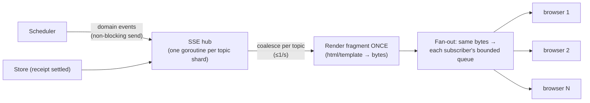

# 08 — Web App and Dashboards (HTMX + SSE)

> Server-rendered pages, live updates over SSE, and the public surfaces that make donations visible and verifiable: routes, page layouts, the SSE fan-out design, the verification page, README badges, and budgets.

---

## 1. Principles

1. **Server-rendered HTML** (`html/template`, auto-escaped). HTMX handles partial updates; the `htmx-ext-sse` extension handles live data. No SPA, no client-side state store.
2. **Read-only pages work without JavaScript.** HTMX and SSE only add liveness.
3. **Render once, fan out to everyone.** A live fragment is rendered one time per update and the same bytes are written to every subscriber.
4. **Privacy by default.** Aggregates are public; individuals appear only if they opt in ([06 §11](06-security-and-trust.md)).
5. **Budgets**: ≤ 50 KB transferred for a public repo page (excluding the avatar images), first contentful paint under 1 s on 4G, Lighthouse accessibility ≥ 95.
6. **Tailwind** is compiled at build time with the standalone CLI (no Node at runtime). The CSS is embedded in the binary and served with immutable cache headers (content-hashed filename).
7. **"Open source · Free forever" on every page.** A persistent footer and the landing page say it plainly: *"Moochy is 100% open source (Apache-2.0 OR MIT) and 100% free. No fees, no commission, no paid tier. Donors pay their own provider directly; Moochy never touches money."* It links to the source, the self-hosting guide, and the public costs page.

---

## 2. Route map

Auth column: P = public, U = signed-in user, O = repo owner/admin, D = device flow.

| Method | Path | Auth | Purpose |
|---|---|---|---|
| GET | `/` | P | Landing: what Moochy is, **"open source and free" statement**, live global counters, featured repos, "works with any MCP client or OpenAI/Anthropic-compatible tool" |
| GET | `/connect` | P | Integration guide: per-client snippets (OpenCode, Claude Code, Cursor, Cline, Zed, Goose, agent frameworks, SDKs) for the MCP door and the API door; supported donor providers (Anthropic, OpenAI, OpenRouter, DeepSeek, …) |
| GET | `/open` | P | **Open source and costs**: links to the source, license, self-host guide; what running moochy.dev costs each month and who sponsors it (static page, updated monthly) |
| GET | `/explore` | P | Repos seeking compute: goal %, donors, models wanted; filters |
| GET | `/p/{owner}/{repo}` | P | Public repo page (§3) |
| GET | `/p/{owner}/{repo}/events` | P | SSE: presence + goal + audit-feed fragments |
| GET | `/p/{owner}/{repo}/badge.svg` | P | README badge (§8) |
| GET | `/p/{owner}/{repo}/donate` | U | Pledge form |
| POST | `/p/{owner}/{repo}/pledges` | U | Create pledge |
| GET | `/station` | U | Donor Station (§4) |
| GET | `/station/events` | U | SSE: the donor's live tasks, budgets, device status |
| POST | `/station/pledges/{id}/pause` · `/resume` · `/reclaim` | U | Pledge controls (HTMX swaps the row) |
| GET | `/console/{owner}/{repo}` | O | Maintainer console (§5) |
| POST | `/console/{owner}/{repo}/donors/{id}/decline` | O | Decline a donor (approval itself is signed by the owner's Node: `moochy approve`) |
| POST | `/console/{owner}/{repo}/members` | O | Update member quotas and request member changes (the change itself is signed by the owner's Node) |
| POST | `/console/{owner}/{repo}/settings` | O | Goal, default model, pinned donors, auto-caching, tripwire mode, member default cap |
| GET | `/claim` · POST `/claim` | U | Claim a repo (admin check) |
| GET | `/device` · POST `/device` | U+D | Device approval (enter code → confirm roles) |
| GET | `/devices` · POST `/devices/{id}/revoke` | U | Device management |
| GET | `/r/{receipt_ref}` | P | Projection detail and how to verify it (§6) |
| GET | `/log` | P | Key-log explorer: latest checkpoints, public Git anchor status, search by pseudonym or repo |
| GET | `/log/checkpoint` · `/log/tile/...` · `/log/keys/...` | P | Machine endpoints for tlog clients (static, CDN-cacheable) |
| GET | `/leaderboard` | P | Global donors (opt-in names) |
| GET | `/auth/{provider}` · `/auth/{provider}/callback` · POST `/logout` | P/U | OAuth |
| GET | `/admin/...` | operator | Minimal moderation and metrics (separate auth: operator device keys) |

All routing uses the standard library `ServeMux` with method and path patterns. No router dependency.

---

## 3. Public repo page `/p/{owner}/{repo}`

```
┌──────────────────────────────────────────────────────────────────────┐
│  owner/repo                                   [ Donate compute → ]   │
│  ★ 12.4k · Rust · "Fast X for Y"                                     │
├──────────────────────────────────────────────────────────────────────┤
│  Monthly compute goal                                     $750 / $1,000 │
│  ███████████████████████████████████████░░░░░░░░░░░░  75% committed  │
│  ████████████████████░░░░░░░░░░░░░░░░░░░░░░░░░░░░░░░  41% used       │
│  ≈ 208M Sonnet-equivalent tokens committed · 23 donors               │
├──────────────────────────────────────────────────────────────────────┤
│  Live pool                    (SSE)                                  │
│  ● 7 nodes online · claude-sonnet-5-5, deepseek-chat, 120+ via OpenRouter │
│  ● 3 tasks running · median added latency 41 ms                     │
│  [opt-in donors]  ● alice (2 nodes)  ● bob-labs (1 node)              │
├──────────────────────────────────────────────────────────────────────┤
│  Top donors this month (undisputed receipts)                         │
│  1. bob-labs   $210   ✓    2. alice   $140   ✓   3. anonymous  $90 ✓ │
├──────────────────────────────────────────────────────────────────────┤
│  Public audit feed            (SSE)                                  │
│  ✓  r_7Hc2…  claude-sonnet-5.5   $0.034   donor: bob-labs   today  [details] │
│  ✓  r_Q91x…  deepseek-chat       $0.002   donor: anon       today  [details] │
│  key log 48,211 entries · checkpoint 13:02 · anchored in Git ✓       │
└──────────────────────────────────────────────────────────────────────┘
```

| Section | Data source | Update |
|---|---|---|
| Header, goal | SQLite (pledges, receipts aggregates) | SSE `goal` event, coalesced to ≤ 1/30 s |
| Live pool | Scheduler state (aggregated) | SSE `pool` event, coalesced to ≤ 1/s |
| Donors | Receipt aggregates (undisputed only) | Page load + SSE every 60 s |
| Audit feed | Newest donor-signed projections for this repo | SSE `audit` event per receipt, coalesced to ≤ 1/s, at most 20 rows kept |
| Log footer | Latest checkpoint | SSE `log` event |

Each row is a donor-signed **projection** ([03 §12.1](03-wire-protocol.md)): model, cost, donor (per their visibility setting), and the **day** only. No task ids, device ids, or timestamps, so the feed never reveals anyone's working hours. `✓` = undisputed, `⚠` = disputed by the maintainer. Each row links to `/r/{receipt_ref}`.

The draft's per-node "RTT / GPG Verified" panel is replaced by the aggregate view. It shows individual donors only with their opt-in, and never their RTT or online schedule per person.

---

## 4. Donor Station `/station`

```
┌──────────────────────────────────────────────────────────────────────┐
│ Devices                                                              │
│  ● home-server   worker · online · 2/4 slots · cap $25: $11.20 used   │
│  ○ laptop        gateway+worker · offline 3h                         │
│  [ + add device ]                                                    │
├──────────────────────────────────────────────────────────────────────┤
│ Pledges                                  budget   spent  reserved    │
│  owner/repo-a  Active   sonnet,opus ≤high  $20     $7.80   $0.42 [⏸][↩] │
│  owner/repo-b  Pending  haiku ≤medium       $5      —       —         │
├──────────────────────────────────────────────────────────────────────┤
│ Live tasks (SSE)                                                     │
│  repo-a · claude-sonnet-5-5 · streaming 12s · member m_8Hq…          │
├──────────────────────────────────────────────────────────────────────┤
│ This month: $19.60 served · 412 tasks · cache hit 83% · saved ≈ $61   │
│ Safety: provider spend limit ✓ (self-reported) · device caps ✓       │
└──────────────────────────────────────────────────────────────────────┘
```

"Saved ≈ $X" is the cost those tasks would have had without cache hits (computed from receipts). It shows donors the value of affinity and makes their donation feel larger, because it is.

---

## 5. Maintainer Console `/console/{owner}/{repo}`

| Panel | Contents |
|---|---|
| Pool health | Committed vs used, utilization, projected end-of-month headroom, models available vs requested-but-missing |
| Donor approvals | Pending donors with useful signals (account age, other repos they support, past disputes) and the one-line command to approve them (`moochy approve <donor>`), which the owner's Node signs; decline is a button |
| Members | Members (including CI devices), quotas, usage, last activity; adding or removing a member is signed by the owner's Node (`moochy members add` / `remove`) |
| Policy | Pinned donors, tripwire mode, auto-caching on/off, default model, own-key fallback guidance |
| Usage | Per-member and per-model usage, cache hit ratio, failover rate, added latency |
| Goal | Monthly goal amount and public description ("what we use AI compute for"), which donors read before pledging |

---

## 6. Projection page `/r/{receipt_ref}` (and how to verify it independently)

What it shows: the projection fields, the donor's signature, the donor device's key-log entry, and the current key-log checkpoint with its public Git anchor.

How to verify **without trusting moochy.dev**: the page gives the one-line command `moochy verify r_7Hc2…`, which fetches the projection, checks the donor signature against the donor key in the locally mirrored key log, and checks the key log against the public Git anchor. (A script served by moochy.dev cannot prove moochy.dev's honesty, so verification happens in the open-source client, not in the page. An in-browser verifier is deferred.)

The page also says what a receipt does **not** prove ("The signature shows which donor reported this usage and committed to the exact bytes sent to the maintainer. It does not prove which model generated them.") so visitors are not misled. Honesty is part of the trust model.

---

## 7. SSE architecture



- **Topics**: `repo:{id}`, `station:{user_id}`, `global`.
- **Coalescing**: per-topic dirty flags. At most one render per topic per interval, whatever the event rate. 1,000 subscribers on one repo page cost **one** template render per second plus 1,000 buffered writes.
- **Backpressure**: each subscriber has a small bounded queue. If it is full, the subscriber is disconnected (the browser's EventSource reconnects automatically and gets a fresh snapshot). The hub never blocks the Scheduler.
- **On connect**: the server sends the current full fragments immediately, so `Last-Event-ID` replay is not needed.
- **HTTP/2** for all web traffic, so browsers' per-host connection limits do not starve SSE plus normal requests.
- **Heartbeat** comment every 25 s to keep intermediaries from closing idle streams.

---

## 8. README badge: the growth loop

`/p/{owner}/{repo}/badge.svg` renders a small SVG: **"AI compute: 23 donors · 75% of goal"**. Maintainers paste it into their README next to CI badges. Visitors click through to the repo page and donate. Each repo page also links to other repos the same donors support.

- Cached for 5 minutes (CDN-friendly). The SVG is generated from a template with no external fonts.
- Cheap to build, and the main organic acquisition channel. Prioritized in [11](11-roadmap-and-testing.md).

---

## 9. Web security (summary; details in [06](06-security-and-trust.md))

- Session cookie: `HttpOnly`, `Secure`, `SameSite=Lax`, random 256-bit id (only its hash is stored).
- **CSRF without token tables**: every state-changing request must carry the `HX-Request: true` header (a custom header cannot be set by cross-site forms without a CORS preflight, which is never granted) **and** an `Origin` that matches the site. Non-HTMX form fallbacks use a per-session token.
- **CSP**: `default-src 'self'`; scripts only from self (htmx bundled locally); `frame-ancestors 'none'`.
- Avatars are proxied or limited to provider avatar hosts via CSP `img-src`.
- Rate limits per IP and per session on POST routes and SSE connections.

---

## 10. Templates organization

| Folder | Contents |
|---|---|
| `layouts/` | Base layout, public layout, app layout |
| `pages/` | One template per route |
| `fragments/` | Swappable parts: goal bar, pool summary, audit row, pledge row, task row, approval card. **The same fragment templates are used for the first render and for SSE/HTMX swaps**, so there is no duplicate markup |
| `emails/` | none in v1 |

---

## 11. Accessibility and UX details

- Live regions (`aria-live="polite"`) on the audit feed and pool summary, throttled so screen readers are not flooded.
- Color is never the only signal: ✓ and ⚠ glyphs plus text, not just green and amber.
- Animated "ping" dots respect `prefers-reduced-motion`.
- Every money value shows dollars first, with tokens in a tooltip (or a details element without JS).
- Dark and light themes via CSS custom properties and `prefers-color-scheme`.
