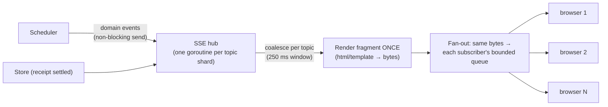

# 08 — Web App and Dashboards (HTMX + SSE)

> Server-rendered pages, live updates over SSE, and the public surfaces that make donations visible and verifiable: routes, page layouts, the SSE fan-out design, the verification page, README badges, and budgets.

> **Updated 2026-10-01:** pages, budgets, and live updates now match `spec/CONTRACT.md` (§0a, §8, §9, §11, §13, §14) and ADR-01/34. Changes: hand-written CSS with custom properties and a native-first motion system replace Tailwind, with byte budgets (CSS ≤ 48 KB raw / ≤ 12 KB gzip, motion JS ≤ 12 KB gzip, at most one self-hosted variable font) and the fixed palette (C10); unique handles with signup choice, rename, 90-day tombstone redirects, and profiles at `/{handle}` (§12, CONTRACT §11, E21); public model slugs with native ids as secondary text (C11); pseudonyms `ps_…` (D10); SSE coalescing 250 ms for audit feed, pool, and station, goal bars ≤ 1 per 30 s, donor rankings ≤ 1 per 60 s (C12); TTFB ≤ 30 ms p50 / 80 ms p99; `mo-web` owns `relay/internal/web/**` behind the `Source` interface (§13); open-source client and closed web/relay, no self-hosting, footer "Open-source client (Apache-2.0) · 100% free" (ADR-01, CONTRACT §0a).
>
> **Updated again 2026-10-01 (main `b65289e7`):** monochrome Ink/Paper/Sky visual direction and subtle motion replace the earlier palette and motion system (CONTRACT §9), VOICE.md wording, app-shell information architecture, Donate tokens button studio and `button.svg`, provider logos, profiles at `/u/{handle}` (R1), web owner renamed mo-design.
>
> **Updated 2026-10-02 (docs site):** public docs routes (`/docs`, `.md` pages, `/llms.txt`) and the projects check API in the route map.

---

## 1. Principles

1. **Server-rendered HTML** (`html/template`, auto-escaped). HTMX handles partial updates; the `htmx-ext-sse` extension handles live data. No SPA, no client-side state store.
2. **Read-only pages work without JavaScript.** HTMX and SSE only add liveness.
3. **Render once, fan out to everyone.** A live fragment is rendered one time per update and the same bytes are written to every subscriber.
4. **Privacy by default.** Aggregates are public; individuals appear only if they opt in ([06 §11](06-security-and-trust.md)).
5. **Budgets** (CONTRACT §9, §13): landing page ≤ 150 KB transferred, dashboards and repo pages ≤ 100 KB (excluding avatar images); LCP ≤ 1.0 s on 4G, CLS = 0, INP ≤ 100 ms; TTFB for `/` and `/p/{owner}/{repo}` ≤ 30 ms p50 / ≤ 80 ms p99 (precompiled templates, in-memory aggregates, no N+1 queries; measured by E22); Lighthouse accessibility ≥ 95.
6. **Hand-written CSS, no framework.** Earlier drafts compiled Tailwind at build time; it was dropped to keep the stylesheet small, readable, and free of a build toolchain. The CSS uses custom properties for the palette and themes, ≤ 48 KB raw (≤ 12 KB gzip). At most one self-hosted variable font (OFL, Latin subset, woff2 ≤ 45 KB, `font-display: swap`, preloaded); no third-party font services. htmx and its SSE extension are vendored locally. All assets are embedded in the binary and served from `/static/` with immutable cache headers (content-hashed filenames).
7. **"Open-source client (Apache-2.0) · 100% free" on every page.** A persistent footer and the landing page say it plainly: *"The Moochy client is open source (Apache-2.0) and the service is 100% free. No fees, no commission, no paid tier. Donors pay their own provider directly; Moochy never touches money. Your keys, your code, and all cryptography stay in the open-source client you can verify; the relay only sees encrypted bytes."* It links to the client source, the protocol spec, and the public costs page. (The relay and web are closed source and self-hosting is not offered, ADR-01; the trust story does not depend on them.)
8. **Visual direction (CONTRACT §9, product owner review 2026-10-01; supersedes the earlier palette and motion rules):** calm, editorial, product-grade; nothing that reads as "AI-made". Strictly monochrome from exactly three base colors, **Ink** (dark), **Paper** (white) and **Sky** (light blue), with every other color a named derived token (tints, shades, or alpha of one base on another). No gradients, glows, blur or glass, sheen or shimmer text, particle backgrounds, cursor-follow effects, magnetic buttons, scroll-jacking or pinned scrollytelling, or marquees. Flat surfaces, 1 px borders, generous whitespace, strong type hierarchy, real content. Success, warning, and error use the same three bases plus icons, labels, and weight. WCAG AA everywhere. A small geometric **mascot** in the three colors is the brand mark (legible at 16 px), with a few expressions used sparingly in empty and loading states.
9. **Motion: subtle and functional only.** State changes, list insertions, page transitions, and the mascot's small expressions; at most one first-view fade per section; animate only `transform` and `opacity`, no layout shift; `prefers-reduced-motion` turns it all off. Any JavaScript beyond htmx stays within ≤ 12 KB gzip, as an external file (strict CSP).
10. **Words follow `docs/brand/VOICE.md`.** Routes and code keep internal names (`/station`, `/console`, `pledges`), but every visible word uses the user-facing vocabulary: **Donate tokens** (the primary call to action), donation (never "pledge"), monthly limit, limit per request, stop donating, Dashboard (`/station`), Project settings (`/console/…`), accept a donor, public receipt.
11. **Information architecture.** Public pages are minimal (landing, explore, public repo page, leaderboard, receipts, open-source client, connect). When signed in, `/` is the app: a shell with a sidebar (Overview, Donations, Repositories, Devices, Activity, Members for owners, Settings), each with listings (filters, sort, empty states), detail views, and forms, all working without JavaScript.
12. **Donate button studio.** Maintainers (or donors) build a **Donate tokens** README button: repository, label, style (mascot + text, text only, compact), theme (light, dark, or auto through `<picture>` and `prefers-color-scheme`), size, live preview, one-click copy of the Markdown and `<picture>` snippets. `/p/{owner}/{repo}/button.svg` is static-safe (no script, no external references, escaped text, strict query-parameter allowlist, `image/svg+xml`, cache headers suited to GitHub's image proxy). User guide: `docs/guides/donate-button.md`.
13. **Provider logos** (Anthropic, OpenAI, OpenRouter, DeepSeek, xAI) are the companies' official single-color marks, vendored locally (never hot-linked), shapes unaltered, used only in a "works with" context; sources recorded in `relay/internal/web/third_party/LOGOS.md`.

---

## 2. Route map

Auth column: P = public, U = signed-in user, O = repo owner/admin, D = device flow.

| Method | Path | Auth | Purpose |
|---|---|---|---|
| GET | `/` | P | Landing: what Moochy is, **"open source and free" statement**, live global counters, featured repos, "works with any MCP client or OpenAI/Anthropic-compatible tool" |
| GET | `/connect` | P | Integration guide: per-client snippets (OpenCode, Claude Code, Cursor, Cline, Zed, Goose, agent frameworks, SDKs) for the MCP door and the API door; supported donor providers (Anthropic, OpenAI, OpenRouter, DeepSeek, xAI, …) |
| GET | `/open` | P | **Open-source client and costs**: links to the client source (`moochy-cli`), its license (Apache-2.0), and the public protocol spec; why the closed relay does not need to be trusted; what running moochy.dev costs each month and who sponsors it (static page, updated monthly) |
| GET | `/docs`, `/docs/{slug}`, `/docs/{slug}.md`, `/llms.txt`, `/llms-full.txt` | P | Public documentation for people and AI agents (CONTRACT §9): `docs/guides/**` rendered by `relay/internal/docsite` (owner mo-docs; mounted by mo-relay per its `WIRING.md`), raw Markdown for agents, the donate-button recipe first in `/llms.txt` |
| GET | `/api/v1/projects/{provider}/{owner}/{repo}` | P | Machine check for agents: `{claimed, donate_url, button_url, docs}`; never donors or amounts (CONTRACT §9; owner mo-relay) |
| GET | `/explore` | P | Repos seeking compute: goal %, donors, models wanted; filters |
| GET | `/p/{owner}/{repo}` | P | Public repo page (§3) |
| GET | `/p/{owner}/{repo}/events` | P | SSE: presence + goal + audit-feed fragments (E19) |
| GET | `/p/{owner}/{repo}/button.svg` | P | **Donate tokens** README button from the studio (§1 item 12, §8) |
| GET | `/p/{owner}/{repo}/badge.svg` | P | README status badge (§8) |
| GET | `/p/{owner}/{repo}/donate` | U | Pledge form |
| POST | `/p/{owner}/{repo}/pledges` | U | Create pledge |
| GET | `/station` | U | Donor Station (§4) |
| GET | `/station/events` | U | SSE: the donor's live tasks, budgets, device status |
| POST | `/station/pledges/{id}/pause` · `/resume` · `/reclaim` | U | Pledge controls (HTMX swaps the row) |
| GET | `/console/{owner}/{repo}` | O | Maintainer console (§5) |
| POST | `/console/{owner}/{repo}/donors/{id}/decline` | O | Decline a donor (approval itself is signed by the owner's Node: `moochy approve`) |
| POST | `/console/{owner}/{repo}/members` | O | Update member quotas and request member changes (the change itself is signed by the owner's Node) |
| POST | `/console/{owner}/{repo}/settings` | O | Goal, default model, pinned donors, auto-caching, tripwire mode, member default cap |
| GET | `/claim` · POST `/claim` | U | Claim a repo (admin check) |
| GET | `/device` · POST `/device` | U+D | Device approval (enter code → confirm roles) |
| GET | `/devices` · POST `/devices/{id}/revoke` | U | Device management |
| GET | `/r/{receipt_ref}` | P | Projection detail and how to verify it (§6) |
| GET | `/log` | P | Key-log explorer: latest checkpoints, public Git anchor status, search by pseudonym or repo |
| GET | `/log/checkpoint` · `/log/tile/...` · `/log/keys/...` | P | Machine endpoints for tlog clients (static, CDN-cacheable) |
| GET | `/leaderboard` | P | Global donors (opt-in names) |
| GET | `/auth/{provider}` · `/auth/{provider}/callback` · POST `/auth/logout` | P/U | OAuth (sign-out lives under `/auth/` so that every first path segment stays in the reserved-handle list) |
| GET · POST | `/auth/handle` | U | Choose a handle at first sign-in; rename later (§12) |
| GET | `/u/{handle}` | P | Public profile by handle (R1; never a bare `/{handle}`): opt-in donor stats, repos owned, undisputed receipts; a tombstoned handle redirects for 90 days (§12) |
| GET | `/static/...` | P | Embedded CSS, motion JS, vendored htmx + SSE extension, font (content-hashed, immutable) |
| GET | `/admin/...` | operator | Minimal moderation and metrics (separate auth: operator device keys) |

All routing uses the standard library `ServeMux` with method and path patterns. No router dependency. The landing page is registered as `GET /{$}` (exact match) and profiles live under the fixed prefix `GET /u/{handle}` (R1), so a handle can never collide with a page name; `u` is a reserved handle.

**Reserved handles = route first segments.** Every first path segment above (`connect`, `open`, `explore`, `p`, `station`, `console`, `claim`, `device`, `devices`, `r`, `log`, `leaderboard`, `auth`, `static`, `admin`), plus those of the API and dev surfaces (`api`, `dev`, `mcp`, `v1`), is in the reserved-handle list of CONTRACT §11. A new top-level route must add its segment to that list (checked in CI) and must not collide with an existing or tombstoned handle; prefer nesting new pages under an existing segment.

---

## 3. Public repo page `/p/{owner}/{repo}`

```
┌──────────────────────────────────────────────────────────────────────┐
│  owner/repo                                   [ Donate tokens →  ]   │
│  ★ 12.4k · Rust · "Fast X for Y"                                     │
├──────────────────────────────────────────────────────────────────────┤
│  Monthly compute goal                                     $750 / $1,000 │
│  ███████████████████████████████████████░░░░░░░░░░░░  75% committed  │
│  ████████████████████░░░░░░░░░░░░░░░░░░░░░░░░░░░░░░░  41% used       │
│  ≈ 208M Sonnet-equivalent tokens committed · 23 donors               │
├──────────────────────────────────────────────────────────────────────┤
│  Live pool                    (SSE)                                  │
│  ● 7 nodes online · anthropic/claude-sonnet-5.5, deepseek/deepseek-chat │
│    (native: claude-sonnet-5-5, deepseek-chat) · 120+ via OpenRouter   │
│  ● 3 tasks running · median added latency 41 ms                      │
│  [opt-in donors]  ● alice (2 nodes)  ● bob-labs (1 node)              │
├──────────────────────────────────────────────────────────────────────┤
│  Top donors this month (undisputed receipts)                         │
│  1. bob-labs   $210   ✓    2. alice   $140   ✓   3. anonymous  $90 ✓ │
├──────────────────────────────────────────────────────────────────────┤
│  Public audit feed            (SSE)                                  │
│  ✓  r_7Hc2…  anthropic/claude-sonnet-5.5  $0.034  donor: bob-labs  today [details] │
│  ✓  r_Q91x…  deepseek/deepseek-chat       $0.002  donor: ps_k7q2…  today [details] │
│  key log 48,211 entries · checkpoint 13:02 · anchored in Git ✓       │
└──────────────────────────────────────────────────────────────────────┘
```

| Section | Data source | Update |
|---|---|---|
| Header, goal | SQLite (pledges, receipts aggregates) | SSE `goal` event, at most one update per 30 s |
| Live pool | Scheduler state (aggregated) | SSE `pool` event, coalescing window 250 ms |
| Donors | Receipt aggregates (undisputed only) | Page load + SSE at most one update per 60 s |
| Audit feed | Newest donor-signed projections for this repo | SSE `audit` event per receipt, coalescing window 250 ms, at most 20 rows kept; a settled task is visible ≤ 500 ms after it settles |
| Log footer | Latest checkpoint | SSE `log` event |

Why two speeds (C12): the audit feed, the pool, and the Donor Station react to "a task settled" or "a node changed", which people watch live, so they follow the ≤ 500 ms responsiveness budget (CONTRACT §13). Goal bars and donor rankings are aggregates that barely move per task; refreshing them faster would only burn renders and animate noise.

Model names are shown as **public slugs** (`anthropic/claude-sonnet-5.5`), the ids clients use and the catalog prices; the provider's native id appears only as secondary text (tooltip or smaller line) ([05 §2.1](05-ledger-and-accounting.md)).

Each row is a donor-signed **projection** ([03 §12.1](03-wire-protocol.md)): model, cost, donor (their handle if they opted in, otherwise their public pseudonym `ps_…`), and the **day** only. No task ids, device ids, or timestamps, so the feed never reveals anyone's working hours. `✓` = undisputed, `⚠` = disputed by the maintainer. Each row links to `/r/{receipt_ref}`.

The draft's per-node "RTT / GPG Verified" panel is replaced by the aggregate view. It shows individual donors only with their opt-in, and never their RTT or online schedule per person.

---

## 4. Donor Station `/station`

```
┌──────────────────────────────────────────────────────────────────────┐
│ Devices                                                              │
│  ● home-server   worker · online · 2/4 slots · cap $25: $11.20 used   │
│  ○ laptop        gateway+worker · offline 3h                         │
│  [ + add device ]                                                    │
├──────────────────────────────────────────────────────────────────────┤
│ Pledges                                  budget   spent  reserved    │
│  owner/repo-a  Active   sonnet,opus ≤high  $20     $7.80   $0.42 [⏸][↩] │
│  owner/repo-b  Pending  haiku ≤medium       $5      —       —         │
├──────────────────────────────────────────────────────────────────────┤
│ Live tasks (SSE)                                                     │
│  repo-a · anthropic/claude-sonnet-5.5 · streaming 12s · member ps_q3vd… │
├──────────────────────────────────────────────────────────────────────┤
│ This month: $19.60 served · 412 tasks · cache hit 83% · saved ≈ $61   │
│ Safety: provider spend limit ✓ (self-reported) · device caps ✓       │
└──────────────────────────────────────────────────────────────────────┘
```

Live tasks, device status, and budgets arrive over `/station/events` with the same 250 ms coalescing window as the repo page, so a settled task shows up within 500 ms (C12). Members are shown by public pseudonym (`ps_` + 16 random base32 characters, never derived from the internal `user_id`), never by internal id. Devices are listed by their name, unique per user (case-insensitive).

"Saved ≈ $X" is the cost those tasks would have had without cache hits (computed from receipts). It shows donors the value of affinity and makes their donation feel larger, because it is.

---

## 5. Maintainer Console `/console/{owner}/{repo}`

| Panel | Contents |
|---|---|
| Pool health | Committed vs used, utilization, projected end-of-month headroom, models available vs requested-but-missing |
| Donor approvals | Pending donors with useful signals (account age, other repos they support, past disputes) and the one-line command to approve them (`moochy approve <donor>`), which the owner's Node signs; decline is a button |
| Members | Members (including CI devices), quotas, usage, last activity; adding or removing a member is signed by the owner's Node (`moochy members add` / `remove`) |
| Policy | Pinned donors, tripwire mode, auto-caching on/off, default model, own-key fallback guidance |
| Usage | Per-member and per-model usage, cache hit ratio, failover rate, added latency |
| Goal | Monthly goal amount and public description ("what we use AI compute for"), which donors read before pledging |

---

## 6. Projection page `/r/{receipt_ref}` (and how to verify it independently)

What it shows: the projection fields, the donor's signature, the donor device's key-log entry, and the current key-log checkpoint with its public Git anchor.

How to verify **without trusting moochy.dev**: the page gives the one-line command `moochy verify r_7Hc2…`, which fetches the projection, checks the donor signature against the donor key in the locally mirrored key log, and checks the key log against the public Git anchor. (A script served by moochy.dev cannot prove moochy.dev's honesty, so verification happens in the open-source client, not in the page. An in-browser verifier is deferred.)

The page also says what a receipt does **not** prove ("The signature shows which donor reported this usage and committed to the exact bytes sent to the maintainer. It does not prove which model generated them.") so visitors are not misled. Honesty is part of the trust model.

---

## 7. SSE architecture



- **Topics**: `repo:{id}`, `station:{user_id}`, `global`.
- **Coalescing**: per-topic, per-fragment dirty flags. The first event after a quiet period opens a 250 ms window; at its end the fragment is rendered once, whatever the event rate inside the window. That keeps "task settled → visible in the browser" ≤ 500 ms (CONTRACT §13) while 1,000 subscribers on one repo page cost at most **four** template renders per second plus buffered writes. Slower fragments have their own floor: `goal` at most once per 30 s, donor rankings at most once per 60 s (C12).
- **Writes**: each SSE event is flushed immediately (`http.Flusher`), no extra buffering in the hub.
- **Backpressure**: each subscriber has a small bounded queue. If it is full, the subscriber is disconnected (the browser's EventSource reconnects automatically and gets a fresh snapshot). The hub never blocks the Scheduler.
- **On connect**: the server sends the current full fragments immediately, so `Last-Event-ID` replay is not needed.
- **HTTP/2** for all web traffic, so browsers' per-host connection limits do not starve SSE plus normal requests.
- **Heartbeat** comment every 25 s to keep intermediaries from closing idle streams.

---

## 8. README badge: the growth loop

The primary README element is now the **Donate tokens** button (`/p/{owner}/{repo}/button.svg`, built in the studio, §1 item 12; user guide `docs/guides/donate-button.md`), which links to `/p/{owner}/{repo}/donate`. A status badge remains available: `/p/{owner}/{repo}/badge.svg` renders a small SVG such as **"Donated tokens: 23 donors · 75% of goal"**, for maintainers who want it next to their CI badges. Visitors click through to the repo page and donate. Each repo page also links to other repos the same donors support.

- Cached for 5 minutes (CDN-friendly). The SVG is generated from a template with no external fonts.
- Cheap to build, and the main organic acquisition channel. Prioritized in [11](11-roadmap-and-testing.md).

---

## 9. Web security (summary; details in [06](06-security-and-trust.md))

- Session cookie: `HttpOnly`, `Secure`, `SameSite=Lax`, random 256-bit id (only its hash is stored).
- **CSRF without token tables**: every state-changing request must carry the `HX-Request: true` header (a custom header cannot be set by cross-site forms without a CORS preflight, which is never granted) **and** an `Origin` that matches the site. Non-HTMX form fallbacks use a per-session token.
- **CSP**: `default-src 'self'`; scripts, styles, and the font only from self (htmx, the SSE extension, and the motion layer vendored locally); no inline script or `style` attributes; `frame-ancestors 'none'`.
- **Handles** are ASCII-only and validated with the shared rules (CONTRACT §11), and every user-provided string is auto-escaped by `html/template`.
- Avatars are proxied or limited to provider avatar hosts via CSP `img-src`.
- Rate limits per IP and per session on POST routes and SSE connections.

---

## 10. Templates organization

| Folder | Contents |
|---|---|
| `layouts/` | Base layout, public layout, app layout |
| `pages/` | One template per route |
| `fragments/` | Swappable parts: goal bar, pool summary, audit row, pledge row, task row, approval card. **The same fragment templates are used for the first render and for SSE/HTMX swaps**, so there is no duplicate markup |
| `emails/` | none in v1 |

---

## 11. Accessibility and UX details

- Live regions (`aria-live="polite"`) on the audit feed and pool summary, throttled so screen readers are not flooded.
- Color is never the only signal: ✓ and ⚠ glyphs plus text, not just green and amber.
- Animated "ping" dots, counters, View Transitions, and every other non-essential motion respect `prefers-reduced-motion` (§1, principle 9).
- Every money value shows dollars first, with tokens in a tooltip (or a details element without JS).
- Dark and light themes via CSS custom properties and `prefers-color-scheme`.

---

## 12. Usernames: choice, rename, profiles

Every user has exactly one Moochy handle, unique on the instance and case-insensitive (CONTRACT §11, threat rows T23–T24 in [06 §3](06-security-and-trust.md); verified by E21). The web is where handles are chosen and changed.

- **Signup (`/auth/handle`, first sign-in).** The form is pre-filled with the provider login lowercased **if it is valid and free**. Otherwise the field is empty and the user must pick one; the page explains why. There is **no automatic suffix** (`alice-2`), because a silent suffix makes a newcomer look like an existing `alice`. Validation runs live as the user types (format, reserved, taken) and again on submit.
- **Format:** ASCII only, lowercase, 3–32 characters, `^[a-z0-9](?:[a-z0-9-]{1,30}[a-z0-9])$`, no `--`. Input with uppercase letters is shown lowercased; input with any non-ASCII character (Cyrillic `а`, zero-width characters, RTL marks) is refused with a plain message, never silently transliterated.
- **Reserved words** are refused: every first path segment of the routes (§2), staff and system words (`moochy`, `admin`, `root`, `support`, `security`, `staff`, `official`, `system`, `null`, `undefined`, `anonymous`, `relay`, `node`, `bot`), and every handle ever used before.
- **Rename (`/auth/handle`, signed in).** Allowed at most once per 30 days; the page shows the date of the last change and when the next one is allowed. Before confirming, it states the consequences: the old handle is retired **for good** (no one, including the user, can take it again), it redirects to the new handle for 90 days, and links in READMEs or posts should be updated.
- **Tombstones and redirects.** `GET /u/{old}` answers a permanent redirect to `/u/{new}` for 90 days after the rename, then `410 Gone` with a short "this handle was retired" page. A tombstoned handle is never reassigned, which blocks takeovers of links, badges, and reputation through username recycling.
- **Profiles by handle (`/u/{handle}`).** The profile shows what the user opted to make public: donor totals and repos supported (undisputed receipts only), repos they own. Pages store user ids, not handles, so every page renders the current handle after a rename.
- **Pseudonyms.** Users who do not opt in to public attribution appear as their pseudonym (`ps_` + 16 random base32 characters). The pseudonym is not derived from `user_id` or the handle and does not change on rename; the key log and projections use only pseudonyms ([06 §10.3](06-security-and-trust.md)).

---

## 13. Code ownership and the `Source` interface

The web layer lives in `relay/internal/web/**` (Go, standard library only) and is owned by `mo-design` (formerly `mo-web`; CONTRACT §0, §9). It never touches the database or the Scheduler directly. The package exports:

- `func New(src Source) http.Handler`: all pages, fragments, static assets, and SSE routes of §2 (OAuth and handle-choice logic come from `relay/internal/oauth`, owned by `mo-oauth`).
- The `Source` interface, defined by `mo-design` and implemented by `mo-relay`: read-only queries (repo by slug, pool summary, goal numbers, recent projections, donor station data). `mo-web` ships a fake `Source` for its own tests.
- `func (h) Publish(topic string, ev Event)`: domain events from the Relay into the SSE hub (§7); non-blocking for the caller.

This boundary keeps the TTFB budget honest (every `Source` call is an in-memory aggregate or one indexed query, no N+1) and lets the web be built and tested without a running Relay. E19 checks the integration end to end: `/p/{owner}/{repo}` renders with the palette tokens present, and `/p/{owner}/{repo}/events` delivers a fragment after a task settles.
