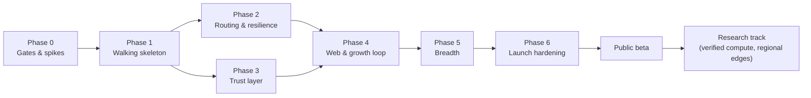

# 11 — Roadmap and Verification Strategy

> Phases ordered so that every phase ships something usable end-to-end and removes the biggest remaining risk. Each phase has a scope, deliverables, **exit criteria that can be checked**, and the risks it retires. Replaces the draft's four-phase list.

> **Updated 2026-10-01:** phases now follow the CONTRACT §8 E2E table, the integrator decisions D12–D14, and the source boundary of CONTRACT §0a. Changes: the E2E table (E01–E22) is the definition of "working" and is due now, so failover (E06), 429 reroute (E07), cancel (E08), chaos caps (E11), tamper/replay/injection/tool gating (E15–E18), throughput (E20), usernames (E21), and responsiveness budgets (E22) move into Phase 1; the OpenAI adapter is Phase 1; the key log is in scope now, with relay-asserted membership allowed only under `MOOCHY_INSECURE_DEV=1` until it ships (ADR-38); Phase 0 sets up the open `moochy-cli` (Apache-2.0, DCO) / closed `moochy-core` split, with no self-host deliverables (ADR-01); gRPC replaces frames (ADR-33); new §6 maps every scenario ID to its phase.
>
> **Updated again 2026-10-01 (main `b65289e7`):** sandbox and donor lockdown in Phase 1 scope (ADR-43), E93+ in the scenario map.
>
> **Updated 2026-10-02 (main `5f9ccf80`):** local GPU donors on main (ADR-49).
>
> **Updated 2026-10-02 (CONTRACT §16–§17):** email and decisions (§16) and cloud boxes (§17) in Phase 1 scope; E99–E108 in the scenario map.

---

## 1. Sequencing logic

The draft's order (backend → routing → dashboard → CLI) builds the server first and the client last. **Nothing works end-to-end until the final phase.** The riskiest assumptions are exactly the ones that need the client:

1. Can real coding agents run through a localhost gateway on donated keys without noticing? (integration risk)
2. Does end-to-end encryption plus failover actually work at acceptable latency? (protocol risk)
3. Does accounting match the provider's bill? (money risk)
4. Do provider terms allow it? (existential risk)

So the plan builds a **thin vertical slice first** (Gateway → Relay → Worker → provider and back), then thickens it.

Phases 2 and 3 can run in parallel with two engineers.

---

## 2. Phases

### Phase 0: Gates and spikes

**Goal:** kill the project early if it should be killed, and pin down the facts the design depends on.

| Item | Output |
|---|---|
| **Two-repository split from day one** (ADR-01, CONTRACT §0a): one internal development monorepo whose open side (`cli/`, `spec/proto`, `spec/vectors`, `spec/protocol.md`, `docs/guides`, `deploy/client`) publishes as the public `moochy-cli` repository under **Apache-2.0** with **DCO** sign-off (README stating "Open-source client (Apache-2.0) · 100% free", CONTRIBUTING, CODE_OF_CONDUCT, SECURITY.md); the relay, web, e2e, deploy, and internal docs stay in the private `moochy-core`. CI check that open code never imports closed code | The client is open from its first commit; the boundary is enforced by tooling, not by habit |
| Provider-terms review with counsel (Anthropic, OpenRouter, DeepSeek, OpenAI, xAI, and each OpenAI-compatible host planned) | Written go/no-go per provider + required donor consent text ([06 §14](06-security-and-trust.md)) |
| Client compatibility spike, **both doors**: MCP (stdio + Streamable HTTP) with OpenCode, Claude Code, Cursor, Cline, Zed, Goose, and one agent framework; base URL with OpenCode, Claude Code, Aider, Continue, Cline, Zed, and the OpenAI/Anthropic SDKs, against a localhost gateway that just proxies to a provider | Integration matrix ([07 §4.4](07-client-cli.md)); captured traffic samples for the firewall corpus |
| Pin per-provider facts: usage field names, rate-limit header names, error shapes, allowed request fields, model defaults | Adapter data tables v0 |
| Crypto spike: HPKE wrap + chunked AEAD in Rust; Go Relay forwarding opaque `Chunk` messages between gRPC streams | First golden test vectors |
| E2E harness: every CONTRACT §8 scenario (E01–E22) exists as a Go test against real binaries and fake providers, `t.Skip("pending: …")` until its components exist | The definition of "working" is executable from the start |
| Latency spike: fake provider, three Nodes in three regions, measure the added latency with and without compression and warm provider pools | Validates the budget in [02 §11](02-architecture-overview.md) |

**Exit criteria:** counsel go for at least Anthropic, OpenRouter, and DeepSeek; at least 3 clients work unmodified through each door; vectors pass in both languages; measured added latency within 2× of the budget.

**Risks retired:** existential (terms), integration.

---

### Phase 1: Walking skeleton (one donor, one maintainer, one repo)

| Area | Scope |
|---|---|
| Relay | Single binary `relay`; GitHub OAuth; **unique handles** with reserved words and tombstones (CONTRACT §11); device approval; repo claim; pledge (web form); gRPC `NodeLink` (Session, Submit, Serve, device login) with channel-bound auth per connection and the CONTRACT §12 hardening; `RelayAdmin` socket; **Scheduler with eligibility + reservation, commit-before-assign with adaptive group commit, per-attempt accounting**, failover before start across workers, 429 reroute, cancellation (P2C and affinity come in Phase 2); Ledger settle with `synchronous=FULL`; policy errors non-retryable (`over_task_cap` → 400, `quota_exceeded` → 403, never 429); Litestream; dev API and chaos switches for E2E |
| Client | Three crates (`moochy-proto`, `moochy-worker`, `moochy`); `login`, `up`, `env`, `connect`, `keys add`, `donate`, `status`, `pause` (CLI commands reach the running Node over `LocalControl`); **API door** (`/v1/messages` and `/v1/chat/completions`, streaming); **MCP door** (`moochy_delegate`, `moochy_pool_status` over stdio and Streamable HTTP); Worker with **Anthropic, OpenRouter, DeepSeek, OpenAI, and xAI adapters** (OpenRouter and DeepSeek serving both dialects), public model slugs, **strict firewall**, local reservations, outbox, served-task set with boot-time floor; Gateway structural tool-call checks and tripwire (E18); every chunk flushed immediately |
| Crypto | Full envelopes (fresh CK per body, **per-attempt response keys**, AAD binding); task signatures; donor-signed receipts and projections; `lp` labels with explicit integer widths; ZIP-215 vectors; username vectors (`spec/vectors/usernames.json`) |
| Key log | In scope now (ADR-38), built in parallel by its own owner (`relay/internal/tlog`, `moochy-keylog`); its exit criteria are listed under Phase 3. Until it ships, Workers accept relay-asserted membership and approvals **only** when started with `MOOCHY_INSECURE_DEV=1` |
| Sandbox | In scope now (ADR-43, CONTRACT §15, owner mo-sandbox): `moochy run` on Linux and macOS (fails closed elsewhere), run tokens so pooled tool calls reach only sandboxed sessions, donor `lockdown_self` and the per-request validator child; verified by E93 and later (E96 for the donor process) as CONTRACT §8 assigns them |
| Local GPU donors | On main (ADR-49): `keys add local` for Ollama, LM Studio, vLLM, llama.cpp; self-reported usage tier and its separate leaderboard need relay catalog and web support |
| Email and decisions | CONTRACT §16 (owner mo-notify, `relay/internal/notify`): confirmed email, notification kinds, Resend outbox and webhooks, accept/refuse from email with passkeys, decision history (ADR-51, ADR-52) |
| Cloud boxes | CONTRACT §17: enrollment tokens and ephemeral box devices, clone detection, `--box-is-sandbox`, vetted TLS GPU hosts, platform templates and the `boxes` guide (ADR-53) |

**Exit criteria (all must pass):**

1. A real Claude Code session completes a multi-step coding task through Moochy, unmodified apart from the two env vars, once on an Anthropic donor and once on an OpenRouter or DeepSeek donor (Anthropic dialect).
2. A real **OpenCode** session runs on an **OpenRouter** donor through the API door **and** uses `moochy_delegate` through the MCP door against a **DeepSeek** donor in the same session.
3. An agent framework (one of those listed in [07 §4.4](07-client-cli.md)) completes a scripted task using only the Streamable HTTP MCP endpoint.
4. `moochy audit --provider` shows ≤ 0.5% drift between Moochy's receipts and each provider's bill over 200 tasks per provider, using that provider's reconciliation method ([05 §7.1](05-ledger-and-accounting.md)).
5. Killing the Relay with `kill -9` mid-stream → after restart, every attempt that reached a provider has exactly one settled receipt (outbox replay), every other reservation is released through `known_tasks`, and nothing is double-settled.
5b. Golden vectors prove that two attempts of one task never share a response key, and that a replayed or forged task (bad signature, stale ULID, foreign repo) is refused by the Worker.
6. Firewall rejects 100% of a seeded corpus of forbidden requests (server tools, file ids, MCP connector, paid OpenRouter add-ons, mismatched route header) and accepts 100% of captured real traffic from the clients in criteria 1–3.
7. The Relay database contains no prompt or output bytes (grep test over a DB produced by the test suite with canary strings in prompts).
8. The CONTRACT §8 E2E table passes with no skips: E01–E22, including failover (E06), 429 reroute (E07), cancel (E08), chaos caps (E11), tamper, replay, injection, and tool gating (E15–E18), throughput with 3 workers (E20), unique usernames (E21), and every responsiveness budget of CONTRACT §13 (E22).

Criteria 5, 5b, 6, and 7 are automated as E12, E15/E16 (plus vectors), E09, and E13.

**Risks retired:** protocol, money (basic), privacy, responsiveness. Until the key log ships, deployments run with **design partners only**, with Workers started under `MOOCHY_INSECURE_DEV=1` so that they accept relay-asserted keys and approvals.

---

### Phase 2: Routing and resilience

| Area | Scope |
|---|---|
| Scheduler | Weighted P2C; **session affinity**; slots/offers; rate-limit headroom; full deadline set (ACK, start, routing); `need_wraps`; member and device quotas; two-queue backpressure; non-retryable policy errors; SQL sweeps |
| Protocol | `Draining`; sessions keyed by `(device, session)`; resubmission rules (cancellation and native errors already ship in Phase 1) |
| Ops | Drain-and-restart upgrade procedure; metrics; SLO dashboards |
| Testing | **Deterministic simulator**; chaos suite beyond the E2E table (random kills, 429 storms, upgrades under load) |

**Exit criteria:**

1. Simulator: 1M tasks across 2,000 virtual workers with injected faults → zero invariant violations ([04 §12](04-routing-engine.md)); same seed → identical run.
2. Chaos (real binaries, fake providers): random worker kills, 429 storms, 2 Relay upgrades during load → task success ≥ 99.5% (excluding injected provider errors and deploy windows), ≤ 10 s of retryable errors per upgrade, zero ledger drift.
3. Real agent sessions: `affinity_hit_ratio` ≥ 95% while workers stay healthy; `cache_read_ratio` ≥ 80% of input tokens.
4. Added latency p50 ≤ 60 ms in-continent.

**Risks retired:** performance, cost efficiency, resilience.

---

### Phase 3: Trust layer

| Area | Scope |
|---|---|
| Key log | (in scope now, ADR-38/ADR-39; `x/mod/sumdb/tlog` + `note` with our own C2SP tiles) Merkle log of keys, **owner-signed** repo claims, donor approvals and memberships, catalog versions; checkpoints (after replication); **hourly public Git anchor**; Node monitor (consistency, own-key alerts, owner alerts on unsigned approvals); Gateways seal only to owner-approved keys; Workers accept only owner-approved members |
| Receipts | Gateway checks (commitments, usage bands, reported model); signed disputes; public projections |
| Maintainer protection | **Signed progress checkpoints** gating tool calls (structural checks and tripwire already ship in Phase 1, E18); untrusted-content framing for MCP results; secret scrubber; MCP `files` rules; `moochy report` |
| Supply chain | Sigstore + SLSA provenance in CI for the open-source client; reproducible Linux musl builds of `moochy` |

**Exit criteria:**

1. An injected rogue device key for user U is flagged by U's Node within 2 checkpoint intervals.
2. A relay-forged donor approval (fake user + device, logged) is refused by Gateways, and a forged repo claim is flagged by the real owner's Node.
3. A forked log (two different checkpoints served) is detected by Nodes against the public Git anchor.
4. Structural checks reject 100% of tool calls not declared in `tools[]`, failing their schema, or lacking a valid progress signature. The tripwire blocks the documented baseline corpus and is documented as a speed bump, not a guarantee.
5. MCP `files` refuses every case of a path-escape corpus (`..`, symlinks, `.git/**`, ignored and secret-shaped files).
6. Independent rebuild of the Linux musl client release from the public `moochy-cli` source is bit-identical.
7. With the key log live, Workers started **without** `MOOCHY_INSECURE_DEV=1` serve only members and donors backed by owner-signed `REPO_CLAIMED`, `DONOR_APPROVED`, and `MEMBER_*` entries.

**Risks retired:** trust, maintainer safety, supply chain.

---

### Phase 4: Web and growth loop

| Area | Scope |
|---|---|
| Public | `/`, `/connect`, `/open`, `/explore`, `/p/{owner}/{repo}` with SSE, **badge.svg**, `/r/{ref}`, `/log`, `/leaderboard` |
| Donor Station | Devices, pledges with pause/resume/reclaim, live tasks, "saved by caching" |
| Console | Approvals, members and quotas, policy, usage, goal |
| SSE | Hub with 250 ms coalescing and render-once fan-out (audit feed, pool, station); goal bars at most every 30 s, donor rankings at most every 60 s |

**Exit criteria:** page and motion budgets met ([08 §1](08-web-dashboard.md), CONTRACT §9: CSS ≤ 48 KB raw, motion JS ≤ 12 KB gzip, LCP ≤ 1.0 s on 4G, CLS 0, INP ≤ 100 ms); web TTFB ≤ 30 ms p50 and live update ≤ 500 ms after a task settles (CONTRACT §13, E22); E19 green; 10k simulated SSE subscribers on one repo page with < 1 core of CPU; accessibility ≥ 95; a usability test where 5 developers donate in under 5 minutes and 5 maintainers get an agent running in under 3 minutes without help.

---

### Phase 5: Breadth

| Item | Notes |
|---|---|
| More adapters: Gemini's OpenAI-compatible endpoint, Groq, Together, Fireworks, Mistral, xAI (OpenAI itself ships in Phase 1) | One table + fixtures each; good first contributions |
| `moochy connect` coverage for every client in the matrix; zero-install `npx -y moochy mcp`; container image | "Works with anything" in practice, not just in theory |
| GitLab identity and repos | Same flows |
| `moochy service install` on all OSes; one-click always-on templates | Supply reliability |
| Windows support (named pipes, Credential Manager) | — |
| Own-key fallback | Optional for maintainers |
| **Remote-MCP self-tunnel mode** (opt-in) | For clients that can only reach a remote HTTPS MCP server: the user exposes their own Node's `/mcp` through their own tunnel, with OAuth 2.1 and a Host allowlist ([07 §4.4](07-client-cli.md)) |

**Exit criteria:** compatibility matrix green for the targeted tools; all CI OS matrix jobs green.

---

### Phase 6: Launch hardening

| Item | Exit criterion |
|---|---|
| External security review / pentest (focus: firewall, envelopes, Gateway localhost surface, web) | All high/critical findings fixed |
| Load test at 2× the design point ([02 §12](02-architecture-overview.md)) | SLOs hold |
| DR drill (VM loss) | RTO < 30 min achieved |
| Docs: donor guide (incl. provider spend limits), maintainer guide, MCP/API integration guide, public protocol spec (`spec/protocol.md`), user-facing threat-model summary, all in `moochy-cli` | Published |
| Terms of service and privacy policy reflecting [06 §14](06-security-and-trust.md) | Counsel sign-off |

---

### Research track (after beta, each gated on evidence)

| Item | Trigger to start |
|---|---|
| Opt-in verified mode, free like everything else (TLS notarization with the Relay as notary) | Maintainer demand for stronger guarantees; acceptable overhead on small requests |
| Public receipt log (Merkle log of projections) + independent witnesses + in-browser verifier | Demand for third-party audit of omissions |
| Prefix-delta transfer ([03 §9](03-wire-protocol.md)) | Gateway upload p50 > 150 ms, or egress among the top 3 costs |
| Blue/green zero-downtime deploys ([10 §3](10-operations.md)) | Deploy-caused failures visible in metrics |
| Trust tiers / auto-approval of donors | Owners asking for less manual approval at scale |
| Regional Edges ([10 §9](10-operations.md)) | p50 added latency > 100 ms for > 25% of traffic |
| Local-model donors (GPU owners via vLLM/Ollama) | Donor demand; a token-based goal display |
| Cross-dialect translation | Pools with dialect mismatch causing > 10% unserved requests |
| Stream resume after Gateway reconnect | Mid-stream Gateway disconnects > 0.5% of tasks |
| Direct peer transport (NAT traversal) | Relay egress becomes a top-3 cost, or latency data shows meaningful gain |

---

## 3. Verification strategy (cross-cutting)

| Layer | Technique | Where |
|---|---|---|
| Wire compatibility | **Golden vectors** shared by Go and Rust ([03 §17](03-wire-protocol.md)); committed generated gRPC code checked against `spec/proto/gen.sh` | Both CIs |
| Scheduler correctness | Pure core + **invariant checks after every event** + deterministic simulation with seeds | `moochy-core` CI (`relay/`) |
| Ledger correctness | Property tests for reserve/settle/release sequences; nightly audit job in prod; provider reconciliation | Both |
| Security boundaries | Fuzzing (firewall incl. nested content, strict JSON parser, protobuf message handling, SSE parser, MCP `files` paths); red-team corpora (firewall, tripwire); canary-string test that the Relay stores no content | Both CIs |
| Integration | One-command harness: real `relay` and `moochy` binaries + fake providers only; the CONTRACT §8 scenarios E01–E22 (no mocks of our own components), plus upgrade during load | `moochy-core` CI |
| Real-world | Nightly staging run with real providers and tiny budgets: one real agent session per supported harness | Staging |
| Performance | Benchmarks with regression budgets (Scheduler apply, `Chunk` forwarding, seal/open throughput); periodic load tests | CI + scheduled |
| Responsiveness | E22: 1,000 tasks with an instant fake provider, every CONTRACT §13 budget checked at p50 and p99; release blocker | `moochy-core` CI |
| Web | Template snapshot tests; accessibility checks; SSE load test; page-weight and motion budgets | `moochy-core` CI (`relay/`) |

**Definition of done for any feature:** its exit criterion is automated (a test, a simulator scenario, or a monitored metric), not a manual claim.

---

## 4. Team-size assumption and rough effort

Assuming 2 experienced engineers (one Go-leaning, one Rust-leaning) plus part-time design and counsel:

| Phase | Rough duration |
|---|---|
| 0 | 2 weeks |
| 1 (two doors, four providers, E01–E22 green) | 8–10 weeks |
| 2 + 3 (parallel; key log started in Phase 1) | 4–6 weeks |
| 4 | 3–4 weeks |
| 5 | 3–4 weeks |
| 6 | 3 weeks |
| **To public beta** | **≈ 6 months** |

These are planning estimates for ordering and staffing, not commitments. Re-estimate after Phase 1 using real velocity.

---

## 5. Launch checklist (beta)

- [ ] Counsel sign-off on terms and per-provider guidance
- [ ] Phase 1–6 exit criteria all automated and green
- [ ] Public protocol spec, user-facing threat-model summary, and guides published in `moochy-cli`
- [ ] Onboarding enforces device caps and promotes provider-side spend limits
- [ ] Status page and incident contact
- [ ] `/open` page live: client license and source link, how to verify a client release, monthly costs and sponsors ("Open-source client (Apache-2.0) · 100% free")
- [ ] Key log live with hourly public Git anchoring (independent witnesses follow after beta)
- [ ] Key log required: public beta never runs with relay-asserted keys or approvals (no `MOOCHY_INSECURE_DEV=1` in production)
- [ ] CONTRACT §8 E2E table (E01–E22) green on the release candidate, including the E22 responsiveness budgets
- [ ] 10 design-partner repos and 50 donors recruited before opening sign-ups

---

## 6. E2E scenario map (CONTRACT §8)

Scenario IDs are stable and owned by `spec/CONTRACT.md`; this table only says when each one must pass. All are due in Phase 1 (decision D12): the later phases add criteria on top, they do not postpone any scenario.

| ID | Scenario (short) | Must pass by | Also proves |
|---|---|---|---|
| E01 | Anthropic streaming through the API door, one receipt, exact spend | Phase 1 | Phase 1 criterion 1 (fake side) |
| E02 | OpenAI dialect via OpenRouter, forced usage, OpenRouter cost | Phase 1 | Criterion 2 (fake side) |
| E03 | Anthropic dialect via DeepSeek and OpenRouter | Phase 1 | Criterion 1 |
| E04 | MCP stdio: tools, model enum, untrusted-content wrapping | Phase 1 | Criterion 2 |
| E05 | MCP Streamable HTTP, bearer required | Phase 1 | Criterion 3 |
| E06 | Failover before start, exactly one charge | Phase 1 | — |
| E07 | Provider 429 before start → reroute, zero cost | Phase 1 | — |
| E08 | Client disconnect cancels the provider call | Phase 1 | — |
| E09 | Firewall refusals, zero spend, provider never called | Phase 1 | Criterion 6 |
| E10 | `over_task_cap` and `quota_exceeded`, non-retryable | Phase 1 | — |
| E11 | Worker device cap holds while the relay ignores caps | Phase 1 | — |
| E12 | Relay `kill -9` mid-stream, outbox replay, one settlement | Phase 1 | Criterion 5 |
| E13 | Privacy canary absent from DB, WAL, logs | Phase 1 | Criterion 7 |
| E14 | Local gateway hardening (token, Host, CORS, loopback) | Phase 1 | — |
| E15 | Route tamper refused (`bad_envelope`) | Phase 1 | Criterion 5b |
| E16 | Task replay refused (`unauthorized_task`) | Phase 1 | Criterion 5b |
| E17 | Forged `Chunk` injected into the Gateway's own `Submit` stream never reaches the client | Phase 1 | — |
| E18 | Tool-call gating (undeclared, schema failure, `curl … \| sh`) | Phase 1 | Phase 3 criterion 4 (structural part) |
| E19 | Repo page renders with palette, SSE fragment after a task | Phase 1 | Phase 4 exit |
| E20 | 200 concurrent streamed tasks across 3 workers | Phase 1 | — |
| E21 | Unique usernames: duplicate, case variant, reserved, confusable, tombstone, rename redirect | Phase 1 | — |
| E22 | Responsiveness budgets of CONTRACT §13 at p50 and p99 | Phase 1, and every release | Phase 4 web budgets |

| E93+ | Sandbox and donor lockdown (CONTRACT §15.3): worktree-only agent, no network but the gateway, poisoned `curl … \| sh` without effect outside, donor process cannot `exec` or connect elsewhere (E96), validator child has no files or sockets | Phase 1 | ADR-43 |
| E99–E101 | Email (CONTRACT §16.5): confirmation link once (replay, expiry, wrong user, tampering refused); one email per accepted donation through the fake Resend with idempotency and retry; unsubscribe stops a category but never security mail; signed bounce webhook stops sending, unsigned or stale refused; no prompt, key, or token in any body | Phase 1 | ADR-51 |
| E102–E104 | Decisions (CONTRACT §16.6): email → /decide → refuse records one event and emails the donor, no key-log entry; accept with a passkey (virtual authenticator) yields a verifiable `DONOR_APPROVED` and the donor starts serving, forged/replayed/wrong-challenge assertions refused by nodes; history matches events; link prefetch changes nothing | Phase 1 | ADR-52 |
| E105–E108 | Boxes (CONTRACT §17.5): enroll with a token, serve within the cap, expire; a cloned box (same key, second session, changed machine-id) refused and the owner alerted; `--box-is-sandbox` without user namespaces runs with clean env and warning, tool calls only if the repo allows platform sandboxes; a vetted TLS GPU host serves, an unvetted or plain-HTTP remote host is refused | Phase 1 | ADR-53 |

New scenarios get the next free ID in CONTRACT §8 first, then a row here.
