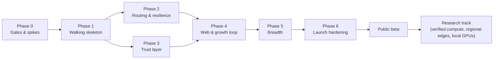

# 11 — Roadmap and Verification Strategy

> Phases ordered so that every phase ships something usable end-to-end and removes the biggest remaining risk. Each phase has a scope, deliverables, **exit criteria that can be checked**, and the risks it retires. Replaces the draft's four-phase list.

---

## 1. Sequencing logic

The draft's order (backend → routing → dashboard → CLI) builds the server first and the client last. **Nothing works end-to-end until the final phase.** The riskiest assumptions are exactly the ones that need the client:

1. Can real coding agents run through a localhost gateway on donated keys without noticing? (integration risk)
2. Does end-to-end encryption plus failover actually work at acceptable latency? (protocol risk)
3. Does accounting match the provider's bill? (money risk)
4. Do provider terms allow it? (existential risk)

So the plan builds a **thin vertical slice first** (Gateway → Relay → Worker → provider and back), then thickens it.

Phases 2 and 3 can run in parallel with two engineers.

---

## 2. Phases

### Phase 0: Gates and spikes

**Goal:** kill the project early if it should be killed, and pin down the facts the design depends on.

| Item | Output |
|---|---|
| **Public monorepo from day one**: license (Apache-2.0 OR MIT), README stating "100% open source, 100% free", CONTRIBUTING, CODE_OF_CONDUCT, SECURITY.md, public roadmap, these plan documents | The project is open from the first commit, not open-sourced later |
| Provider-terms review with counsel (Anthropic, OpenRouter, DeepSeek, OpenAI, and each OpenAI-compatible host planned) | Written go/no-go per provider + required donor consent text ([06 §14](06-security-and-trust.md)) |
| Client compatibility spike, **both doors**: MCP (stdio + Streamable HTTP) with OpenCode, Claude Code, Cursor, Cline, Zed, Goose, and one agent framework; base URL with OpenCode, Claude Code, Aider, Continue, Cline, Zed, and the OpenAI/Anthropic SDKs, against a localhost gateway that just proxies to a provider | Integration matrix ([07 §4.4](07-client-cli.md)); captured traffic samples for the firewall corpus |
| Pin per-provider facts: usage field names, rate-limit header names, error shapes, allowed request fields, model defaults | Adapter data tables v0 |
| Crypto spike: HPKE wrap + chunked AEAD in Rust; Go Relay forwarding opaque frames | First golden test vectors |
| Latency spike: fake provider, three Nodes in three regions, measure the added latency with and without compression and warm provider pools | Validates the budget in [02 §11](02-architecture-overview.md) |

**Exit criteria:** counsel go for at least Anthropic, OpenRouter, and DeepSeek; at least 3 clients work unmodified through each door; vectors pass in both languages; measured added latency within 2× of the budget.

**Risks retired:** existential (terms), integration.

---

### Phase 1: Walking skeleton (one donor, one maintainer, one repo)

| Area | Scope |
|---|---|
| Relay | Single binary; GitHub OAuth; device approval; repo claim; pledge (web form; approval is relay-asserted until Phase 3); Edge with channel-bound handshake and frames; **Scheduler with eligibility + reservation, commit-before-assign, per-attempt accounting** (single worker, no P2C); Ledger settle with `synchronous=FULL`; Litestream |
| Client | `login`, `up`, `env`, `connect`, `keys add`, `donate`, `status`, `pause`; **API door** (`/v1/messages` and `/v1/chat/completions`, streaming); **MCP door** (`moochy_delegate`, `moochy_pool_status` over stdio and Streamable HTTP); Worker with **Anthropic, OpenRouter, and DeepSeek adapters** (OpenRouter and DeepSeek serving both dialects), public model slugs, **strict firewall**, local reservations, outbox, served-task set |
| Crypto | Full envelopes (fresh CK per body, **per-attempt response keys**, AAD binding); task signatures; donor-signed receipts and projections; `lp` labels; ZIP-215 vectors |

**Exit criteria (all must pass):**

1. A real Claude Code session completes a multi-step coding task through Moochy, unmodified apart from the two env vars, once on an Anthropic donor and once on an OpenRouter or DeepSeek donor (Anthropic dialect).
2. A real **OpenCode** session runs on an **OpenRouter** donor through the API door **and** uses `moochy_delegate` through the MCP door against a **DeepSeek** donor in the same session.
3. An agent framework (one of those listed in [07 §4.4](07-client-cli.md)) completes a scripted task using only the Streamable HTTP MCP endpoint.
4. `moochy audit --provider` shows ≤ 0.5% drift between Moochy's receipts and each provider's bill over 200 tasks per provider, using that provider's reconciliation method ([05 §7.1](05-ledger-and-accounting.md)).
5. Killing the Relay with `kill -9` mid-stream → after restart, every attempt that reached a provider has exactly one settled receipt (outbox replay), every other reservation is released through `known_tasks`, and nothing is double-settled.
5b. Golden vectors prove that two attempts of one task never share a response key, and that a replayed or forged task (bad signature, stale ULID, foreign repo) is refused by the Worker.
6. Firewall rejects 100% of a seeded corpus of forbidden requests (server tools, file ids, MCP connector, paid OpenRouter add-ons, mismatched route header) and accepts 100% of captured real traffic from the clients in criteria 1–3.
7. The Relay database contains no prompt or output bytes (grep test over a DB produced by the test suite with canary strings in prompts).

**Risks retired:** protocol, money (basic), privacy. Phases 1–2 run with **design partners only**: until the key log ships (Phase 3), donor keys and approvals are asserted by the Relay.

---

### Phase 2: Routing and resilience

| Area | Scope |
|---|---|
| Scheduler | Multi-worker pools; weighted P2C; **session affinity**; slots/offers; rate-limit headroom; deadlines (ACK, start, routing); failover before start only; `need_wraps`; member and device quotas; two-queue backpressure; non-retryable policy errors; SQL sweeps |
| Protocol | Cancellation propagation (incl. on Gateway disconnect); dialect-native errors; `relay.draining`; sessions keyed by `(device, session)`; resubmission rules |
| Providers | OpenAI adapter |
| Ops | Drain-and-restart upgrade procedure; metrics; SLO dashboards |
| Testing | **Deterministic simulator**; chaos suite |

**Exit criteria:**

1. Simulator: 1M tasks across 2,000 virtual workers with injected faults → zero invariant violations ([04 §12](04-routing-engine.md)); same seed → identical run.
2. Chaos (real binaries, fake providers): random worker kills, 429 storms, 2 Relay upgrades during load → task success ≥ 99.5% (excluding injected provider errors and deploy windows), ≤ 10 s of retryable errors per upgrade, zero ledger drift.
3. Real agent sessions: `affinity_hit_ratio` ≥ 95% while workers stay healthy; `cache_read_ratio` ≥ 80% of input tokens.
4. Added latency p50 ≤ 60 ms in-continent.

**Risks retired:** performance, cost efficiency, resilience.

---

### Phase 3: Trust layer

| Area | Scope |
|---|---|
| Key log | Merkle log of keys, **owner-signed** repo claims, donor approvals and memberships, catalog versions; checkpoints (after replication); **hourly public Git anchor**; Node monitor (consistency, own-key alerts, owner alerts on unsigned approvals); Gateways seal only to owner-approved keys; Workers accept only owner-approved members |
| Receipts | Gateway checks (commitments, usage bands, reported model); signed disputes; public projections |
| Maintainer protection | **Signed progress checkpoints** gating tool calls; structural tool-call checks; tripwire (speed bump); untrusted-content framing for MCP results; secret scrubber; MCP `files` rules; `moochy report` |
| Supply chain | Sigstore + SLSA provenance in CI; reproducible Linux musl builds |

**Exit criteria:**

1. An injected rogue device key for user U is flagged by U's Node within 2 checkpoint intervals.
2. A relay-forged donor approval (fake user + device, logged) is refused by Gateways, and a forged repo claim is flagged by the real owner's Node.
3. A forked log (two different checkpoints served) is detected by Nodes against the public Git anchor.
4. Structural checks reject 100% of tool calls not declared in `tools[]`, failing their schema, or lacking a valid progress signature. The tripwire blocks the documented baseline corpus and is documented as a speed bump, not a guarantee.
5. MCP `files` refuses every case of a path-escape corpus (`..`, symlinks, `.git/**`, ignored and secret-shaped files).
6. Independent rebuild of the Linux musl release is bit-identical.

**Risks retired:** trust, maintainer safety, supply chain.

---

### Phase 4: Web and growth loop

| Area | Scope |
|---|---|
| Public | `/`, `/connect`, `/open`, `/explore`, `/p/{owner}/{repo}` with SSE, **badge.svg**, `/r/{ref}`, `/log`, `/leaderboard` |
| Donor Station | Devices, pledges with pause/resume/reclaim, live tasks, "saved by caching" |
| Console | Approvals, members and quotas, policy, usage, goal |
| SSE | Hub with coalescing and render-once fan-out |

**Exit criteria:** page budgets met ([08 §1](08-web-dashboard.md)); 10k simulated SSE subscribers on one repo page with < 1 core of CPU; accessibility ≥ 95; a usability test where 5 developers donate in under 5 minutes and 5 maintainers get an agent running in under 3 minutes without help.

---

### Phase 5: Breadth

| Item | Notes |
|---|---|
| More adapters: Gemini's OpenAI-compatible endpoint, Groq, Together, Fireworks, Mistral, xAI (OpenAI itself ships in Phase 2) | One table + fixtures each; good first contributions |
| `moochy connect` coverage for every client in the matrix; zero-install `npx -y moochy mcp`; container image | "Works with anything" in practice, not just in theory |
| GitLab identity and repos | Same flows |
| `moochy service install` on all OSes; one-click always-on templates | Supply reliability |
| Windows support (named pipes, Credential Manager) | — |
| Own-key fallback | Optional for maintainers |
| **Remote-MCP self-tunnel mode** (opt-in) | For clients that can only reach a remote HTTPS MCP server: the user exposes their own Node's `/mcp` through their own tunnel, with OAuth 2.1 and a Host allowlist ([07 §4.4](07-client-cli.md)) |

**Exit criteria:** compatibility matrix green for the targeted tools; all CI OS matrix jobs green.

---

### Phase 6: Launch hardening

| Item | Exit criterion |
|---|---|
| External security review / pentest (focus: firewall, envelopes, Gateway localhost surface, web) | All high/critical findings fixed |
| Load test at 2× the design point ([02 §12](02-architecture-overview.md)) | SLOs hold |
| DR drill (VM loss) | RTO < 30 min achieved |
| Docs: donor guide (incl. provider spend limits), maintainer guide, protocol spec, threat model (public) | Published |
| Terms of service and privacy policy reflecting [06 §14](06-security-and-trust.md) | Counsel sign-off |

---

### Research track (after beta, each gated on evidence)

| Item | Trigger to start |
|---|---|
| Opt-in verified mode, free like everything else (TLS notarization with the Relay as notary) | Maintainer demand for stronger guarantees; acceptable overhead on small requests |
| Public receipt log (Merkle log of projections) + independent witnesses + in-browser verifier | Demand for third-party audit of omissions |
| Prefix-delta transfer ([03 §9](03-wire-protocol.md)) | Gateway upload p50 > 150 ms, or egress among the top 3 costs |
| Blue/green zero-downtime deploys ([10 §3](10-operations.md)) | Deploy-caused failures visible in metrics |
| Trust tiers / auto-approval of donors | Owners asking for less manual approval at scale |
| Regional Edges ([10 §9](10-operations.md)) | p50 added latency > 100 ms for > 25% of traffic |
| Local-model donors (GPU owners via vLLM/Ollama) | Donor demand; a token-based goal display |
| Cross-dialect translation | Pools with dialect mismatch causing > 10% unserved requests |
| Stream resume after Gateway reconnect | Mid-stream Gateway disconnects > 0.5% of tasks |
| Direct peer transport (NAT traversal) | Relay egress becomes a top-3 cost, or latency data shows meaningful gain |

---

## 3. Verification strategy (cross-cutting)

| Layer | Technique | Where |
|---|---|---|
| Wire compatibility | **Golden vectors** shared by Go and Rust ([03 §17](03-wire-protocol.md)) | Both CIs |
| Scheduler correctness | Pure core + **invariant checks after every event** + deterministic simulation with seeds | Monorepo CI (`relay/`) |
| Ledger correctness | Property tests for reserve/settle/release sequences; nightly audit job in prod; provider reconciliation | Both |
| Security boundaries | Fuzzing (firewall incl. nested content, frames, SSE parser, MCP `files` paths); red-team corpora (firewall, tripwire); canary-string test that the Relay stores no content | Both CIs |
| Integration | One-command harness: Relay + Nodes + fake providers; scripted scenarios (happy path, failover, cancel, outbox replay, upgrade during load) | Both CIs |
| Real-world | Nightly staging run with real providers and tiny budgets: one real agent session per supported harness | Staging |
| Performance | Benchmarks with regression budgets (Scheduler apply, frame forwarding, seal/open throughput); periodic load tests | CI + scheduled |
| Web | Template snapshot tests; accessibility checks; SSE load test | Monorepo CI (`relay/`) |

**Definition of done for any feature:** its exit criterion is automated (a test, a simulator scenario, or a monitored metric), not a manual claim.

---

## 4. Team-size assumption and rough effort

Assuming 2 experienced engineers (one Go-leaning, one Rust-leaning) plus part-time design and counsel:

| Phase | Rough duration |
|---|---|
| 0 | 2 weeks |
| 1 (two doors, three providers) | 6–7 weeks |
| 2 + 3 (parallel) | 6–8 weeks |
| 4 | 3–4 weeks |
| 5 | 3–4 weeks |
| 6 | 3 weeks |
| **To public beta** | **≈ 6 months** |

These are planning estimates for ordering and staffing, not commitments. Re-estimate after Phase 1 using real velocity.

---

## 5. Launch checklist (beta)

- [ ] Counsel sign-off on terms and per-provider guidance
- [ ] Phase 1–6 exit criteria all automated and green
- [ ] Public threat model, protocol spec, and self-host guide published in the open-source monorepo
- [ ] Onboarding enforces device caps and promotes provider-side spend limits
- [ ] Status page and incident contact
- [ ] `/open` page live: license, source links, self-host guide, monthly costs and sponsors ("100% open source, 100% free")
- [ ] Key log live with hourly public Git anchoring (independent witnesses follow after beta)
- [ ] Key log required: public beta never runs with relay-asserted keys or approvals
- [ ] 10 design-partner repos and 50 donors recruited before opening sign-ups
