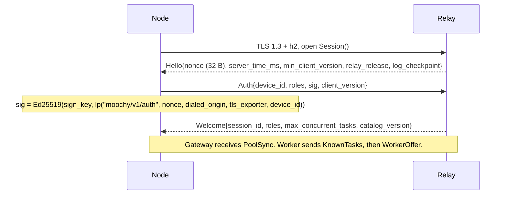

# Moochy protocol, version 1 (`moochy.v1`)

Status: normative for the open-source `moochy` client. License: Apache-2.0. Date: 2026-10-01.

This document specifies everything a Moochy client sends and receives on the network: encodings, keys and derivations, encryption, signatures, the gRPC link to the relay, receipts, and the key log a client verifies. It is written so that anyone can read the client, check that it does what this document says, and write a compatible implementation.

Sources of truth, in order:

1. The golden test vectors in [`spec/vectors/`](vectors/). If this text and a vector disagree, the vector wins and this text is a bug.
2. The protobuf schema [`spec/proto/moochy/v1/link.proto`](proto/moochy/v1/link.proto).
3. For the key log and the receipt log: [`spec/KEYLOG.md`](KEYLOG.md) (record formats, signatures, checkpoints, tiles, owner keys, monitor rules).
4. This document.

The words MUST, MUST NOT, SHOULD, and MAY are used as in RFC 2119.

**Terms.** This is a technical document, so it uses the protocol's own names, which are also the identifiers in messages and signed fields. In the app and the guides they read differently: a *pledge* (`pledge_id`) is a **donation**; its *budget* is the **monthly limit**; `weekly_limit_uusd` and `daily_limit_uusd` are the optional **weekly limit** and **daily limit**; the *per-task cap* is the **limit per request**; the *Node* (with its *Gateway* and *Worker* roles) is **the Moochy app** on a user's device; the *firewall* is the **safety checks**; a *projection* is a **public receipt**; amounts in µ$ are shown in dollars. The identifiers themselves never change.

---

## 1. Overview and trust model

A **Node** is the `moochy` process on a user's machine. It holds one device signing key and one device encryption key and may act in two roles:

- **Gateway**: accepts requests from local AI clients (provider-compatible HTTP API or MCP), seals them, and submits them to the relay.
- **Worker**: receives sealed tasks for a donor, verifies them, calls the donor's provider with the donor's API key, and streams the sealed response back.

The **Relay** schedules tasks, keeps the money ledger, and forwards ciphertext. It is operated by moochy.dev and is not open source. **The protocol is designed so that nobody needs to trust it** for confidentiality, for authenticity of tasks, or for the donor's spending caps:

| The Relay sees | The Relay never sees |
|---|---|
| The route header (§7): repo, dialect, public model id, effort, `max_tokens`, a deterministic input-size estimate, cache TTL, stream flag, an opaque affinity HMAC, feature flags | Prompts, system prompts, tools, files, outputs, provider headers |
| Sizes and timing of chunks; failure codes | Failure details (sealed to the Gateway), commitment salts |
| Usage numbers and costs in receipts | Provider API keys (they never leave the donor's machine), provider request ids (only a salted hash) |

What enforces this:

- Every body is encrypted end to end under a fresh key (§8, §10). Keys are wrapped only to Worker keys the Gateway itself checked in the public key log (§13).
- Every task is signed by the Gateway that created it (§9). A Worker serves a task only if the signer is an owner-approved member of the repo, the task is fresh, and it was never served before.
- The route header is bound into the encryption and the signature, so a relay that edits it (for example, to swap in a cheaper model) breaks decryption.
- Workers enforce their own local spending caps independently of the relay.
- Receipts are signed by the donor's device; the Gateway checks them against what it actually sent and received and disputes mismatches by signature (§12).

---

## 2. Encodings

### 2.1 Containers

- **Machine-to-machine messages are protobuf over gRPC** (§6, `link.proto`).
- **Signed and bound artifacts are JSON byte strings** carried verbatim in protobuf `bytes` fields: the route header, the inner payload, receipts, projections, and the price catalog. They are signed, hashed, and stored as the exact bytes produced by their author. Nobody re-serializes them, so no canonical-JSON scheme is needed.
- Protobuf parsing is never trusted for a security or money decision (proto3 merges repeated singular fields, last one wins). Those decisions read the signed JSON bytes with the strict parser below.

### 2.2 Strict JSON (parser-differential rule)

Every JSON parse that feeds a security or money decision (route header, inner payload, receipts, projections, catalog, provider request bodies in the Worker firewall, provider responses for usage, MCP messages) MUST reject:

- duplicate object keys;
- invalid UTF-8 and lone surrogates (`\uD800` without its pair);
- numbers outside the range of i64 (integers) or f64 (others);
- nesting deeper than 64.

Route headers, inner payloads, receipts, projections, and catalogs also reject unknown fields: a field a verifier does not understand could carry meaning it cannot check, so it fails closed. When a Worker mutates a provider request body, it re-serializes from the validated tree and never forwards bytes that another parser could read differently.

### 2.3 Values

| Value | Encoding |
|---|---|
| Bytes inside JSON | base64url **without padding** (RFC 4648 §5) |
| Task id | ULID, canonical 26-character string. Where written `task_id_16B`: the 16 raw ULID bytes |
| Device id | `d_` + ULID |
| Repository id | `r_` + ULID |
| Pledge id | `p_` + ULID |
| Public user pseudonym | `ps_` + 16 random characters from lowercase Crockford base32 (`0-9a-hjkmnp-tv-z`, 80 bits), never derived from any internal id |
| Money | JSON integer **micro-US-dollars** (µ$), field names end in `_uusd`. No floats in signed bytes |
| Timestamps | integer milliseconds since the Unix epoch unless stated |
| Dialects | `anthropic.messages`, `openai.chat` |
| Roles | `gateway`, `worker` (protobuf enum `Role`) |

### 2.4 Length-prefixed concatenation `lp`

`lp(a, b, …)` = `u32_be(len(a)) || a || u32_be(len(b)) || b || …`

- Strings are their UTF-8 bytes. Ids (`task_id`, `device_id`, `repo_id`) are their text form unless `task_id_16B` is written.
- Integers are encoded with the width written at the call site: `u32(x)` = 4 bytes big-endian, `u64(x)` = 8 bytes big-endian. **An integer written without a width is `u64`.**
- Single bytes written as `kind_byte` or `last_byte` are 1 byte.

Every signature, hash commitment, key derivation info, and AAD in this protocol uses `lp`, so field boundaries are never ambiguous.

### 2.5 Primitives

| Primitive | Choice |
|---|---|
| Hash | SHA-256 |
| KDF | HKDF-SHA256 (RFC 5869); output length 32 bytes unless stated. `HKDF(salt, ikm, info)` = Extract then Expand |
| Signatures | Ed25519. Signing is plain RFC 8032. **Verification follows ZIP-215** (accepts non-canonical encodings of A and R, requires canonical S, uses the cofactored equation), so every implementation reaches the same verdict on every signature. Edge cases are in the vectors |
| AEAD | ChaCha20-Poly1305 (RFC 8439), 16-byte tag. Nonce (12 bytes) = `0x00 × 8 || u32_be(seq)` |
| HPKE | RFC 9180 base mode, KEM `0x0020` DHKEM(X25519, HKDF-SHA256), KDF `0x0001` HKDF-SHA256, AEAD `0x0003` ChaCha20-Poly1305 |
| `suite_id` | the string `moochy.v1.hpke.x25519-sha256-chacha20poly1305` |
| Compression | zstd |

### 2.6 Labels

Every signed, hashed, or derived value begins with one of these labels inside `lp`. A value made for one purpose can never be accepted for another.

`moochy/v1/auth`, `moochy/v1/device-start`, `moochy/v1/req`, `moochy/v1/resp`, `moochy/v1/wrap`, `moochy/v1/task`, `moochy/v1/salt`, `moochy/v1/req-commit`, `moochy/v1/resp-commit`, `moochy/v1/provider-req`, `moochy/v1/receipt`, `moochy/v1/projection`, `moochy/v1/resp-progress`, `moochy/v1/dispute`, `moochy/v1/detail`; key log: `moochy/v1/keylog`, `moochy/v1/keylog-sig`, `moochy/v1/key-pop`, `moochy/v1/receipt-log` (their use is defined in `spec/KEYLOG.md`).

---

## 3. Device keys

Each Node creates, on the device and never exported:

- a **signing key** (Ed25519): authentication, task signatures, receipts, projections, progress checkpoints, disputes, owner approvals;
- an **encryption key** (X25519): receiving content keys as a Worker.

The client stores them in the OS keychain, or in a passphrase-encrypted file on headless machines. All secrets are zeroized after use.

---

## 4. Device login

Unauthenticated, strictly rate-limited per IP by the relay.

1. The Node calls `DeviceStart(DeviceStartRequest{sign_pub, enc_pub, roles, name, suite, sig, pop_sig})` with
   `sig = Ed25519(sign_key, lp("moochy/v1/device-start", sign_pub, enc_pub, roles_csv, name, suite))`,
   where `roles_csv` is the requested role names (`gateway`, `worker`) joined by `,` in the order sent, and `suite` is `suite_id`. The signature proves possession of the new key. `pop_sig` is the key-log proof of possession (label `moochy/v1/key-pop`, `spec/KEYLOG.md`) that goes into the `KEY_ADDED` entry.
2. The relay returns `user_code` (`XXXX-XXXX`, shown to the user), a secret `device_code`, a poll interval, and an expiry.
3. The user approves the code in a signed-in browser (and chooses roles and an optional repo scope).
4. The Node polls `DevicePoll{device_code}` at the given interval until the state is `APPROVED` (with `device_id`, the user's `ps_…` pseudonym and username), `DENIED`, or `EXPIRED`.

On approval the relay appends a `KEY_ADDED` entry to the key log (§13). Every Node later alerts its owner about any key on their account it did not create.

---

## 5. Transport

| Property | Value |
|---|---|
| Protocol | gRPC over HTTP/2 |
| TLS | 1.3 only, ALPN `h2`. Never plaintext h2c |
| gRPC compression | none (ciphertext does not compress, and compression next to secrets invites CRIME-style oracles) |
| Service | `moochy.v1.NodeLink` |
| Max gRPC message | 128 KiB (a chunk is ≤ 64 KiB) |
| Max header list | 16 KiB |
| Concurrent streams per connection | 128 |
| Keepalive | server pings every 15 s; 2 missed = connection dead |
| Origin | `https://<relay-host>:<port>`. The client's relay URL is configurable for development and tests; release builds default to the moochy.dev relay |

Clients MUST set connect and request timeouts, bound every per-stream buffer, flush every chunk immediately (no batching of tokens), and set `TCP_NODELAY`.

---

## 6. The gRPC link (`NodeLink`)

```
service NodeLink {
  rpc Session(stream NodeMsg) returns (stream RelayMsg);      // control, one per connection
  rpc Submit(stream SubmitUp) returns (stream SubmitDown);    // Gateway: one per task
  rpc Serve(stream ServeUp) returns (stream ServeDown);       // Worker: one per assigned attempt
  rpc DeviceStart(DeviceStartRequest) returns (DeviceStartResponse);
  rpc DevicePoll(DevicePollRequest) returns (DevicePollResponse);
  rpc GetLogTile(LogTileRequest) returns (LogTileResponse);   // public key-log and receipt-log tiles
}
```

### 6.1 Session and authentication

Authentication is **per HTTP/2 connection**, bound to the TLS channel.



- `dialed_origin` is the exact origin the Node itself dialed and verified with TLS, scheme included: `https://host:port`. It is never taken from the server, so a phishing relay cannot forward a login to the real one.
- `tls_exporter` is the RFC 9266 channel-binding value of this TLS connection (`EXPORTER-Channel-Binding`, empty context, 32 bytes). A signature captured on one connection is useless on any other.
- No bearer token crosses the wire and no shared secret is stored by the relay; it holds only public keys.
- `Submit` and `Serve` streams are accepted only on the **same HTTP/2 connection** that authenticated, and they MUST carry the metadata `x-moochy-session: <session_id>`. A stream from any other connection gets `UNAUTHENTICATED`.
- A new successful authentication for a device closes that device's previous session. A Node that loses its connection rebuilds the channel and authenticates again (exponential back-off with full jitter, base 250 ms, cap 30 s).
- If `server_time_ms` differs from local time by more than 5 minutes, the client warns the user (task ids carry timestamps that Workers check).
- `min_client_version` lets the relay refuse clients with known security bugs.

### 6.2 Session messages

| Message | Direction | Purpose |
|---|---|---|
| `Hello`, `Auth`, `Welcome` | | §6.1 |
| `PoolSync{repo_id, full, workers[], removed_worker_devices[], repo_slug, repo_provider, auto_cache, excluded_providers, allow_unsandboxed_tools}` | R → Gateway | Candidate Workers for a repo: `worker_device`, `enc_pub`, `sign_pub`, `key_log_index`, `approval_log_index`, `donor_pseudonym`, `dialects`, `models` (public slugs), `hint` (coarse 0–100). The Gateway **independently verifies** each key and approval in its key-log mirror (§13) before wrapping to it, and never wraps to a Worker serving through a provider in `excluded_providers`. Project settings: `auto_cache` (add automatic prompt caching to multi-turn Anthropic requests) and `allow_unsandboxed_tools` (§11.1) |
| `KnownTasks{tasks[]}` | Worker → R | Sent right after `Welcome`: every `(task, attempt)` the Worker has `running` or in its `outbox`. The relay releases, at zero cost, reservations for this Worker that are not listed |
| `WorkerOffer{slots_free, models[], pledges[], window_open, local_cap_left_uusd}` | Worker → R | Capacity the Worker will accept now. `models[]` = `{dialect, model, rl_headroom}`. `window_open = false` when the donor's schedule is closed (an eligibility condition, not a pledge state). Sent on connect and on every change; only the latest counts |
| `AssignNotice{task, attempt}` | R → Worker | Open a `Serve` stream for this attempt. Sent only after the relay has durably reserved the cost |
| `ReceiptDispute{task, attempt, code, gateway_sig}` | Gateway → R | §12.3 |
| `ReplayReceipt{receipt}` | Worker → R | Resend a receipt from the outbox after a reconnect |
| `ReceiptReplaySince{since_ms}` | R → Worker | After a relay restore: resend every receipt since that time, acknowledged or not |
| `ReceiptAck{task, attempt, receipt_log_index, receipt_log_proof, receipt_log_checkpoint}` | R → Worker | The receipt is durably stored. The Worker marks the outbox entry acknowledged and keeps it 7 more days. The last three fields prove the receipt was appended to the public receipt log (§12.5); empty until it is |
| `SignedLogEntry{request_id, kind, body, sigs}` / `LogEntryAck{request_id, index, error}` | Node → R / R → Node | Owner-signed key-log entries (claims, donor approvals and revocations, memberships, owner keys) and their position once appended (§13) |
| `ApprovalRequests{requests[]}` | R → owner's Node | Requests waiting for the owner's signature. The Node parses `body_to_sign`, shows its meaning, and signs only after an explicit command and confirmation from the owner; `summary` is display text, never signed as-is |
| `LogCheckpoint{note}` | R → Node | Newest signed key-log checkpoint (§13) |
| `GetLogTile{path}` (unary RPC) | Node → R | One C2SP tile or checkpoint of the key log (receipt log under the prefix `receipts/`), at most 123,392 bytes. Unauthenticated, rate-limited per IP |
| `CatalogUpdate{version, catalog_json, sig}` | R → Node | Signed price catalog (§14). Nodes reject version decreases |
| `Draining{reconnect_after_ms}` | R → Node | The relay will restart; reconnect after the delay |
| `Ping` / `Pong` | both | Liveness and RTT |
| `Error{code, message, task}` | R → Node | Session-level error |

### 6.3 `Submit` stream (Gateway, one per task)

| Message | Direction | Meaning |
|---|---|---|
| `SubmitOpen{task, route, wraps[], body_len, body_chunks}` | G → R | First message. `route` = the exact route-header JSON bytes (§7), raw. `wraps` ≤ 8 (§8.3). Deduplicated per `(gateway_device, task)` |
| `Chunk` (as `body`) | G → R | Sealed request chunks, `attempt = 0`, `seq` from 0 |
| `NeedWraps{workers[]}` | R → G | None of the wrapped candidates is eligible; wrap CK for these Workers (one round trip, only on a stale pool snapshot) |
| `Wraps{wraps[]}` | G → R | Answer to `NeedWraps`. The body is not resent |
| `Accepted{attempt, worker_device, r}` | R → G | A Worker acked. `r` = its per-attempt response salt `R`. The Gateway decrypts only this attempt |
| `Started{attempt}` | R → G | The provider answered with response headers. **No failover after this point** |
| `Chunk` | R → G | Sealed response chunks of the accepted attempt, in `seq` order |
| `Checkpoint{attempt, seq, running_hash, sig}` | R → G | Forwarded Worker progress signature (§11) |
| `SignedReceipt` (as `end`) | R → G | Final receipt and projection (§12) |
| `Failed{code, retryable, retry_after_ms, sealed_detail, attempt, worker_device, r}` | R → G | Task failed; the Gateway converts it to a provider-native error (§15). `attempt`, `worker_device` and `r` identify the Worker that produced `sealed_detail` (`attempt = 0` for a relay-side failure), so the Gateway can derive `K_det` (§15.3) |
| `Cancel{reason}` | G → R | The client went away. Cancelling the gRPC stream has the same effect |

### 6.4 `Serve` stream (Worker, one per assigned attempt)

| Message | Direction | Meaning |
|---|---|---|
| `ServeOpen{task, attempt}` | W → R | First message, after `AssignNotice` |
| `Assign{task, attempt, route, wrap, pledge_id, repo_id, deadline_ack_ms, body_len, body_chunks, pledge_policy, pledge_headroom_uusd, per_task_cap_uusd, catalog_version}` | R → W | First server message. `route` = the same bytes the Gateway sent; `wrap` = this Worker's wrap. `pledge_policy` is the exact policy JSON the Worker enforces locally (§9.1); `pledge_headroom_uusd` is advisory (the Worker's own caps still rule); `catalog_version` is the price catalog in effect at the start of the attempt |
| `Chunk` (as `body`) | R → W | The sealed request chunks |
| `Ack{r}` | W → R | Authentic, decrypted, firewall passed, local caps reserved, provider call starting. Carries the fresh salt `R`. Deadline: `deadline_ack_ms` after the last body chunk (default 500 ms) |
| `Nack{r, code, retryable, retry_after_ms, sealed_detail}` | W → R | Refusal (§15). Details are sealed to the Gateway (§15.3) |
| `Started{attempt}` | W → R | Provider response headers received |
| `Chunk` | W → R | Sealed response chunks |
| `Checkpoint` | W → R | Progress signature (§11) |
| `SignedReceipt` (as `end`) | W → R | Receipt and projection, written to the Worker's outbox before sending |
| `Cancel{reason}` | R → W | The Worker MUST abort the provider request immediately |
| `ReceiptAck` | R → W | As in §6.2 |

### 6.5 Chunks

`Chunk{attempt, seq, last, ct}`: `ct` is the AEAD ciphertext including its 16-byte tag. Plaintext per chunk ≤ **65,497 bytes**, so `ct` ≤ 64 KiB. `seq` starts at 0 and increases by one; `last` is set on the final chunk of the stream. The gRPC stream identifies the task, and the AAD (§8.2, §10) binds the task, attempt, sequence number, and last flag, so a chunk cannot be moved to another task, attempt, or position, and a stream cannot be truncated silently.

### 6.6 Status codes

Policy outcomes travel as `Failed` / `Nack` messages inside the stream. gRPC status codes are reserved for transport and authentication: `UNAUTHENTICATED`, `RESOURCE_EXHAUSTED`, `UNAVAILABLE`, `DEADLINE_EXCEEDED`.

---

## 7. Route header

The plaintext the relay schedules on: UTF-8 JSON, sent as exact bytes in `SubmitOpen.route` and forwarded unchanged in `Assign.route`. It is bound as HPKE AAD in every wrap (§8.3) and inside the task signature (§9), and **the Worker MUST check it against the decrypted body**. An unknown field makes the Worker refuse with `route_mismatch`.

| Field | Value | Worker check |
|---|---|---|
| `repo_id` | the Gateway's repo for this request | equals the repo of the assigned pledge in the Worker's own pledge table |
| `dialect` | `anthropic.messages` or `openai.chat` | exact |
| `model` | public model id (slug, e.g. `anthropic/claude-sonnet-5`) | exact, after mapping through the signed catalog to the provider's id |
| `effort` | request effort, or the model's catalog default when absent | effective value matches |
| `max_tokens` | `max_tokens` / `max_completion_tokens` | exact; MUST be present |
| `est_input_tokens` | deterministic estimate: `ceil(text_bytes / 3) + images × max_image_tokens + pages × max_page_tokens` (catalog values; `text_bytes` = UTF-8 bytes of all text content) | recomputed and MUST match exactly |
| `cache_ttl` | longest cache TTL requested: `none`, `5m`, `1h` | matches |
| `stream` | boolean | exact |
| `affinity` | 16-byte HMAC under a per-device secret over `lp(system, tools, first user message)`, base64url | not checked; opaque to the relay |
| `flags` | opt-in features the body uses: `fast`, `images`, `documents`, `long_context`, … | each requires the donor's opt-in |

A mismatch closes the attack of declaring a cheap model or a small input in the header while sending something expensive in the sealed body.

---

## 8. Sealing the request

### 8.1 Inner payload

The plaintext sealed for the Worker is a JSON object:

```json
{"v":1,
 "body_b64":"<provider request body exactly as the client sent it>",
 "body_sha256":"<SHA-256 of that body>",
 "headers":{"anthropic-version":"…","anthropic-beta":"…"},
 "S":"<32 random bytes>",
 "gateway_device":"d_…",
 "task_sig":"<§9>"}
```

`headers` holds only allowlisted provider headers, lowercase names. All bytes are base64url without padding. The **whole JSON** is zstd-compressed (level 1–3, chosen by size), then chunked and sealed.

### 8.2 Request encryption

- `CK` = 32 random bytes, **fresh for every sealed body**. It is never used directly as an AEAD key.
- `K_req = HKDF(salt = "", ikm = CK, info = lp("moochy/v1/req", task_id))`
- Chunk `i`: `ct_i = AEAD(K_req, nonce(i), aad = lp("moochy/v1/req", kind_byte, task_id_16B, u32(i), last_byte), pt_i)`, with `kind_byte` = the constant `0x01` (domain separation from responses), `last_byte` = `0x01` on the last chunk, else `0x00`.

The nonce is unique because `K_req` encrypts exactly one body.

### 8.3 Wraps

For each candidate Worker the Gateway verified (§13):

`wrap = HPKE.SealBase(pkR = enc_pub, info = lp("moochy/v1/wrap", suite_id, task_id), aad = route_header_bytes, pt = CK)` → `enc (32) || ct (48)` = **80 bytes**.

The body is sealed once and opens for any recipient. Adding a recipient costs one more 80-byte wrap, never a re-upload, which is what makes zero-round-trip failover compatible with end-to-end encryption. Because the route header is the HPKE AAD, a relay that changes a single byte of it makes the unwrap fail. `suite_id` in the info prevents downgrade across versions.

---

## 9. Task signature and Worker acceptance

HPKE base mode lets anyone who knows a Worker's public key, including the relay, build a valid envelope. So the Gateway signs every task inside the sealed payload:

`task_sig = Ed25519(gateway_sign_key, lp("moochy/v1/task", task_id, repo_id, route_header_bytes, body_sha256, headers_sha256))`

where `body_sha256` is the raw 32-byte hash and `headers_sha256 = SHA-256(lp(name_1, value_1, name_2, value_2, …))` over the inner-payload `headers` sorted by name in ascending byte order (SHA-256 of the empty string when there are none).

Before sending `Ack`, the Worker MUST, in this order:

1. find its wrap, HPKE-open `CK` with `Assign.route` as AAD, derive `K_req`, decrypt every chunk in order, decompress (bounded: 32 MiB decompressed maximum), and check `body_sha256`;
2. verify `task_sig` for `gateway_device`, whose key is in the key log and not revoked;
3. check membership: the key log holds an **owner-signed `MEMBER_ADDED`** for that user and `repo_id`, or the user is the repo owner (§13);
4. check that the assigned pledge belongs to this donor and to `repo_id`;
5. check freshness: the ULID timestamp of `task_id` is within ±10 minutes of the Worker's clock **and not earlier than the Worker process's own start time**;
6. check that `(gateway_device, task_id)` was never served by this process (an in-memory set covering the freshness window). Together with rule 5, a task can never be replayed, even across Worker restarts, without any disk write in the hot path;
7. run the request firewall (a strict allowlist of request fields and provider headers per provider) and the route-header checks of §7;
8. reserve the worst-case cost locally against the device's monthly cap and per-pledge counters, including the pledge's daily and weekly limits when set (§9.1);
9. draw `R` and send `Ack{r}`.

Any failure is a `Nack` with the codes of §15. A malicious relay therefore cannot run its own inference on donor keys, replay genuine tasks, or move a task to another repo's pledge.

**Development mode.** Until a deployment publishes owner-signed approvals in the key log, a Worker accepts relay-asserted membership and approvals **only** when started with `MOOCHY_INSECURE_DEV=1`. Production Workers never do.

### 9.1 Pledge policy and limit windows

`Assign.pledge_policy` is a JSON object with exactly these keys, all optional:

| Key | Value |
|---|---|
| `models` | allowed public model ids; a trailing `*` matches a prefix; empty = any |
| `max_effort` | `low` … `max`; empty = no bound |
| `dialects` | allowed dialects; empty = any |
| `flags` | the opt-in features the donor allowed (§7) |
| `daily_limit_uusd` | integer µ$ > 0, the most the pledge may spend in one **UTC calendar day** (00:00 to 24:00 UTC); absent or 0 = none |
| `weekly_limit_uusd` | integer µ$ > 0, the most the pledge may spend in one **ISO week** (Monday 00:00 UTC to the next Monday 00:00 UTC); absent or 0 = none |

Each limit that is set is > 0 and no larger than a longer window's limit: daily ≤ weekly ≤ monthly budget (the relay refuses anything else). The monthly budget keeps its own period, anchored on the pledge's day of the month (05 §9).

A Worker MUST refuse (`firewall`, not retryable) a policy with a key it does not know. A new limit is therefore never served by a client that would ignore it. Clients before 0.1.3 ignore unknown keys: the relay never assigns a pledge with a daily or weekly limit to a Worker whose `Auth.client_version` is older than 0.1.3, and it folds both windows into `pledge_headroom_uusd`, which every client checks.

The relay enforces the windows across all of the donor's devices, like the monthly budget. Each Worker also counts its own spend per pledge per window, attributed to the attempt's start time, and refuses a task (`local_cap`) whose worst-case cost would pass a window's limit. The local counters are per device: they bound what one device serves, the relay bounds the sum. The policy is not signed: like the budget and `per_task_cap_uusd`, it is the relay's copy of what the donor set, so the device's monthly cap and the provider's spend limit (05 §6) stay the bounds that do not trust the relay.

---

## 10. Sealing the response

- `R` = 32 random bytes drawn by the Worker **for each attempt**, sent in `Ack` / `Nack`.
- `RK = HKDF(salt = R, ikm = CK, info = lp("moochy/v1/resp", task_id, worker_device, u64(attempt)))`
- Chunk `seq`: `AEAD(RK, nonce(seq), aad = lp("moochy/v1/resp", task_id_16B, u64(attempt), R, u32(seq), last_byte), pt)`

The Worker seals the provider's response bytes exactly as received, one chunk per provider read, and sends each chunk immediately.

The Gateway never passes a donor's bytes to the client as-is: it parses each event strictly (bounded, pure-Rust decompression, 32 MiB cap) and re-emits it from its typed form (allowlisted fields, canonical JSON, normalized SSE framing). The client receives the same events the provider sent, but no byte chosen by the donor reaches the client's parser verbatim.

Because `R` is fresh per attempt and bound into both the key and the AAD, **no two response streams ever share a key**, whatever the relay does (honest failover or a deliberate double assignment). The Gateway:

- decrypts only chunks of the attempt named in `Accepted`;
- fails the task on the **first** AEAD failure (logged as `bad_envelope`) and never writes a byte of an unauthenticated chunk to the client;
- aborts the task if chunks ever appear for a second started attempt.

---

## 11. Progress checkpoints

A malicious Worker could stream a poisoned tool call and disconnect before signing a receipt. So the Worker signs a checkpoint at the end of every tool-call block (Anthropic `tool_use` blocks; OpenAI `tool_calls` per index) and on the last chunk:

`Checkpoint.sig = Ed25519(worker_sign_key, lp("moochy/v1/resp-progress", task_id, u64(attempt), R, u64(seq), running_sha256))`

where `running_sha256` is the SHA-256 of all response plaintext up to and including chunk `seq`.

The Gateway holds each tool-call block until it ends, runs its local checks, and **releases it to the client only after verifying a checkpoint that covers it**; otherwise it substitutes an error tool result. Text streams immediately. Every tool call a client executes is therefore signed by a known donor device.

### 11.1 Sandboxed sessions

By default the Gateway releases tool calls from donated tokens only to **sandboxed sessions**: requests that carry a run token minted for a live `moochy run` sandbox. Other clients receive the text and a visible `[moochy]` notice in place of each tool call, unless the project's `allow_unsandboxed_tools` setting (in `PoolSync`) is on. This is local client behaviour; nothing about it travels on the wire except that setting.

---

## 12. Receipts, projections, disputes

### 12.1 Commitment salts

From the inner payload's `S`: `S_x = HKDF(salt = "", ikm = S, info = lp("moochy/v1/salt", name))` for `name` ∈ {`req`, `resp`, `pid`}. Only the Gateway and the Worker know them, so the commitments below reveal nothing to the relay or the public.

### 12.2 Receipt

UTF-8 JSON, signed as exact bytes by the Worker:

| Field | Meaning |
|---|---|
| `v` | `1` |
| `task_id`, `attempt`, `repo_id`, `pledge_id` | identifiers |
| `worker_device`, `gateway_device` | device ids |
| `dialect`, `provider`, `model_reported` | `model_reported` = the model string in the provider's response |
| `usage` | `input`, `output`, `cache_write_5m`, `cache_write_1h`, `cache_read`, `estimated` (bool), `provider_cost_uusd` (only when the provider reports a cost, e.g. OpenRouter; rounded up) |
| `catalog_version`, `cost_uusd` | cost under the signed catalog (or the provider-reported cost) |
| `req_commit` | `SHA-256(lp("moochy/v1/req-commit", S_req, body))`, body as sent by the Gateway, before any Worker-side mutation |
| `resp_commit` | `SHA-256(lp("moochy/v1/resp-commit", S_resp, SHA-256(response plaintext)))` |
| `provider_req_hash` | `SHA-256(lp("moochy/v1/provider-req", S_pid, provider request id))` |
| `status` | `ok`, `cancelled`, `provider_error`, `partial`, `not_started` |
| `t_start`, `t_started`, `t_end` | Worker timestamps (ms) |

`donor_sig = Ed25519(worker_sign_key, lp("moochy/v1/receipt", receipt_bytes))`.

The Worker appends the signed receipt to its local outbox (durably) before sending it, and keeps it 7 days after `ReceiptAck`, so no receipt is lost if the relay restarts.

### 12.5 Receipt transparency log

The relay appends every settled receipt to a second public log (origin `moochy.dev/receipts`, its own key), whose leaf is `lp("moochy/v1/receipt-log", SHA-256(receipt_bytes))`: the receipt itself never enters the log. `ReceiptAck` returns the index, an inclusion proof, and the signed receipt-log checkpoint, so either party can prove its receipt was logged, and the relay cannot silently leave a settled receipt out of what it publishes. Formats: `spec/KEYLOG.md` §8.

### 12.3 Projection (public)

The public audit feed shows only a **projection**, signed by the same donor key:

`{"v":1, "receipt_ref":<16 random bytes>, "repo_id", "donor":<pseudonym per the pledge's visibility, or null>, "model", "cost_uusd", "day":"YYYY-MM-DD" (UTC), "receipt_sha256"}`

`projection_sig = Ed25519(worker_sign_key, lp("moochy/v1/projection", projection_bytes))`.

Projections contain no device ids, no task ids, and no time finer than a day, so they never reveal when someone works or when their machine is on, yet anyone can verify them against the donor's logged key (`moochy verify`).

### 12.4 Acknowledgment by silence, disputes by signature

The Gateway checks every receipt against what it actually sent and received:

- `req_commit` and `resp_commit` recomputed from its own bytes;
- input and cache usage within a band around its own deterministic estimate; `cache_write_1h > 0` only if the request asked for a 1-hour TTL;
- for non-reasoning responses, visible output tokens within ±25% of its own count;
- `model_reported` equals the requested model or its catalog alias.

If everything matches, the Gateway sends nothing (**silence = acceptance**). Otherwise it sends `ReceiptDispute{task, attempt, code, gateway_sig}` with `gateway_sig = Ed25519(gateway_sign_key, lp("moochy/v1/dispute", task_id, u64(attempt), code))`. Disputed receipts still settle (the donor's provider billed either way) but are marked disputed in public views.

---

## 13. Key log

A public, append-only Merkle log of identities, approvals, and prices. Clients mirror it fully (it is small) and verify it themselves; they never take the relay's word for a key or an approval. Record formats, signatures, checkpoints, tiles, and monitor rules are normative in [`spec/KEYLOG.md`](KEYLOG.md); this section summarizes them.

| Entry | Signed by |
|---|---|
| `KEY_ADDED` / `KEY_REVOKED` | relay (binding to a user) + the new key (proof of possession, §4) |
| `OWNER_KEY_ADDED` / `OWNER_KEY_REVOKED` | the new owner key (and the previous one on rotation); revocation is relay-asserted and only removes trust |
| `REPO_CLAIMED` | relay (repository admin check) + the owner key |
| `DONOR_APPROVED` / `DONOR_REVOKED` | the repo's owner key |
| `MEMBER_ADDED` / `MEMBER_REMOVED` | the repo's owner key |
| `CATALOG` | relay catalog key |
| `MODERATION` | relay |

- **Owner keys.** Approvals are signed with an owner key, separate from every device key, held encrypted by the foreground command-line app and loaded only for one command the owner typed and confirmed. The background process never reads it, so a compromised background process cannot approve anyone. Approvals signed with a device key are refused.
- Tree hashing, inclusion proofs, and consistency proofs follow RFC 6962 / RFC 9162 as implemented by Go's `golang.org/x/mod/sumdb/tlog`; tiles follow the C2SP tlog-tiles layout (fetched with `GetLogTile` or over HTTPS under `/log/`); checkpoints are C2SP signed notes, signed only for sizes already replicated. Witness cosignatures (C2SP `tlog-cosignature`) may be required by a client before it applies a checkpoint.
- Every Node verifies consistency between every checkpoint it receives (`Hello.log_checkpoint`, `LogCheckpoint`) and the previous one, and compares them with the **hourly public Git anchor** of checkpoints. A fork or rewrite is visible to anyone who ever fetched the anchor.
- Entries contain only pseudonymous ids, device public keys, repo ids, signatures, and catalog data. No personal data.

Client duties:

- **Every Node** alerts on any key on its own account it did not create.
- **An owner's Node** alerts on any `REPO_CLAIMED`, approval, or membership for its repos it did not sign.
- **Gateways** wrap only to Worker keys that are logged, not revoked, and whose donor has an owner-signed `DONOR_APPROVED` for the repo, and only while their mirror holds a checkpoint verified in the last 10 minutes. With no verified checkpoint, a stale one, or a detected fork, the Gateway refuses to seal at all (`spec/KEYLOG.md` §6).
- **Workers** accept tasks only from Gateway keys whose user has an owner-signed `MEMBER_ADDED` for the repo or is its owner (§9).

---

## 14. Price catalog

`CatalogUpdate.catalog_json` carries the exact signed catalog bytes: `{"version", "effective_at_ms", "entries":[…]}`; each entry gives, for a public model slug and a provider, the provider's model id, the dialects, and integer µ$ prices per token type (input, output, cache writes for 5 min and 1 h, cache reads), image and page token maxima, the default effort, and the maximum output. Nodes verify the signature against the catalog key in the key log and reject any version lower than one they have seen. Prices apply to tasks started at or after `effective_at_ms`. Workers compute receipt costs with the catalog; the Gateway checks them.

---

## 15. Failures

### 15.1 Worker refusal codes (`Nack.code`)

| Code | Retry on another Worker | Typical cause |
|---|---|---|
| `busy` | yes | slot race |
| `rate_limited` | yes | provider 429 (`retry_after_ms`) |
| `overloaded` | yes | provider 529/503 |
| `provider_error` | yes | provider 5xx or network error before start |
| `local_cap` | yes | device monthly cap, pledge counter (monthly headroom, daily or weekly limit), or schedule window |
| `model_unavailable` | yes | the key cannot use this model |
| `firewall` | **no** | disallowed field, header, or feature (detail sealed to the Gateway) |
| `route_mismatch` | **no** | route header ≠ body, or unknown route-header field |
| `unauthorized_task` | **no** | a §9 authenticity check failed (signature, membership, freshness, replay) |
| `bad_envelope` | **no** | decryption or hash failure |

Unknown codes are treated as non-retryable. `unauthorized_task` and `bad_envelope` indicate possible relay misbehaviour; clients log them prominently.

### 15.2 Failover rules

- A task has at most 3 attempts. A retryable refusal before `Started` moves the task to the next candidate with one more wrap; the body is not re-uploaded.
- **No failover after `Started`**: a second attempt could bill the donor twice. Mid-stream failures become clean, retryable, provider-native errors, and the client's own retry creates a fresh task.
- A late message from a superseded attempt is answered with `Cancel` for that attempt; its receipt still records whatever it actually spent.

### 15.3 Sealed details

`Nack.sealed_detail` is encrypted by the Worker for the Gateway, and the relay copies it unchanged into `Failed.sealed_detail`:

- `K_det = HKDF(salt = R, ikm = CK, info = lp("moochy/v1/detail", task_id, worker_device, u64(attempt)))`
- `sealed_detail = AEAD(K_det, nonce = 12 zero bytes, aad = lp("moochy/v1/detail", task_id_16B, u64(attempt), code), pt)`, with `pt` the UTF-8 detail, at most 1 KiB

There is one detail per attempt, so the zero nonce is never reused under a key. The relay sees only the code, never, for example, the name of a rejected field.

### 15.4 Errors shown to clients

The Gateway turns every failure into the native error shape of the client's dialect:

| Code | Anthropic dialect | OpenAI dialect | Retryable |
|---|---|---|---|
| `rate_limited`, `overloaded`, `provider_error` (before streaming) | 429 / 529 / 500 with an `error` body | 429 / 503 / 500 | yes |
| any failure after streaming began | `event: error` SSE event (`overloaded_error`, `rate_limit_error`, `api_error`) | error chunk, then close | yes |
| `firewall` | 400 `invalid_request_error`, with the unsealed detail | 400 | no |
| `over_task_cap` | 400 `invalid_request_error` ("this request's worst-case cost exceeds the donors' per-task cap") | 400 | no |
| `quota_exceeded` | 403 `permission_error` | 403 | no |
| `model_not_in_pool` | 404 `not_found_error` | 404 | no |

Policy failures **never** use 429, because agents retry 429 automatically.

---

## 16. Cancellation

The client closes its HTTP request or MCP call → the Gateway cancels the `Submit` stream (or sends `Cancel`) → the relay sends `Cancel` on the Worker's `Serve` stream → the Worker **aborts the provider request** (the provider stops generating and billing) → it signs a receipt with `status: cancelled` and the usage actually incurred (`estimated: true` when the provider's final usage never arrived). If a Gateway's connection drops, the relay cancels its unfinished tasks the same way. If a Worker loses its link, it aborts its in-flight provider calls, writes their receipts to the outbox (`not_started` with zero usage when the provider was never called), and on reconnect sends `KnownTasks` and replays the outbox.

---

## 17. Limits (defaults)

| Limit | Value |
|---|---|
| Concurrent tasks per Gateway device | 16 (`Welcome.max_concurrent_tasks`) |
| Worker slots | 4 by default, 1–64 |
| Wraps per submit | ≤ 8 |
| Attempts per task | 3 |
| Request body | 32 MiB decompressed |
| Plaintext per chunk | 65,497 bytes |
| gRPC message | 128 KiB |
| Ack deadline | 500 ms after the last body chunk reaches the Worker |
| Start deadline | 30 s after `Ack` |
| Routing deadline | 5 s after the last body chunk reaches the relay |
| Task-id freshness | ±10 min, and not before the Worker's process start |

---

## 18. Versioning

- The package name carries the major version (`moochy.v1`). A breaking change gets a new package; the relay serves both for at least 90 days.
- Within v1, protobuf fields are additive. Signed JSON artifacts reject unknown fields (§2.2); a new artifact field therefore requires a new artifact version `v`.
- Labels include `v1` and the HPKE info includes `suite_id`, so v2 values can never be confused with or downgraded to v1.

---

## 19. Test vectors

[`spec/vectors/`](vectors/) holds golden files that every implementation MUST pass:

- `lp` encoding, every label, and integer widths;
- auth and device-start signature inputs with channel binding;
- envelopes: fixed `CK`, recipients, and `R` values → exact wraps, `K_req`, `RK`, chunk ciphertexts, including a vector proving that two attempts of one task derive different response keys;
- task signature (`headers_sha256`), receipt, projection, progress-checkpoint, and dispute bytes and signatures;
- Ed25519 ZIP-215 edge cases (non-canonical encodings, small-order points);
- strict-JSON rejections (duplicate keys, lone surrogates, depth, number range);
- route-header ↔ body consistency, including the deterministic input estimate;
- key-log inclusion and consistency proofs and the checkpoint note format;
- usernames (`usernames.json`): valid, invalid, reserved, confusable, and case-variant handles.

A protocol change is not done until the vectors are regenerated and every implementation passes them.
